# Lab 02-Reporting and Telemetry

### Lab Scenario

In this Hands-on Lab, you are an administrator helping adopt the Power Platform.
An important part of keeping the Power Platform running successfully is monitoring the ongoing usage. 
In this hands-on lab you will be using the platform tools and the COE Starter Kit to perform usage 
monitoring

### Lab Test Environment

This hands-on lab is designed to be completed in an environment setup for multiple students to complete 
the Admin in a day series of hands on labs.
You need to use the assigned user and environment information to complete this lab. You must have 
completed the prior labs to successfully complete this lab

## Exercise 1: Explore the out of the box analytics

Now in this exercise, you will explore the out of the box analytics that are available from the Power 
Platform admin center.

### Task 1: Explore the Power Automate analytics

1. Navigate to Power Platform admin center
2. Expand Analytics.
3. Select Power Automate. Select change filters and change to the Power Platform COE environment

    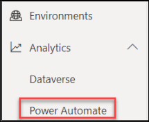

4. Review the visuals in the Runs tab and then select the Usage tab

    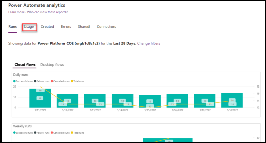
    
5. Review the visuals in the Usage tab.
6. Review the visuals in the rest of the tabs.
7. In the upper right corner change Environment level analytics to Tenant level analytics

     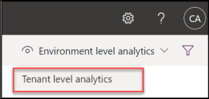
     
8. Now you are looking at data for all environments you have access to.
9. Review the Usage data and then switch to Maker Activity and Inventory and review the data available. Notice you can still filter on more specific criteria

     
     
### Task 2: Explore the Power Apps analytics

1. Navigate to Power Platform admin center
2. Expand Power Apps.
3. Review the visuals in all tabs.

    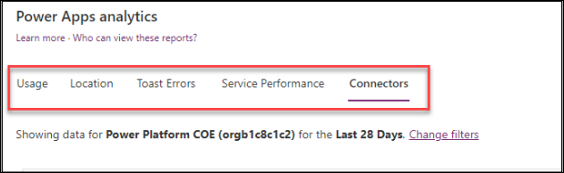
    
4. In the upper right corner change Environment level analytics to Tenant level analytics

    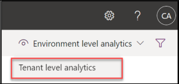
    
5. Now you are looking at data for all environments you have access to.
6. Review the Usage data and then switch to Maker Activity and Inventory and review the data available. Notice you can still filter on more specific criteria.
7. Hover your mouse over the far-right corner of data under Region and you can click on … to show more options.

    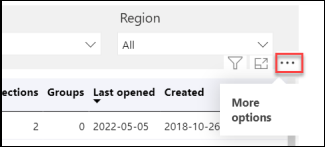
    
8. Select Export data

    
    
9. If you have Excel installed choose one of the options and select Export. After the file downloads review the details available. If you don’t have Excel simply select Cancel

    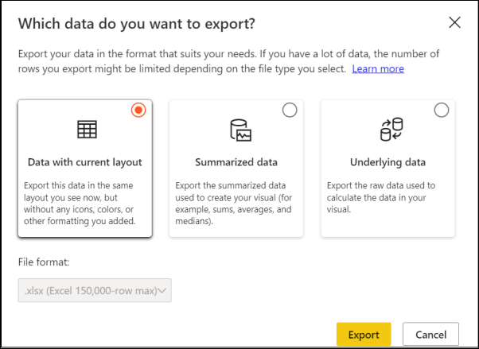
    
### Task 3: Explore the Capacity analytics

1. Navigate to Power Platform admin center
2. Expand Resources and select Capacity.

    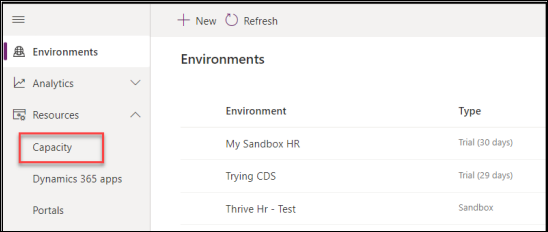
    
3. Notice the Storage capacity usage.

    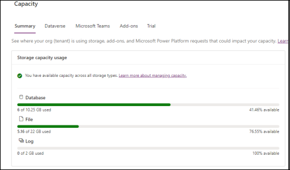
    
1. Notice the Storage capacity by source.

    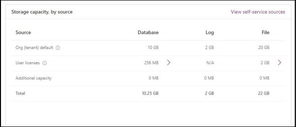
    
1. Go to the Top storage usage by environment section and notice the capacity usage by top environments

    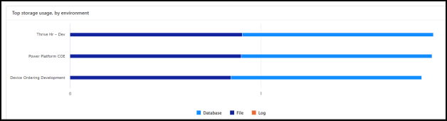
    
1. Click to select the Dataverse tab.

    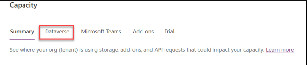
    
1. Locate the Device Ordering Development environment storage capacity and click Details.

    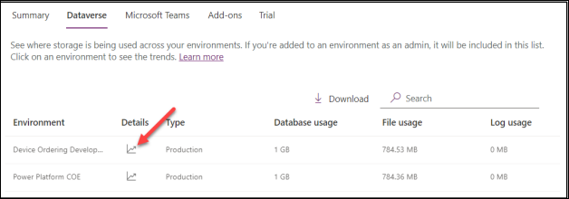
    
1. Click on the Chart menu button and select Download all tables.
