# Lab 02-Reporting and Telemetry

### Lab Scenario

In this Hands-on Lab, you are an administrator helping adopt the Power Platform.
An important part of keeping the Power Platform running successfully is monitoring the ongoing usage. 
In this hands-on lab you will be using the platform tools and the COE Starter Kit to perform usage 
monitoring

### Lab Test Environment

This hands-on lab is designed to be completed in an environment setup for multiple students to complete 
the Admin in a day series of hands on labs.
You need to use the assigned user and environment information to complete this lab. You must have 
completed the prior labs to successfully complete this lab

## Exercise 1: Explore the out of the box analytics

Now in this exercise, you will explore the out of the box analytics that are available from the Power 
Platform admin center.

### Task 1: Explore the Power Automate analytics

1. Navigate to Power Platform admin center
2. Expand Analytics.
3. Select Power Automate. Select change filters and change to the Power Platform COE environment

    

4. Review the visuals in the Runs tab and then select the Usage tab

    
    
5. Review the visuals in the Usage tab.
6. Review the visuals in the rest of the tabs.
7. In the upper right corner change Environment level analytics to Tenant level analytics

     
     
8. Now you are looking at data for all environments you have access to.
9. Review the Usage data and then switch to Maker Activity and Inventory and review the data available. Notice you can still filter on more specific criteria

     
     
### Task 2: Explore the Power Apps analytics

1. Navigate to Power Platform admin center
2. Expand Power Apps.
3. Review the visuals in all tabs.

    
    
4. In the upper right corner change Environment level analytics to Tenant level analytics

    
    
5. Now you are looking at data for all environments you have access to.
6. Review the Usage data and then switch to Maker Activity and Inventory and review the data available. Notice you can still filter on more specific criteria.
7. Hover your mouse over the far-right corner of data under Region and you can click on … to show more options.

    
    
8. Select Export data

    
    
9. If you have Excel installed choose one of the options and select Export. After the file downloads review the details available. If you don’t have Excel simply select Cancel

    
    
### Task 3: Explore the Capacity analytics

1. Navigate to Power Platform admin center
2. Expand Resources and select Capacity.

    
    
3. Notice the Storage capacity usage.

    
    
1. Notice the Storage capacity by source.

    
    
1. Go to the Top storage usage by environment section and notice the capacity usage by top environments

    
    
1. Click to select the Dataverse tab.

    
    
1. Locate the Device Ordering Development environment storage capacity and click Details.

    
    
1. Click on the Chart menu button and select Download all tables.

    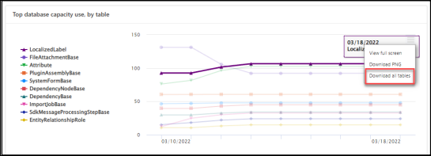
    
1. Click Open file. You should see list of all tables and their database size in MB

    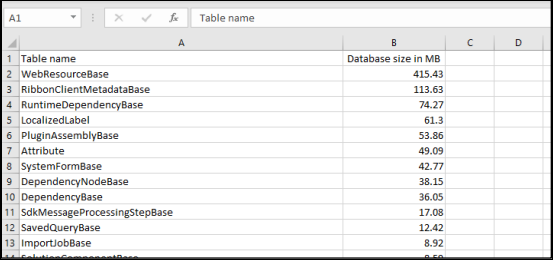
    
1. Close the Excel file.
1. Expand Analytics and select Dataverse

    
    
1. Review the visuals.
1. Click Change filters.

   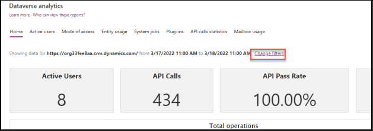
   
1. Change the date range to between one-week ago and today, and then click Apply.

   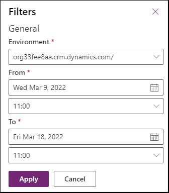
   
1. The visuals should change to reflect your changes.

## Exercise 2: Configure Dataverse logging for a table

In this exercise, you will configure Dataverse logging for a table that requires auditing.

### Task 1: Review audit logging in the environment

1. Navigate to the Power Apps maker portal and select the My Sandbox environment.
2. Select Solutions and click to open the Fabrikam Project Management solution.

    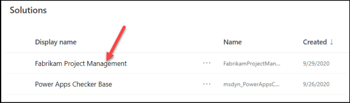
    
3. Select Tables and click to open the Project table.
4. Locate and click to open the Due Date column.

    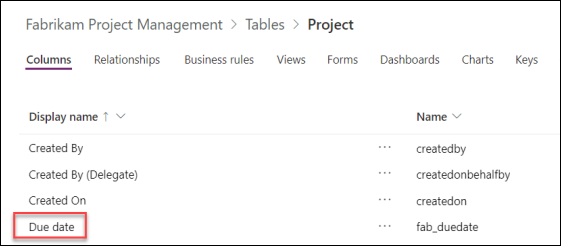
    
5. Expand the Advanced options section. Auditing is enabled for this column.

    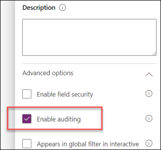
    
6. Click Cancel to close the field details pane.
7. Select Tables, select the Project table, and then click Settings.

    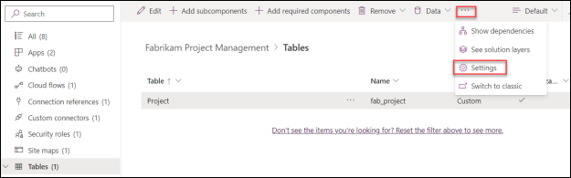
    
8. Expand the Advanced options section.
9. Scroll down to the For this table section.
10. Check the Audit changes to its data checkbox and click Save.

    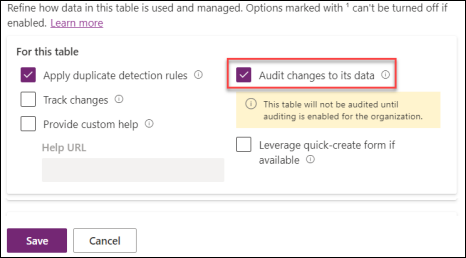
    
11. Select All from the left navigation of the solution.
12. Click Publish all customizations and wait for the publishing to complete.
13. Navigate to Power Platform admin center and select Environments.
14. Select the My Sandbox environment and click Settings.

    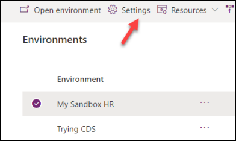
    
15. Expand Audit and logs section and click Audit settings.

    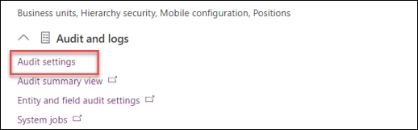
    
16. Check the Start auditing checkbox and click Save.

    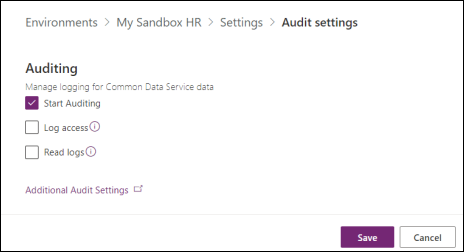
    
### Task 2: Test auditing

1. Navigate to the Power Apps maker portal and select the My Sandbox environment.
2. Select Apps and click to launch the Project Admin application.

    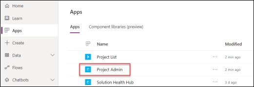
    
3. Click to open the Annual Conference project.

    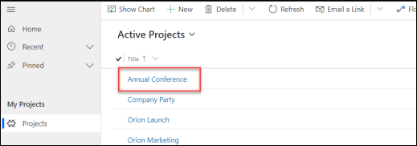
     
4. Change the Due Date and click Save.

    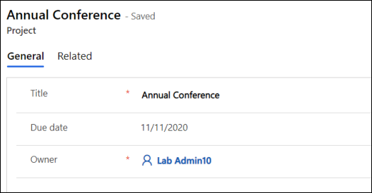
    
5. Change the Due Date and save couple more times.
6. Click Related and select Audit History.

    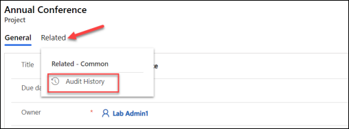
    
7. You should see the change history for each of your changes. Click to open one the change history records.

    
    
8. You should see the Filed Name, Old Value and New Value.

    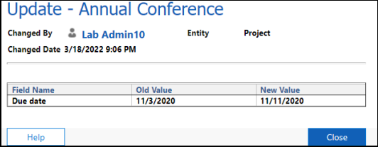
    
9. Close the change history record.

## Exercise 3: Setup the CoE Starter Kit Power BI Dashboard

### Scenario

In this exercise, you will explore some of the apps and analytics that are part of the Power Platform CoE 
Starter Kit. We have already installed and configured the starter kit into the tenant you are using for this 
lab. As part of configuring we imported the solution, shared the apps, configured the flows that 
synchronize data and published the Power BI report. If you were doing this in your own tenant, you 
would follow the instructions to complete these steps.

Now in this exercise, you will explore the following key components
- Power Platform Admin View app
- Power BI Dashboard
- The business process that is used by the Developer Compliance process

### Task 1: Explore the Power Platform Admin View app

1. Navigate to Power Apps maker portal
2. Select Power Platform CoE environment in the environment selector.

   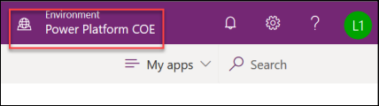
   
3. Select Apps in the left navigation and you should see a list of available apps in this environment – click on **Power Platform Admin View**.
