# Lab 03 - Action through Automation

## Lab Scenario

In this hands-on lab, you are an administrator, helping to adopt the Power Platform.

Contoso has decided to control creation of Power Platform environments by disabling creation unless you 
are a global or service admin. Contoso doesn’t want to discourage use of the Power Platform so they 
would like you to put an automated process in place to allow users to request an environment and a 
Microsoft Dataverse database.

In this lab, you will be building a Microsoft Form to allow users to submit their environment requests. 
Using the Power Platform administrative connectors and the built-in approval capabilities of Power 
Automate you will automate the processing of the requests.

The following is an outline of the process you will be implementing:
• A user submits request via the form including justification for the environment
• Form submission triggers flow to run
• Flow uses the approval connector to ask admin team for approval
• If approved, the environment and Dataverse database are created
• User is notified of the outcome; approved or rejected.

This process could easily be expanded to request approval from the user’s manager as well as the request 
information along with the environment information could be stored for resource usage charge back.

Contoso has also decided to use the app auditing process from the CoE Starter Kit. You will be seeing 
how this works by going through the process as both a maker and an admin. 

Additionally, you will be installing a pre-created flow that checks for new people building apps and adds 
them to an Office 365 group and sends them a welcome email.

### Lab Test Environment
This hands-on lab is designed to be completed in an environment setup for multiple students to complete 
the Admin in a day series of hands-on labs.

You will be assigned one or more users to use to complete the hands-on tasks. Because this is a shared 
environment, some tasks that require a tenant Global Administrator or a Service Administrator will already 
be performed.

This lab does not require you have completed any of the prior labs.

## Exercise 1: Create Environment Request Form

### Scenario

In this exercise, you will be creating an environment request form using Microsoft Forms. This form could collect additional information allowing it to be tailored to your individual organization requirements.

### Task 1: Create Microsoft Form

1. While logged in as the lab admin user navigate to Microsoft Forms and close the welcome screen.

     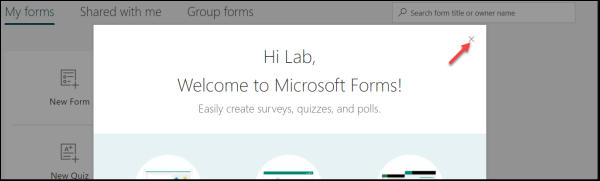
     
2. Click **New Form**.

     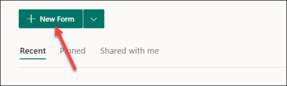
    
    >Note: Create the Form below, if you need steps, continue the steps here. If you do not need each step, continue to the next exercise.
    
    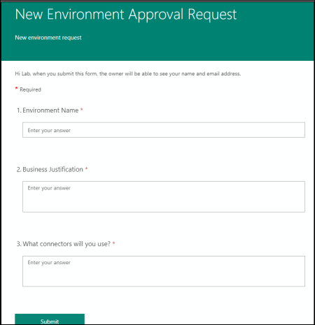
      
3. Enter **New Environment Approval Request** for title, enter **New environment request** for description, and click **Add new**.

      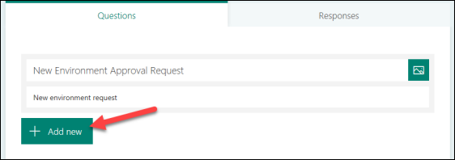
      
3. Select **Text**.

      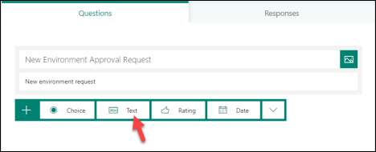
      
4. Enter **Environment Name**, make the question **Required**, and click **Add New**.

     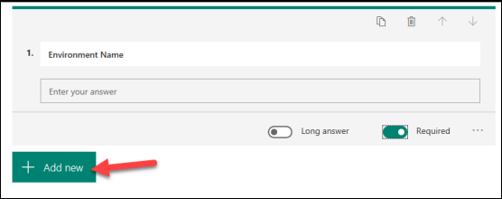
     
5. Select **Text** again.
6. Enter **Business Justification**, select **Long Answer**, and make it **Required**.

     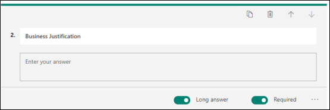
     
7. Click **Add New** and select **Text**. 
8. Enter **What connectors will you use?** select **Long Answer** and make it **Required**.

     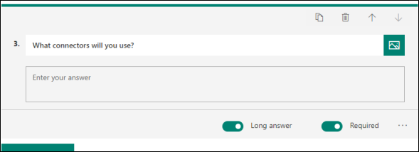
     
9. The form will be saved automatically.
10. Click **Preview**.

     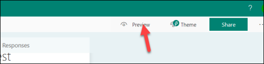
     
     
## Exercise 2: Create Environment on Form Submit

### Scenario

In this exercise, you will be building the automated flow to process new form submissions.

Note: for the purposes of this exercise, we have hard-coded the language, currency and environment 
template. The Power Platform Administration connector has actions allowing you to dynamically retrieve 
these and make the process more flexible. In fact, you could allow the user to specify the values, or infer 
them from the user’s Office 365 profile information using the Office 365 connector.

### Task 1: Delete your sandbox environment

1. While logged in as the lab admin user navigate to the Power Platform admin center.
2. Locate and select your sandbox environment that you created in module one named **My Sandbox (Your initials)** in the list of environments.
3. Click the Delete button and confirm the deletion by typing the environment name.

### Task 2: Create New Environment Approval Flow

1. Log in with your **Lab Admin** user, navigate to Power Automate, and login with your admin user.
2. Confirm that your environment is set to **Power Platform CoE**. 

Note: This environment is where our CoE starter kit is installed and is intended to be our dedicated admin environment. Even if you don’t use the starter kit, having a dedicated admin environment can be helpful.

    

3. Select **My flows**. 
4. Click **+ New flow** and select **Automated clod flow**. 
5. Type **New Environment Approval** in the Flow name field.
6. In the **Choose your flow’s trigger** section, search for Microsoft Forms, select When a new response is submitted, and click **Create**.

    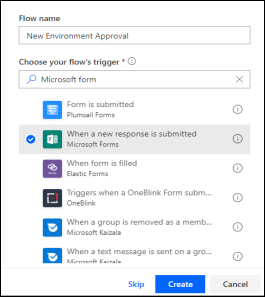
    
7. Select the **New Environment Approval Request** form you created and click **+ New Step**.

    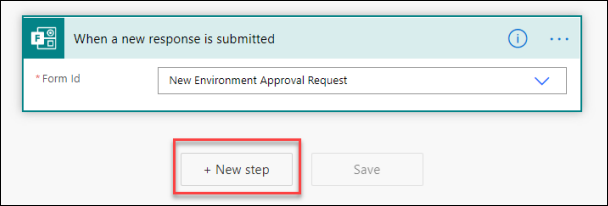
    
8. Search for **Microsoft Forms** and select **Get Response Details**.

    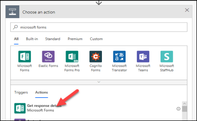
    
9. Select **New Environment Approval Request** for **Form Id** and click on the **Response Id** field.

    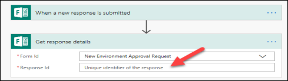
    
10. Select **Response Id** from the Dynamic content pane.

     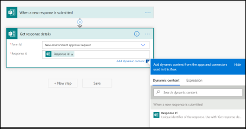
     
11. Click **+ New step**.
12. Search for **Approvals** and select **Start and Wait for an Approval**.

     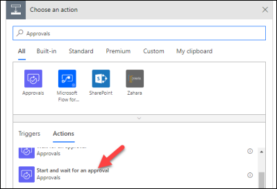
     
13. Select **First to Respond** for **Approval Type**.

      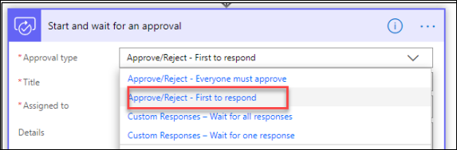
      
14. Enter **Environment Approval Requested** for Title.
15. Select the user you are logged in as for **Assigned to**.
16. Type **New Environment was requested by**: in the **Details** field.
17. Select **Responders’ Email** from the Dynamic content pane.

      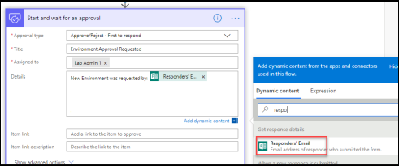
      
18. Hit the enter key and type **Environment Name**: and select **Environment Name** from the Dynamic content pane.

     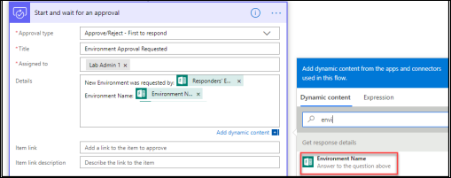
     
19. Hit the enter key again and type **Business Justification**: and select **Business Justification** from the Dynamic content pane.

     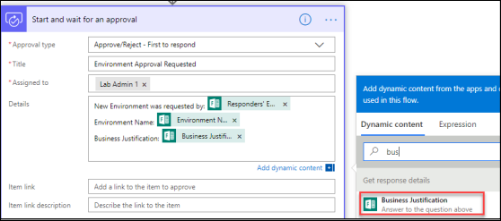
     
20. Hit the enter key again and type **Connectors**: and select **What connectors will you use?** from the Dynamic content pane.

     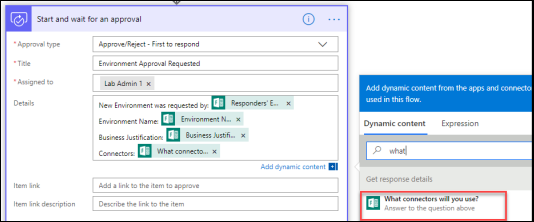
     
21. Click **+ New step**. 
22. Select **Condition** Control.

     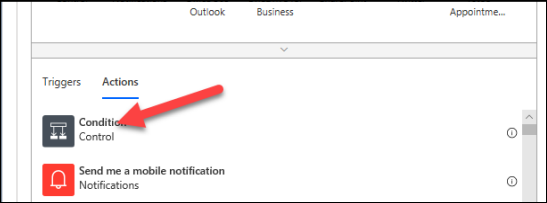
     
23. Click on the Choose a value field and select **Outcome**.

     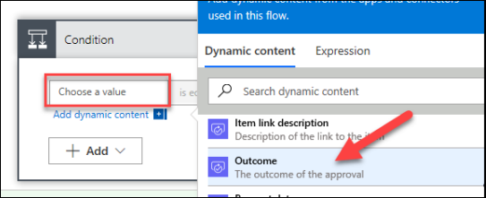
     
24. Enter **is equals** to for condition, enter **Approve** for value, and click **Add an action** in the **Yes** branch.

     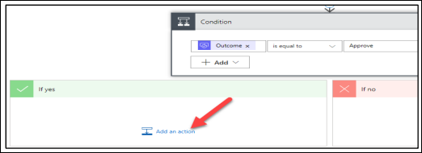
     
25. Search for **Power Platform** and select **Power Platform for admins**.

     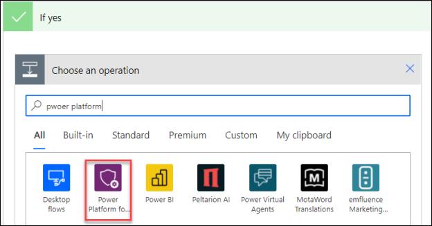
     
26. Select **Create Environment**.

     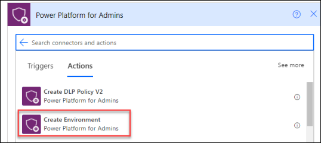
     
27. Select **United States** for the **location** and click on the **Display Name** field.

    Note: Location determines the region for the environment, in a real process you might allow this to be auto determined by the user location or something the                 requester provides.
    
28. Select **Environment Name** from the Dynamic content pane.

      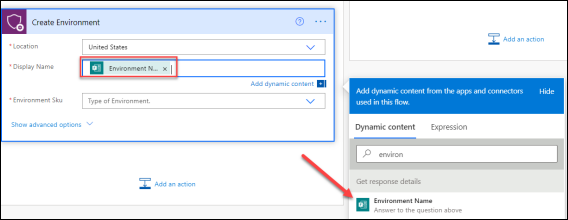
      
29. Select **Trial** for **Environment Sku**. 
30. Click **Save**. Do not navigate away from this page.

### Task 3: Create Database and Notify User

1. Click **Add Action** under **Create Environment**.

     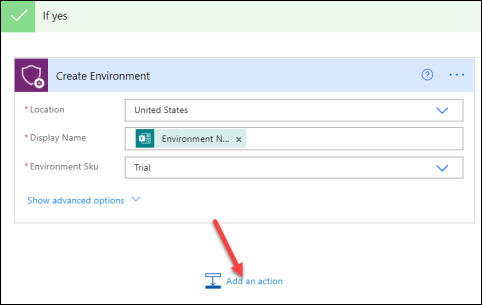
     
2. Search for **Power Platform** and select **Create CDS Database**.

    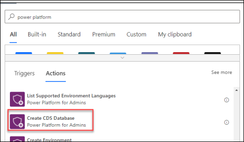
    
3. Click on the **Environment Name** dropdown and select Enter **Custom Value**.

     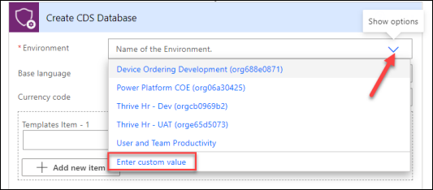
     
4. Select **Name** from the Dynamic content pane.

    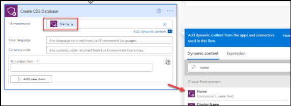
    
5. Enter **1033** for Base Language and enter **USD** for Currency Code.
6. Enter **D365_CDSSampleApp** for Template Item.
7. Click **Add an action**.

     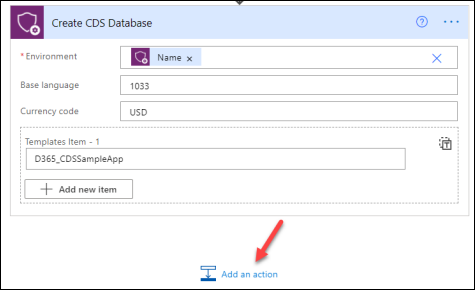
     
8. Search for **Send Email** and select **Send an email (V2) Office 365 Outlook**.

    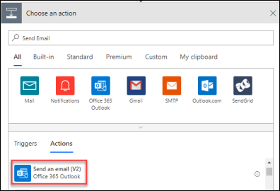
    
9. Click on the **To:** field and select **Responder’s Email** for the Dynamic Content pane.
10. Enter **Your environment was created** for **Subject**.
11. Enter **Environment** in the **Body** field and select **Display Name** from the Dynamic Content pane under the **Create Environment** step.
12. Add **was created**.
13. Your email should look like the image below.

     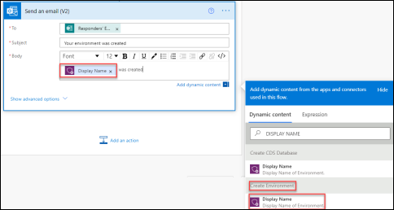
     
14. Go to the **No** branch and click Add an Action.
15. Search for Send email and select **Send an email (V2) Office 365 Outlook**. 
16. Click on the **To:** field and select **Responder’s Email** from the Dynamic Content pane.
17. Type **Rejected environment request** for **Subject**. 
18. Enter **Your request for new environment was rejected** in the **Body**. 
19. Your email should now look like the image below.

     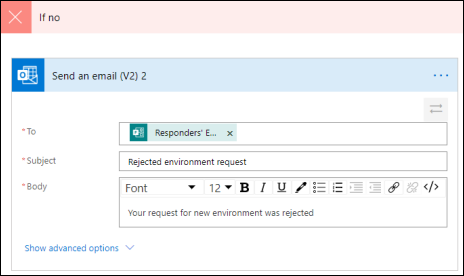
     
20. Click **Save**.

     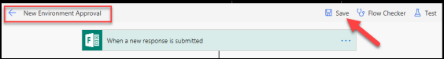
     
21. Click **Flow Checker** and make sure there are no errors.

     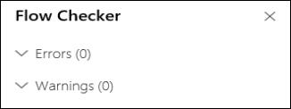
     
22. Close the **Flow Checker** pane.
23. Click on the **Back** button. 

     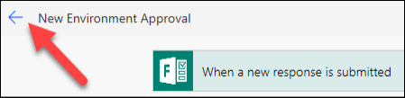
     
### Task 4: Test the Flow

1. Navigate to Microsoft Forms and click to open the form you created.

      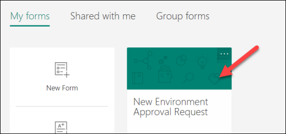
      
2. Click **Share** and **Copy the link**.

     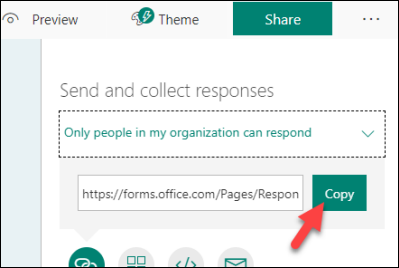
     
3. Paste the link in the browser and navigate to it.
4. The form should load. Provide an Environment Name of **Central Apps Test**, Business Justification,and the connector Microsoft Dataverse. Note: For the purposes of    this course, we will be using this environment we created here later in another lab to deploy the Device Ordering solution using  Azure Dev Ops, for that lab it        will serve as the Test environment that is why we are suggesting naming it Central Apps Test. In real word use, most likely it would be a team/project development 
   environment that would be requested using a form like this.
5. Click **Submit**.

     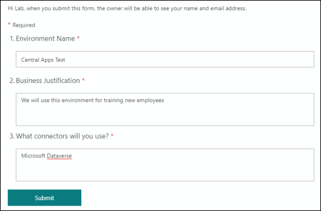
     
6. Go back to **My flows** list and open the flow you created.

     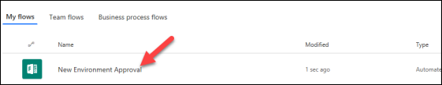
     
7. You should see the flow running. Click to open it.

     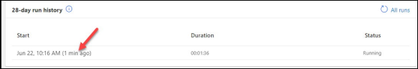
     
8. The flow is waiting for the approval.

     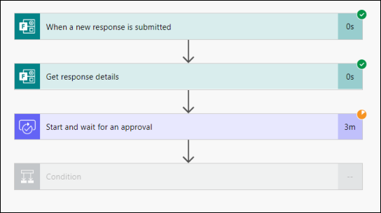
     
9. Start a new browser tab and navigate to Outlook. 
10. You should have approval request email, click to open it.

     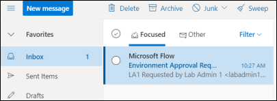
     
11. Click **Approve**. 

     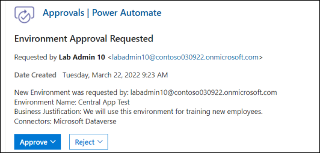
     
12. Click **Submit**.
13. Go back to the flow browser tab.
14. The flow should succeed.

     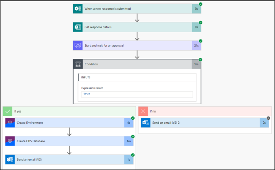
     
15. Navigate to Power Platform admin center and select Environments. The new environment should be listed there.

     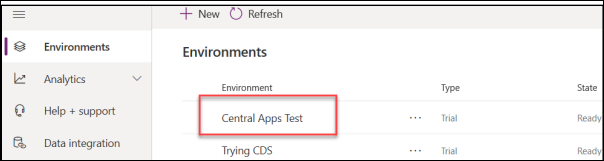
     
16. You should also get an email.

     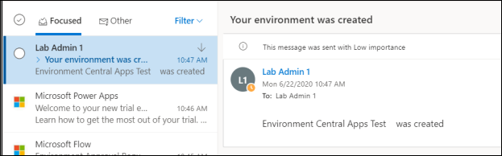
     
17. You may test for request rejection if you like.

## CoE Environment Management Sample Implementation

The CoE starter kit includes a sample implementation of an environment management process you can tailor to your own needs. The following diagram illustrates the high level process.

   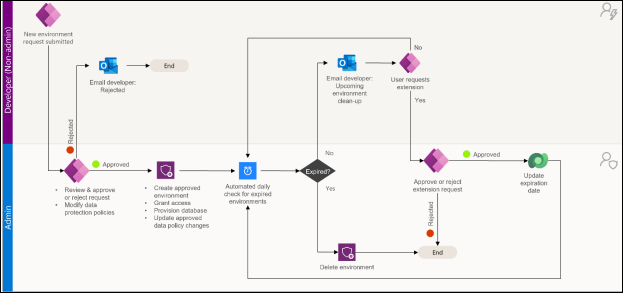
   
You can learn more about the details in How to use the Environment Management components - Power Platform | Microsoft Docs

Using the starter kit process can save you time, but as you saw in Exercise 1 and 2 the platform also supports you building your own custom processes. 

## Exercise 3: Application Compliance Process

In this exercise, you will be walking through the application compliance process that has been put in place 
using the CoE Starter Kit. As part of this you will be playing both the role of the application developer and 
the administrator seeing both sides of the process. 

The goal of this process is to help IT that doesn't know what all these apps are intended for or how to 
support individual apps when the helpdesk is called, and it's unclear whether all the apps are being 
maintained to any standard. They can see details like the description and number of shared users from the 
Power Apps for Admins connector, but they need to communicate directly with the app owner to fully 
understand the situation around the apps. Especially in a large organization, it's not feasible for the IT 
team to be responsible for manually reaching out to each app owner individually, and those details can't 
be stored in email conversations. 

To automate this, a flow **Admin | Compliance Detail Request** is used to iterate through all the apps in 
the tenant and check whether the apps are compliant. If the owner hasn't submitted a business 
justification and the app was shared broadly (in this example, with more than 20 users or at least one 
group), the flow sends the owner an email to notify them that their specific app isn't in compliance with 
policy. The email contains a link to the Developer Compliance Center canvas app, where the owner can 
provide the business justification details in a form submission. The Developer Compliance Center app also 
contain details about the compliance thresholds and has links to the app settings, so the owner can 
configure the description and republish if needed.

This app auditing sample process showcases how your CoE department or IT administrators can automate 
an auditing process on an app-level basis to gather additional information about an app, like business 
justification and the impact of an outage, from the maker

### Task 1: Complete Developer Compliance 

In this task you will be performing the role of the developer and completing the application information that will be requested by the automated process.

1. When the full process runs the maker will receive an email like the following, with a link to the Developer Compliance Center. For our exercise, we will briefly        review and then we will launch the app from the maker portal.

     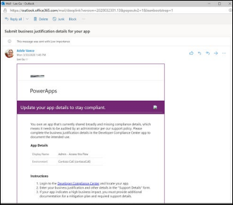
     
2. Navigate to the maker portal.
3. Select the **User and Team Productivity** environment.
4. Select **Apps**.
5. Select the **Lab Admin** # application where # is your user number.
6. Click **Edit**.
7. Click **File** and select **Settings**.

     
     
8. Provide **Description** and close the settings.
9. Click **File** again and then click **Save**.
10. Click **Publish**.
11. Select **Publish this version** and wait for the publishing to complete.
12. Click on the **** button.
13. Go back to the maker by clicking on the ** Back** button.
14. Switch to the **Power Platform COE** environment.
15. Select Apps and launch the **Power Platform Admin View** app.
16. Select PowerApps and open the **Lab Admin X** app, where X is your lab user number.
17. Select **Requested** for **Admin Risk Assessment State**.

      
      
18. Close the **Power Platform Admin View** application.
19. Launch the **Developer Compliance Center** app.
20. The application will list all the apps that you are the owner of. The red circle indicates the apps current level of compliance. 
21. You should see at least one app that has the name lab admin and your number. Click on the **Details** button.

      

22. Review the App Compliance section which gives clear guidance on what needs to be updated

      
      
23. In the Support Details section fill in all the fields with information about your application, you can make it as detailed as you want but submit information for       each field in this section.
24. Normally we would also go adjust the description by editing the app, but for the purposes of this lab will skip that.
25. Click the **Submit button** to save the information about the application.

### Task 2: Admin Review

In this task you will be performing the administration review of the application details that was submitted by the developer.

1. In the maker portal, with **Power Platform CoE** environment selected click on Apps.
2. Launch the **Power Platform Admin View** app.
3. Select on **PowerApps** Apps in the left navigation and change the view to **Compliance – Requested**.

     
     
4. Locate your application it will be Lab Admin and your # and click on it to open it.
5. Click on **Validate Maker Business Requirements** in the process guide. This shows you the current stage of the review process and highlights the progress. Notice      it says the maker provided the business requirements. 

       
       
6. Review the information provided by the maker by clicking on the **Audit** tab.  

        
      
7. After reviewing you can advance the process to the next stage by clicking the Next Stage. 

        
       
8. In the Admin section change the Risk Assessment to Minor.
9. The process guide will now have either Mitigation plan as the active stage or Access risk depending on if the maker indicated the app is critical or not, click Next    Stage again to advance.
10. In the final stage you can choose a category for the app in the catalog and indicate if it was featured. Make your selections and then click Finish.
11. You have now completed the full review process. This is an example that is provided with the starter kit you can tailor the process to your own organization needs     including adding stages and steps to the process and requiring additional data from the maker.

## Exercise 4: Welcome New Makers (Optional if you have time)

In this exercise, you will be importing a pre-built flow that is designed to identify new app makers and 
welcome them by sending an email with some information for new makers. Additionally, the flow will add 
the user to an Office 365 group, so you have an easy way to communicate with all the makers in the 
company.

### Task 1: Create Office 365 Group

1. Navigate to Azure portal.
2. Select **Azure Active Directory**.

    
  
3. Select **Groups**. 

    
    
4. Click **+ New Group**.

     
     
5. Select **Microsoft 365** for Group Type, enter **Lab Admin Your# Makers** for Group Name, and click **Create**. 

        
     
6. Open the group after it gets created.

      
     
7. Select **Properties** and copy the **Object ID**. 

        
      
8. Paste the object ID to a notepad, you will need it in future step.

### Task 2: Import Flow

1. Navigate to Power Automate 
2. Make sure **Power Platform COE** environment is selected. Note: While we are using this here, in your own tenant you might do this in an admin focused environment      or where you have installed the CoE Starter Kit.

     
    
3. Select **My Flows** and click **Import**. 

      
     
4. Click **Upload**. 
5. Select the **Send Welcome Email** zip file and click **Open**. This will be in your lab resource files you downloaded named                                            SendWelcomeEmailToNewPowerAppsMakers_20190529192359.zip   

      
      
5. Click Configure for the flow.

     
     
6. Select **Create as new** and click **Save**.

       
      
7. Click **Configure** for **Power Platform for Admin Connection**.

      
      
8. Select the available connection and click **Save**.

        
      
9. Click Action for **Office 365 Outlook Connection**.
10. Select the available connection and click **Save**.
11. Click **Configure** for **Power Apps for Admin Connection**.

      
      
12. Click to select the available connection and click **Save**.

      
      
13. Click **Configure** for **Office 365 Group Connection**.
14. Click **Create new**.

      
      
15. Click **+ New connection**.

      
      
16. Search for **Office 365 Groups** and click **Add**.

        
      
17. Click **Create**.
18. Login with your maker credentials.
19. You should now have the connections listed in the image below. 

        
       
20. Go back to the Flow import.
21. Click **Refresh list**, select the connection you just added, and click **Save**.

      
      
22. Click Action for **Office 365 Users Connection**. 
23. Select the available connection and click **Save**. 
24. Repeat this for the **Office 365 Outlook Connection**. 
25. Click **Import** and wait for the import it to complete.

          
       
26. The flow should import successfully. 

       
      
### Task 3: Edit and Test Flow 

1. Navigate to the maker portal https://make.powerapps.com and select the **Central Apps Test environment**.
2. Select **Apps**. 
3. Click **+ New app** and select **Canvas**. 
4. Enter **Test app** for App name, select **Tablet** for format, and click **Create**. 
5. The app designer should open. Click **File** and then click **Save**. 
6. Click on the ** back** button.

     
     
7. Go back to the app maker main page by clicking on the ** Back** button.
8. Select **Solutions**. 
9. Click **Publish all customizations** and wait for the publishing to complete.
10. Navigate to Power Automate and select the **Power Platform CoE environment**.
11. Select **My Flows**. 
12. Locate the flow you imported and click **Edit**.

       
      
13. Expand the **Recurrence** and make sure the flow is set to run once a day.

      
      
14. Expand the **Office Group ID** step.
15. Clear the **current Group ID**. 
16. Copy the **Group ID** from your notepad and paste it here.

      

17. You may examine the steps of the flow.
18. Click **Save**. 
19. Click on the back button.

      
      
20. **Turn on** the flow.
21. Click **Run**.   

       
      
22. Click **Run Flow**. 
23. Click **Done**. 
24. Click **Refresh**. 
25. Your flow run should succeed. 

      
      
26. Go back to Azure portal 
27. Select **Azure Active Directory**. 
28. Select **Groups** and open the group you created.

      
      
29. Select **Members**. You should have at least one member.

       
      
30. Navigate to Outlook . 
31. You should get a welcome email. Open the email. If you don’t get an email, it is probably because you didn’t create an application in the past 24 hours, create a       new Power App and run the flow again.
 
      
