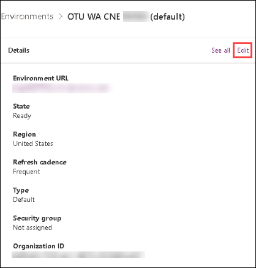
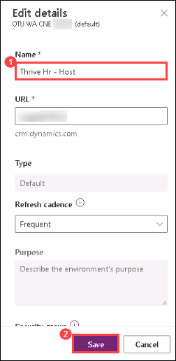

# Putting Governance in its Place


## M02-HOL-Managed Environments – Sharing Limits and Pipelines”


## Table of Contents


1. Exercise 1 - Managed Environment

   **Scenario**
   
   - Task 1: Upgrade Default environment to managed environment

   - Task 2: Share the Canvas App to users

2. Exercise 2 – Power platform Pipelines

   **Scenario**
   
   - Task 1: Install Power Platform Pipelines

   - Task 2: Configure a deployment pipeline
  
   - Task 3: Run the pipeline

        


## Exercise 1: Managed Environments

### Scenario

In this exercise, you will upgrade an environment to a Managed Environment. A managed environment comes with a suite of capabilities that allows admins to manage at scale with more control, more visibility, and less effort.”

### Task 1: Upgrade Default environment to managed environment

1. Go to the Power Platform admin center using your tenant administrator credentials (https://aka.ms/ppac).   
   
   a. Reminder: Your credentials are in the **"Environment Details"** tab.
   
      
    

2. Select **Environment (1)** tab from left panel and select the Default environment named **OTU WA CNE <inject key="Deployment ID" enableCopy="false"/> (2)** and select the three dots to 
   view all the ribbon options, then select **Enable managed environment (3)** to start the configuration process for this environment. .

       


3. Administrators seeking to create or edit managed environments must have the Global Administrator role, Power Platform Administrator role, or the Dynamics 365 admin Azure Active            Directory role. Delegated admins, or Environment Admins will not be able to enable or edit managed environments. At the top of the panel that appears, the system informs you that a 
   particular license is required in order to use the resources. While an unmanaged environment will allow users to interact with resources freely, a managed environment prevents them 
   from doing so if they do not have the correct license for the respective areas. To learn more about Managed Environment licensing, see [Licensing](https://nam10.safelinks.protection.outlook.com/?url=https%3A%2F%2Flearn.microsoft.com%2Fen-us%2Fpower-platform%2Fadmin%2Fmanaged-environment-licensing&data=05%7C01%7Cabhilash.r%40spektrasystems.com%7Cb66b4d860a32451dc5d308db9e70097d%7C6d7e0652b03d4ed2bf86f1999cecde17%7C0%7C0%7C638277976316671495%7CUnknown%7CTWFpbGZsb3d8eyJWIjoiMC4wLjAwMDAiLCJQIjoiV2luMzIiLCJBTiI6Ik1haWwiLCJXVCI6Mn0%3D%7C3000%7C%7C%7C&sdata=Kg6C6YSZI3XoOEQBG31SK5GDmoizIDP0XzYn67xfaY8%3D&reserved=0) and [Licensing overview for Microsoft Power Platform](https://nam10.safelinks.protection.outlook.com/?url=https%3A%2F%2Flearn.microsoft.com%2Fen-us%2Fpower-platform%2Fadmin%2Fpricing-billing-skus&data=05%7C01%7Cabhilash.r%40spektrasystems.com%7Cb66b4d860a32451dc5d308db9e70097d%7C6d7e0652b03d4ed2bf86f1999cecde17%7C0%7C0%7C638277976316671495%7CUnknown%7CTWFpbGZsb3d8eyJWIjoiMC4wLjAwMDAiLCJQIjoiV2luMzIiLCJBTiI6Ik1haWwiLCJXVCI6Mn0%3D%7C3000%7C%7C%7C&sdata=eRaW6iY%2FBo6V4wLptyfDFMObVLjKsEO%2BaOMHVGBA3GE%3D&reserved=0)”

    a. In Limit Sharing, choose **Exclude sharing with security group**s. Once this is enabled, you can restrict the users the app gets shared to.

    b. Select the **Limit individuals…** checkbox and set the limit number to **3**. 

    c. Set Solution Checker to **Warn**. This will validate any custom solutions being imported to the environment. 

    d. Leave the **Usage insights** checked. This item is selected by default. 

    e. For **Maker welcome content**, copy and paste the following into the text box: 

        
       ## Welcome to Contoso Power Apps 
       ### Let's get started with data 
       Before you start using Power Apps, please refer to our company guidance.
       1. **Get trained:** [Learning Videos]() and [training guides]() 
       2. **Contribute ideas:** Submit an idea for a new app or flow idea at [Suggestion box]() 
       3. **Learn from others:** [Top tips]() by expert makers at Contoso

      • This will be used to greet users when they log in or switch to the environment. This can either be written in plain text, or as Markdown, as seen above.

       

     f. Select **Enable** once completed

    

4. A green banner will appear at the top notifying you of the successful update..
  
    
  


### Task 2: Share the Canvas App to users


1. Go to the Power Apps Maker portal at https://make.powerapps.com.   
    
2. Make sure you are working in the default environment named **OTU WA CNE <inject key="Deployment ID" enableCopy="false"/>**.
   
   a. Your default environment is named differently from the one depicted in the screenshots.
   
      
    
3. Click on the **“Apps”** section of the left nav.

4. select the canvas app named **“DLP – Exercise 1 – Task 2” (1)** created previously and click on **share (2)**.

   
      
5. Search **Lab User01** and choose a user. 

   
     
6. Repeat this process two more times until you have three users to add and select **Share**.

   

7. A banner will appear at the top of the panel, which will show the sharing rules are enabled, and being enforced. This is because the owner is counted with the number of individuals the 
   app can be shared with.
   
          
     
8. Remove a user from the chosen users, then select **Share**.

   

9. Once complete, a banner should appear notifying you of the success. 

    


### Exercise 2: Power Platform Pipelines

### Scenario

Another feature of a managed environment is the ability to utilize the in-platform pipelines to democratize application lifecycle management (ALM) by bringing the ALM automation and 
continuous integration and continuous delivery (CI/CD) capabilities to the service. Included with these is the ability to view out of the box analytics within a central location and 
Power BI reports. Pipelines can deploy solutions, connections, connection references, and environment variables to environments of the same region as the host environment.

#### Task 1: Install Power Platform Pipelines


1. Navigate to Power Platform admin center by using below URL and select environments if not already opened.

    ```
    https://admin.powerplatform.microsoft.com/environments
    ```

2. For this lab, we will use this structure for our environments, following the guidelines for Application Lifecycle Management (ALM).

     | Pipeline Stage | Environment Name | Type |
     | -------------- | ---------------- | ---- |
     | Host           | OTU WA CNE <inject key="Deployment ID" enableCopy="false"/> | Default |
     | Development    | Thrive Hr - Dev  |  Sandbox |
     | Test           | Thrive Hr - Test | Sandbox |
     | Production     | Thrive Hr- prod  | Production |
   

  
  >*Note:* Host Environments act as storage and management for pipeline configurations, run histories, and security settings. Should this environment be deleted, all pipelines and run        data will be deleted as well and cannot be recovered. Host environments can only have development and target environments that exist within the same region as the host environment. For 
  this reason, some tenants may have multiple host environments.
  

3. Select **OTU CNE** to open a detailed view for the environment.

    

4. In the **Details** pane, select **Edit.**

    
  
5. Clear out the existing name and replace it with **Thrive Hr - Host (1)** to remain in line with the naming convention of the other environments and select **Save (2)**.

    


6. To finish up the setup, you will need to enable managed environments for each of the associated environments in the pipeline. Navigate back to the **Environments** page with the
   breadcrumbs at the top or the left side navigation.

    

10. Select the circle next to **Thrive Hr - Dev (1)** and select **Enable Managed Environment (2)**.

    

7. For the purposes of this lab, we will not be configuring each of the associated environments for other features (e.g., Limit Sharing, Usage insights, etc.). Select **Enable** at the       bottom of the panel.

    

8. Repeat this process for **Thrive Hr - Prod** and **Thrive Hr - Test** environments in the setup .

9. Now, you need to install the pipelines app onto the host environment. In the Resources Panel, select **Dynamics 365 apps.** A list of apps currently installed for the environment will     appear.
  
    

10. Select **Install App** from the ribbon at the top.

     

11. Scroll down to locate **Power Platform Pipelines (1)** and select the name, then click on **Next (2)**.

    

12. Select the **checkbox (1)** to agree to the Terms of Service, then select **Install (2)**.

    

13. Confirm that the app is being installed onto the environment by checking that the **Status** reads as **Installing**.

    

14. **Do not navigate away from this page.**


#### Task 2: Configure a deployment pipeline


##### 1A: Add the environments to the database.

1. While waiting for the app to install, you'll need to gather the environment IDs of all development and target environments that will be linked to the pipelines.

2. To do this, navigate back to the **Environments** page of the Power Platform Admin site from the left-side navigation.

   

3. Select the **... (1)** to the right of to **Thrive Hr - Dev** , then select **Detailed View (2)** to get the environment information.

   

4. Locate the **Environment ID** in the details pane and copy it to a notepad for later.

   

5. Repeat this process with **Thrive Hr – Test** and **Thrive Hr – Prod** , copying the IDs to the same notepad.

6. Navigate to Power Apps and set the environment to the **Thrive Hr – Host** environment.

   

7. Navigate to **Apps (1)** and select **Deployment Pipeline Configuration (2)**, then select **Play** from the ribbon at the top.

   

8. Select **Environments (1)** on the left pane, and then click on **+ New** symbol.

   

9. You’ll need to add the Dev, Test, and Prod environments as our deployment environments to create the environment records in Dataverse:

    a. Name : **Thrive Hr - Dev (1)**

    b. Environment Type : **Development Environment (2)**

    c. Environment Id : Paste the **Environment ID (3)** you copied from earlier here.

     

10. Select **Save**.

    

11. Select **Save and Close**.

    

12. **Refresh (1)** the form, then verify **Validation Status** equals **Success (2)**.

    

13. Repeat steps 3-11 for **Thrive Hr - Test** and **Thrive Hr - Prod,** setting the type as **Target Environment** respectively.

14. You should have three environments listed now.

    


##### 1B. Create a pipeline.


1. Select **Pipelines (1)** on the left navigation pane, and then select **+ New (2)** to create a new deployment pipeline.

   

2. Set the **Name** to be **Thrive Hr Standard Deployment Pipeline (1)** and select **save (2)** to show the rest of the content available..

   

3. Now we need to add the environments we've created to the pipeline. In the **Linked Developments** section, Select **Add Existing Deployment Environment**.

   

4. Select the **Thrive HR - Dev** to add the environments to the list and clcik on **Add**.

   

5. Locate the **Deployment Stages (Deployment Pipeline)** section, select **New Deployment stage.**

   

6. Set the **Name** to **Deploy to Test (1).**

7. Set the **Description** to **Deploy the completed development content to the Test phase (2).**

8. Since this is the first stage of our deployment, the **Previous Deployment Stage** field will be left
    blank for this one.

9. Set the **Target Development Environment** to the **Thrive HR - Test (3).**

10. Leave the predeployment condition unselected. To learn more about predeployment conditions,
    follow this link.

11. Confirm that your setup reflects the image below.

    

12. Select the arrow next to **Save and Close** and select **Save and Create New.**

    

13. Set the **Name** to **Deploy to Prod (1).**

14. Set the **Description** to **Deploy the completed development content to the Production phase (2).**

15. Set the **Previous Deployment Step** to **Deploy to Test (3)**

16. Set the **Target Development Environment** to the **Thrive HR - Prod (4).**

17. Select **Save and Close (5)**.

18. Confirm that your setup reflects the image below.

    

19. Do not navigate away from this page.


#### Task 2: Run the pipeline

1. Navigate to Power Apps in a new tab.

2. Ensure you are in the Thrive HR - Dev environment at the top right.

   

3. Select **Solutions (1)** from the left-side navigation, then select **Import Solution (2)** from the ribbon at the top.

   

4. Select Browse and locate  **PipelineExample_1_0_0_1.zip** in **Labfiles**

5. Select **Next.**

6. Review the details and select **Import**. This is the solution we will be deploying through our pipeline. Any solutions sent through a pipeline must be unmanaged.

   

7. Once the solution has been imported, select it from the available solutions.

   

8. Select **Pipelines** from the left side navigation. From here we can view the current deployment stage, and what stage we will be deploying to next.

   

9. Select **Deploy here**.

    

10. This is where you can schedule deployments or deploy immediately. Set the deployment schedule to **Now** and select **Next.**

    

11. Add any appropriate deployment notes and select **Deploy.**

    

12. The solution is now being processed, validated, and deployed to the Thrive Hr - Test environment.

    

13. Once the deployment is complete, the option to deploy to production appears. Select **Deploy** **here** for the **Deploy to Prod** stage.

    

14. This time, we'll schedule the deployment. To do so, select **Later** from the radial menu, and set the deployment time closest to your current time (ex. Your current time is 4:53 PM, 
    select 5:00  PM. then select **Next.**

    

15. Review any details and optionally add deployment notes, then select **Deploy.**

16. If needed, administrators can change the time of or cancel a deployment from this screen by selecting the **Cancel Deployment** button, or by selecting the Run History tab, and 
    selecting the three dots next to the Start time. From here, you can also view the run information, such as any notes or comments.

    

     


17. Administrations can also make changes to the run record from the Deployment Pipeline Configuration app, such as altering the starting time and deployment notes. Return to the 
    **Deployment Pipeline Configuration App** in the host environment and select **Run history**.

    

18. Select the scheduled deployment and select **Edit** at the top right.

    

19. Locate the **Scheduled Time** and select the clock next to the selected time.

    

20. Select the new time, and then select **Save and Close.**

    

    

 
 **Congratulations!** You have completed this portion of the workshop.

