### Lab Scenario

In this hands-on lab, you will be an environment administrator for Fabrikam helping to adopt the Power Platform. You have been assigned responsibility for ensuring that Fabrikam’s employees are able to build Power Apps applications and flows using Power Automate to help them be productive. At the same time, you are expected to ensure that Fabrikam’s data and security policies are followed.
Some of Fabrikam’s employees have already started experimenting with the Power Platform so your first task is to get an understanding of what is already in use.
Next, you will be taking steps to put some baseline security policies in place to implement Fabrikam’s data and security policies.  

## 1.	Understand the basics of security and administration 

### 1.1.	Azure Identity and Access Management 
Azure Active Directory (Azure AD) is a cloud-based identity and access management service that authenticated Power Platform experiences rely on. 

## Exercise #1 – Explore existing Power Platform usage. 
TODO – recycle Exercise #1 from this admin in a day workshop.

## Exercise #2 - Specify which users may operate in an environment. 

### Scenario: 
In this exercise, you will audit Production environments to see which have security groups bound to them, controlling which users can operate in the environment, and create a new environment bound to a new security group.

### Task 1: Review existing environments
1.	Logged in with the Lab Admin account in an in-private browser session navigate to https://aka.ms/ppac  and select Environments.
1.	Review the list of environments. These are the environments that are available for you to manage.
    
      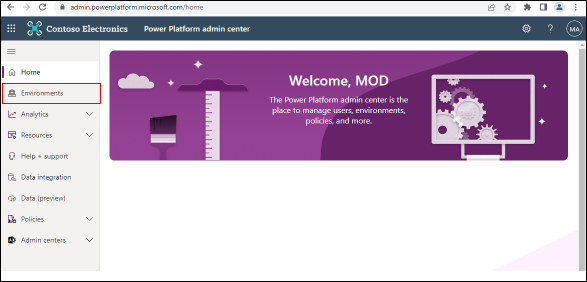
      
1.	Select an environment to see more details.

      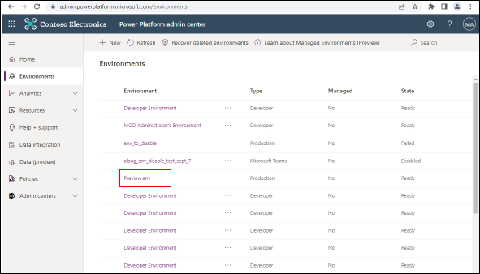
      
1.	Note, Dataverse must exist in an environment to associate a security group to the environment. Environments with Dataverse will present details similar to the image below. The Security group property indicates what, if any, group is associated with the environment.

      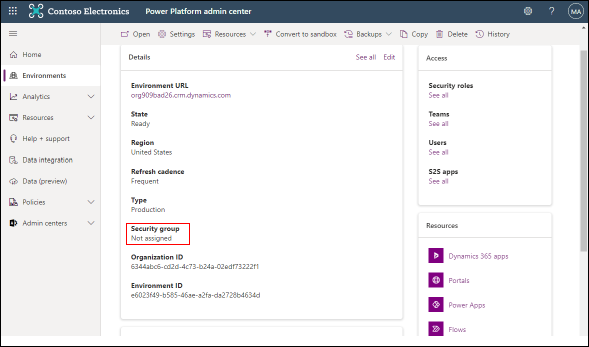
      
### Task 2: Add a security group to an existing environment
1.	There are two views for environment details: environment details when Dataverse exists and environment details when Dataverse does not exist. 
1.	If Dataverse does not exist, click + Add database.

      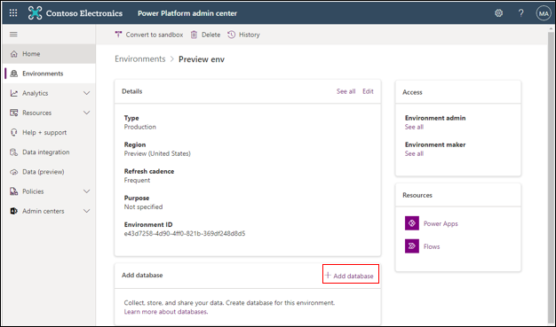

1.	If Dataverse exists, click Edit.

      

1.	In the edit details panel, click the ‘edit’ icon in the security group section.

      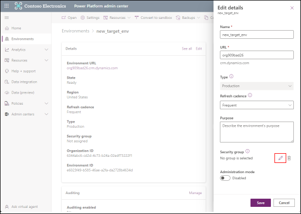

1.	Select your preferred security group (managed in Azure Active Directory). 

      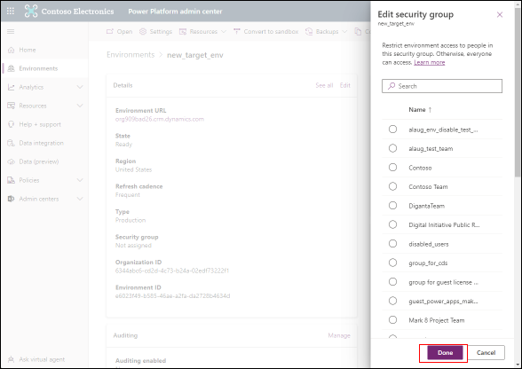

### Task 2: Create a new environment with a security group.  

1.	Logged in with the Lab Admin account in an in-private browser session navigate to https://aka.ms/ppac  and select Environments.

      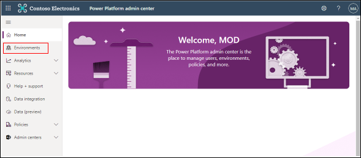
      
1.	Select + New.

      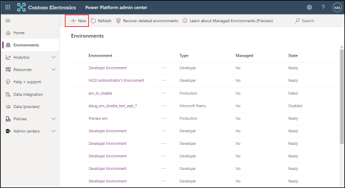

1.	In the New environment panel, toggle Create a database for this environment to Yes.

      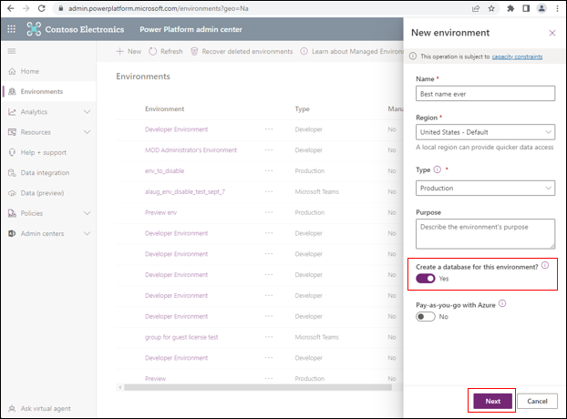
      
4.	In the Add database panel, click + Select to associate a security group to the environment.

      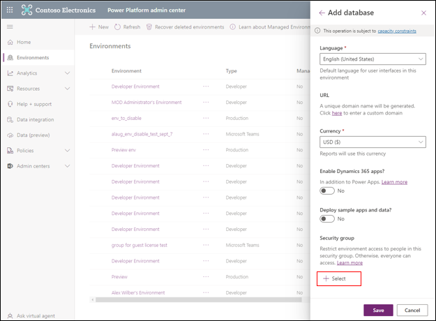
      
5.	Select your preferred security group (managed in Azure Active Directory). 

      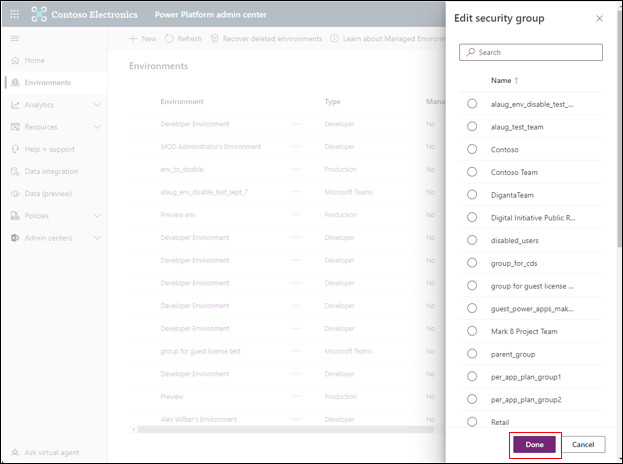
      
 ### 1.2.	Conditional Access 

Conditional Access policies at their simplest are if-then statements, if a user wants to access a resource, then they must complete an action. Example: A payroll manager wants to access the payroll application and is required to perform multi-factor authentication to access it. Administrators are faced with two primary goals: - Empower users to be productive wherever and whenever - Protect the organization's assets By using Conditional Access policies, you can apply the right access controls when needed to keep your organization secure and stay out of your user’s way when not needed. Conditional Access policies are enforced after the first-factor authentication has been completed

## Exercise #1 – Apply a Conditional Access policy to all Power Apps 

The following Conditional Access policy will apply to experiences users access in https://make.powerapps.com (an experience for users to make apps) and https://apps.powerapps.com (an experience for end users to play apps). 

### Task 1: Create a Conditional Access policy requiring Multifactor authentication to access Power Apps

1.	Logged in with the Lab Admin account in an in-private browser session navigate to https://portal.azure.com.

     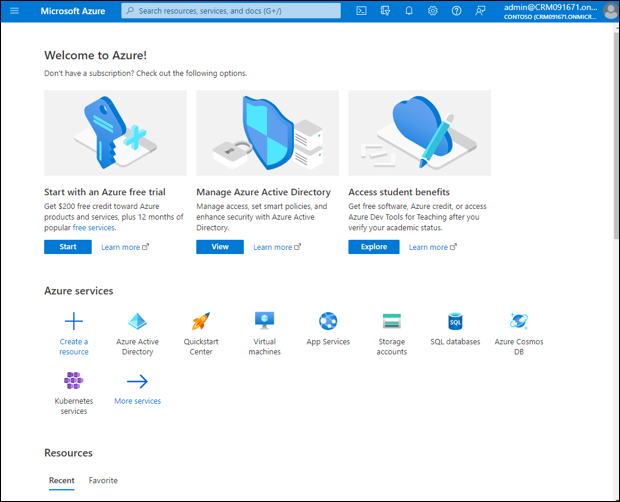
     
2.	Search for Azure AD Conditional Access.

     
     
3.	Select + New policy.

     
     
4.	Type a name for the policy 
5.	Select 0 users or workload identities selected under Users or workload identities. 

     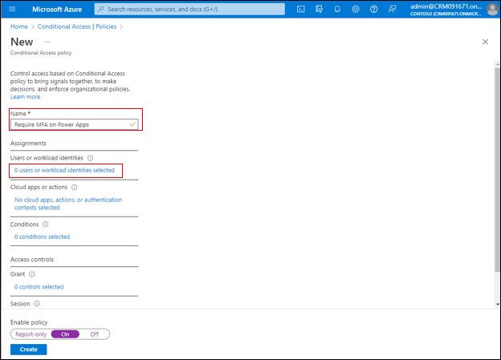
     
6.	Specify the users or groups you want this policy to be applied to. For this exercise, we’ll target all users in the tenant. 

     
     
7.	Select No cloud apps, actions, or authentication controls selected in the Cloud apps or actions subsection. 
8.	Apply this policy to Cloud apps.
9.	Set the Select apps radio button to apply this policy to a specific app. 
10.	In the Select panel that appears, search for PowerApps and select Microsoft PowerApps.
11.	Click the Select button in the Select panel.

     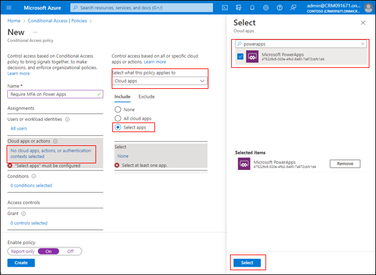
     
12.	Under the Grant section, select 0 controls selected.
13.	Set the Grant access radio button and check the Require multifactor authentication checkbox.
14.	Click the Select button in the Grant panel.

     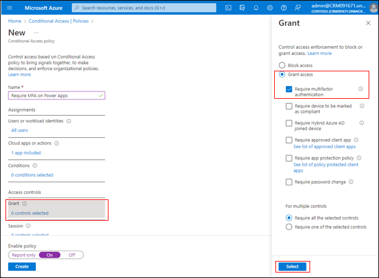
     
15.	Under the Enable policy section, set the toggle to On.
16.	Select Create under the Enable policy section. 

     
     
17.	Close the browser session. 
18.	Open a new InPrivate browser session and navigate to https://make.powerapps.com.
19.	Follow the Multifactor authentication dialog. 

     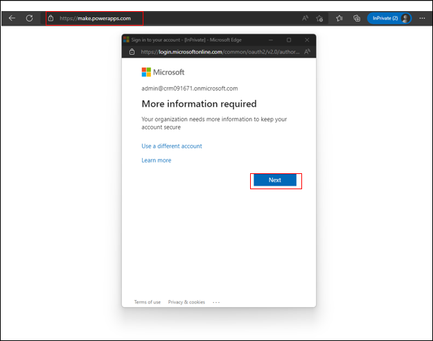
     
20.	Observe that passing the Multifactor authentication dialog then leads a user to the experience. 

     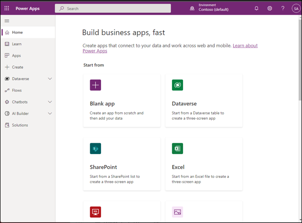

22.	Feel free to go back to https://portal.azure.com > Azure AD Conditional Access > and turn this policy off or set it to report only. 

## Exercise #2 – Apply a Conditional Access policy to specific Power Apps 
Note, this exercise use two preview capabilities: 
i.	Conditional Access authentication context
ii.	Conditional Access on individual apps in Power Apps 

### Task 1: Create a Conditional Access authentication context

1.	Logged in with the Lab Admin account in an in-private browser session navigate to https://portal.azure.com.

      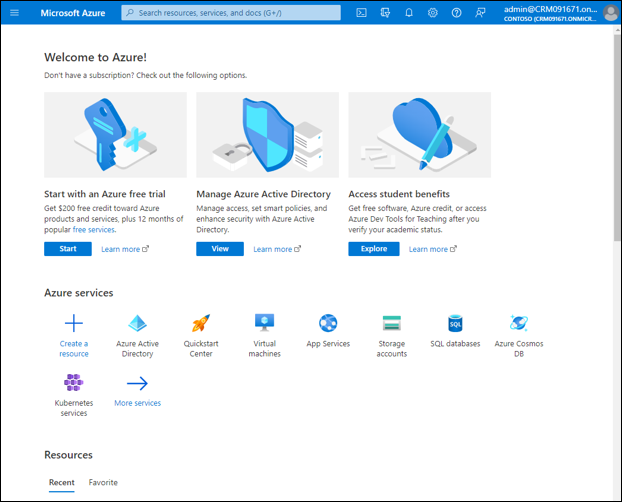
      
2.	Search for Azure AD Conditional Access.

      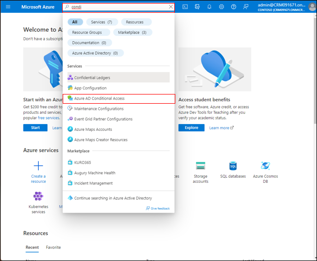
      
3.	Select Authentication context (Preview) in the left hand navigation and then select + New authentication context.

     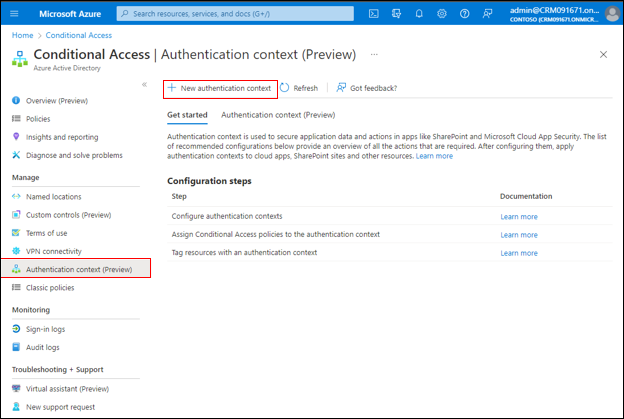

4.	In the Add authentication context panel, provide a name for the authentication context. For this example you can use “Strong authentication”. 
5.	In the Add authentication context panel, take note of the ID.
6.	Save the authentication context. 

     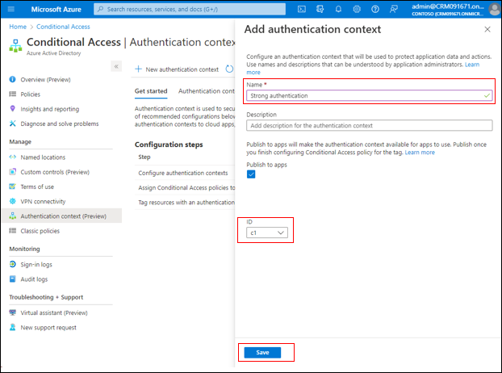
     
### Task 2: Create a Conditional Access policy applied to an authentication context

1.	Logged in with the Lab Admin account in an in-private browser session navigate to https://portal.azure.com.

      
      
1. Search for Azure AD Conditional Access.

      
      
9.	Select + New policy.

      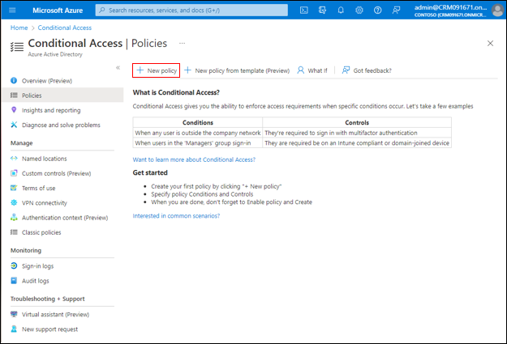
      
10.	Type a name for the policy 
11.	Select 0 users or workload identities selected under Users or workload identities. 

      
      
12.	Specify the users or groups you want this policy to be applied to. For this exercise, we’ll target all users in the tenant. 

      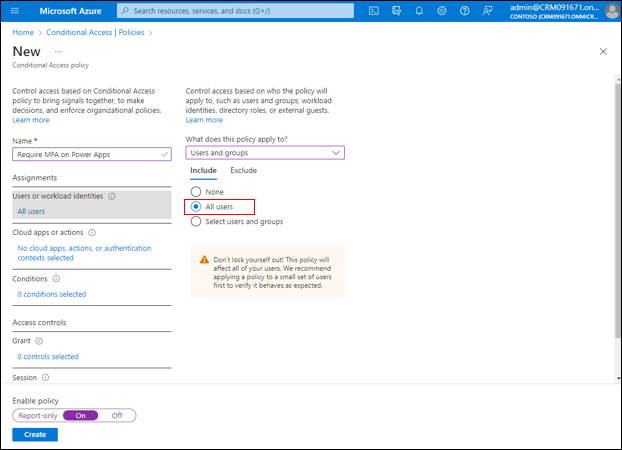
      
13.	In the Cloud apps or actions section, change the dropdown value under Select what this policy applies to to Authentication context (preview).

      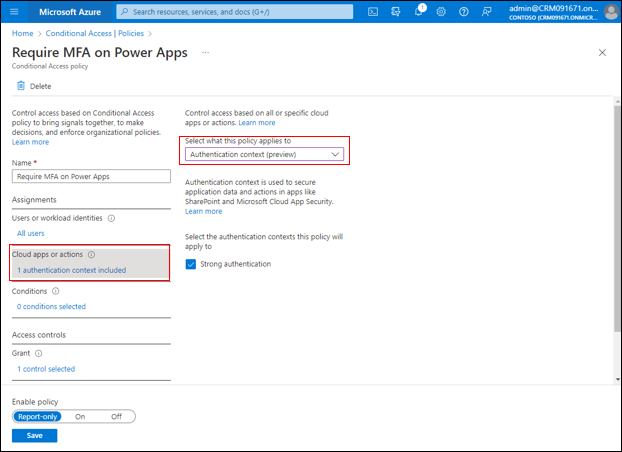

14.	Under the Grant section, select 0 controls selected.
15.	Set the Grant access radio button and check the Require multifactor authentication checkbox
16.	Click the Select button in the Grant panel.

      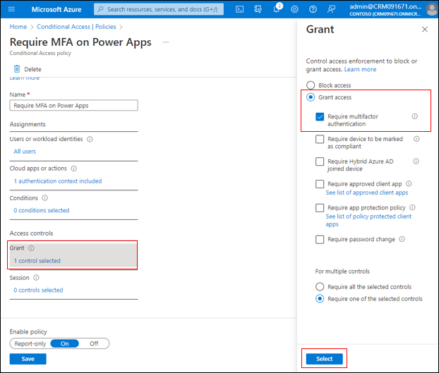
      
17.	Under the Enable policy section, set the toggle to On.
18.	Select Create (or Save) under the Enable policy section.

     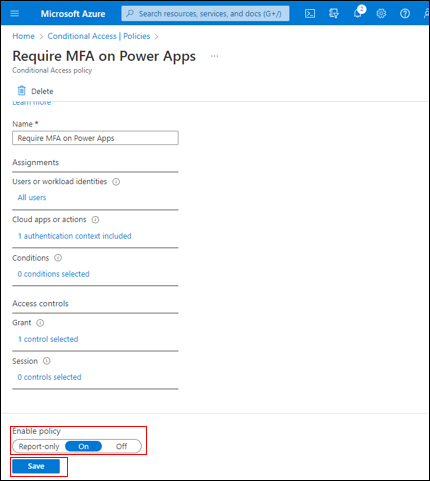
     
### Task 3: Add a Conditional Access authentication context to a specific canvas app

1.	Logged in with the Lab Admin account in an in-private browser session navigate to https://aka.ms/ppac  and select Environments.
2.	Review the list of environments. These are the environments that are available for you to manage.

     
     
3.	Select an environment to see more details.

     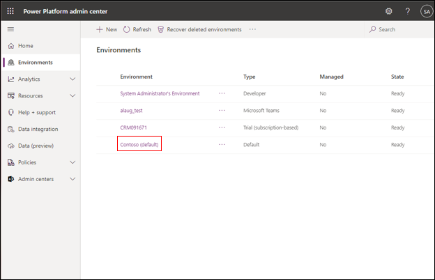
     
4.	Select Power Apps in the Resources pane. 

     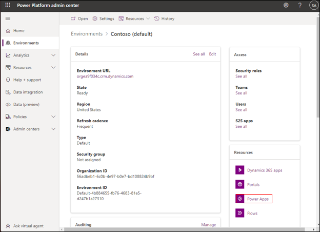
     
5.	For the canvas app you’d like to apply the Conditional Access policy, select the ellipses (…). 
  
     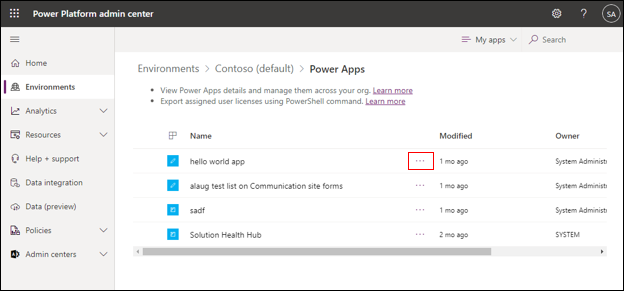
     
6.	From the URL and app details pane you can retrieve both the environment id and app id. The environment id can also be retrieved from the environment details page. 

     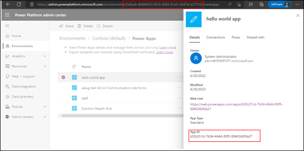
     
7.	Open PowerShell and run the following command to set the authentication context on the app.  
Set-AdminPowerAppConditionalAccessAuthenticationContextIds –EnvironmentName <EnvironmentName> -AppName <AppName> -AuthenticationContextIds <id1, id2, etc...>
Here’s an example using the values from the screenshots above.
Set-AdminPowerAppConditionalAccessAuthenticationContextIds –EnvironmentName Default-4b884655-fb76-4683-81e5-d247b1a27310 -AppName bf2b251d-7b04-464d-80f5-8840360f2e27 -AuthenticationContextIds c1

     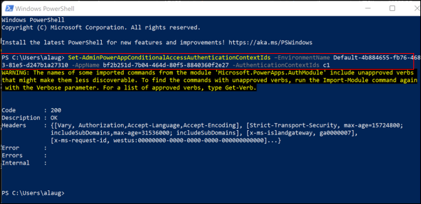
  
8	Close the browser session. 
9	Open a new InPrivate browser session and attempt to launch the app (this can be done from https://make.powerapps.com or directly from the app link). 

     
     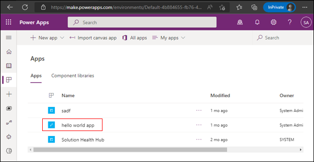
  
10.	Follow the Multifactor authentication dialog.
  
     
  
     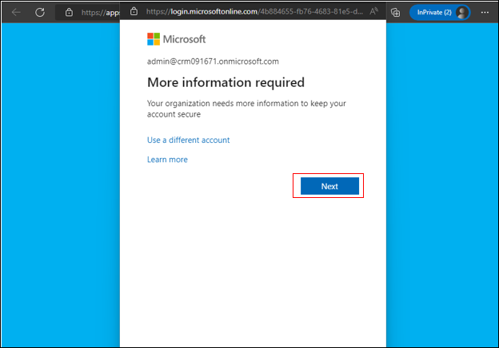
