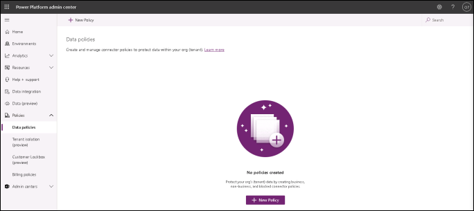

# Admin in a day

## M01-HOL-Securing your tenant

## Table of Contents

**Lab theory** 

**Lab test environment**

1. Exercise 1 - Baseline data policy for the entire tenant

   **Scenario**
   
   - Task 1: Create the "Baseline data policy" 

   - Task 2: Test the new "Baseline data policy" when building a canvas app 

2. Exercise 2 – Reinforcing the default environment

   **Scenario**
   
   - Task 1: Create the "Default data policy"

   - Task 2: Test the new "Default data policy" when building a canvas app 

3. Exercise 3 – Empowering your pro developers

   **Scenario**
   
   - Task 1: Create the "Pro dev data policy"
   
   - Task 2: Test the new "Pro dev data policy" when building a cloud flow 

   - Bonus task: Enable the HTTP connector with endpoint filtering (public preview) 

## Lab theory

Power Platform has a large ecosystem of that enable your Makers to connect their applications, automations, websites, and chatbots to more than 800 data sources, services, and devices - either on-premises or in the cloud. Your Makers will use these connectors day-to-day to build what they need to solve their business problems. At times, it can be easy for your Makers to overlook important considerations such as the security of your organization's data.

Thankfully, Power Platform's allow you as administrators to control what connectors are available to your Makers and how they can us act as guardrails to help prevent Makers from unintentionally exposing your important business data. These data policies are configured in the Power Platform admin center and are a fundamental tool of the administrator's toolbox. Tenant administrators can create data policies which protect the entire tenant whereas environment administrators can create data policies strictly for the environments they administer. In both cases, Makers working in the target environment(s) will have to respect the rules put forth in your data policies. In today's workshop, you will play the role of a tenant administrator for a new customer seeking to establish their first data loss prevention strategy.

## Lab test environment

Please use the unique tenant and the user credentials provided to complete the following 3 exercises.

 •  Registration URL: https://bit.ly/3TVhk9u 

 •  Activation code: ACTIVATE25983           

## Exercise 1: Baseline data policy for the entire tenant

### Scenario

Your first objective as a tenant administrator is to establish a first layer of governance for your entire organization. To do so, you will create a data policy that applies to all environments (both existing and future environments). This data policy will require your Makers to build their canvas apps and cloud flows exclusively with connectors that are published by Microsoft (there are more than 250 of them), not from external 3rd parties. Connectors that are created by external 3rd parties are incredibly valuable, but you will want to review them beforehand because they have not been built by Microsoft. Keep in mind that the process of creating a new connector is a rigorous and safe one regardless of its origin.

Environments and data policies before exercise #1:

  

Environments and data policies after exercise #1:

  

### Task 1: Create the "Baseline data policy"

 1.   Go to the Power Platform admin center using your tenant administrator credentials (https://aka.ms/ppac).   
    
        a. Reminder: Your credentials are in the"Environment Details" tab.

       
  
  

2. Enter the "Data policies" page under the "Policies" section of the admin center's left nav.
   
3. Click "New Policy" in the top command bar to create your first data policy.
    
  
     
  

4. In the "Policy name" section of the wizard, name your data policy as follows: "Baseline data policy".
  
     
     
  

5. In the "Prebuilt connectors" section of the wizard, block all connectors that are not published by Microsoft.  

     a. Click the "Publisher" column.      

     b.Under "Filter by column value", click "Non Microsoft".                  

     c. Click "Apply".             

     d. Select all connectors that are displayed.          

     e. Click "Block" in the top command bar.                 

      
      
      
      
      
        
        
        6\. Important: Find the "MSN weather" and the "HTTP" connector in "Non-business" and block them too.

> height="1.1913571741032372in"}{width="2.3249989063867016in"
> height="1.2126071741032372in"}{width="2.3319444444444444in"
> height="1.2110094050743656in"}{width="2.3208333333333333in"
> height="1.0253674540682414in"}{width="2.3208333333333333in"
> height="1.020366360454943in"}{width="7.63888888888889e-2in"
> height="7.63888888888889e-2in"}{width="3.4069444444444446in"
> height="0.6203543307086614in"}
>
> Additional information: If a connector is placed in blocked, your
> Maker will not be able to save a canvas app or cloud flow if it uses
> this blocked connector. The meaning of the "business" and
> "non-business" categories will be covered in the second exercise of
> the data policy workshop.

  7\.   7\. In the "Set default group" in the top command bar, you will block all new connectors.   
  ----- ------------------------------------------------------------------------------------------- ---------------------------------------------------------------------------------------------------------
        a\.                                                                                         a\. All new connectors added in the future -- whether published by Microsoft or not -- will be blocked.
                                                                                                    

  --
  --

  --
  --

> **Commented \[MF11R10\]:** I want to keep the \"more info\" tag for
> visually impaired readers. They might not easily decipher the icon.
>
> **Commented \[WH12\]:** Could we perhaps add a screenshot of what a
> user sees if a connector is blocked?
>
> **Commented \[MF13R12\]:** That will be demonstrated later in this
> same exercise.
>
> **Commented \[MB14\]:** Would this setup also block new connectors
> that are published by Microsoft? Irrespectively, we should clarify
> this aspect here
>
> **Commented \[MF15R14\]:** Done!

  --
  --

  --
  --

{width="7.777777777777778in"
height="8.347222222222221in"}{width="3.411110017497813in"
height="0.735239501312336in"}{width="7.63888888888889e-2in"
height="7.63888888888889e-2in"}{width="2.6513877952755904in"
height="1.2106332020997375in"}{width="2.1041666666666665in"
height="1.2124004811898512in"}{width="7.63888888888889e-2in"
height="7.63888888888889e-2in"}{width="2.7527777777777778in"
height="1.0610706474190725in"}{width="1.8027766841644794in"
height="1.0616349518810149in"}{width="3.4125in"
height="0.7005129046369204in"}

> Pro tip: Before blocking all new connectors, make sure you have
> established a process to regularly review new connectors that have
> been recently introduced to the Power Platform. You might find
> something that could be incredibly valuable to your organization. All
> connectors are listed in this
>
> 8\. In the "custom connectors" section of the wizard, block the first
> and only "custom connector pattern".
>
> a\. Click "Edit".
>
> b\. Change the default data group from "Ignore" to "Blocked
> (default)".

  --
  --

  --
  --

  --
  --

  --
  --

  --
  --

  --
  --

> Information bubble: Your Makers can create their own to connect their
> apps and flows with a world of services, like a custom API built by a
> service oock this by default as a precautionary measure. Soon enough,
> you will want to enable it in specific environments because it is an
> effective building tool.
>
> 9\. Move to the "Scope" section where you configure which environments
> will be protected by this data policy.
>
> c\. "Add all environments" is pre-selected by default.

  --
  --

  --
  --

  --
  --

  --
  --

> 10.Move to the "Review" section of the wizard to confirm you have made
> the right changes (picture above).

+-----+---------------------------------------------------------------+
| d\. | > Policy name: "Baseline data policy"                         |
+=====+===============================================================+
| e\. | e\. Prebuilt connectors: "(0) Business, 220 (Non-business),   |
|     | (601) Blocked"                                                |
+-----+---------------------------------------------------------------+
| f\. | > Custom connector patterns: "1 pattern(s) added"             |
+-----+---------------------------------------------------------------+
| g\. | > Scope: "Add all environments"                               |
+-----+---------------------------------------------------------------+

> 11.Click "Create policy" and you will see your first data policy
> displayed in the "Data policies" page.

  --
  --

> **Commented \[MB16\]:** Link missing. What PS command?
>
> **Commented \[MB17\]:** I have hard time distinguishing what is a
> \"pro tip\" vs \"info\". I suggest to use \"pro tip\" everywhere.
>
> **Commented \[WH18\]:** Do we want to call out enabling it in specific
> environments?
>
> **Commented \[MB19\]:** Earlier you name the policy \"baseline data
> policy\"

Task \#2: Test the new "Baseline data policy" when building a canvas app
{width="4.1666666666666664e-2in"
height="0.16666666666666666in"}

  1\.   1\. {width="4.1666666666666664e-2in" height="0.125in"}Go to the Power Apps Maker portal at https://make.powerapps.com.   
  ----- ---------------------------------------------------------------------------------------------------------------------------------------------------------------------------------------- ---------------------------------------------------------------------------------------------
  2\.   2\. Make sure you are working in the default environment. It has the "(default)" suffix appended.                                                                                        
        a\.                                                                                                                                                                                      a\. Your default environment is named differently from the one depicted in the screenshots.

  -- --
     
  -- --

Exercise \#2: Reinforcing the default environment

Scenario\
Now that you have established a baseline for the entire organization, it
is time to focus on the Every organization is equipped with a single
default environment from the very beginning. It i Makers can play around
and get excited about low code. For example, if your Makers build
automations directly from the SharePoint product, the resulting cloud
flows will be in the default environment.

  -- --
     
  -- --

  3\.   3\. Click "New Policy" in the top command bar to create your second data policy.
  ----- ----------------------------------------------------------------------------------------------------------
  4\.   4\. In the "Policy name" section of the wizard, name your data policy as follows: "Default data policy".

  ------------------------------------------------------------------------------------------------------------------------------
  {width="2.4138888888888888in" height="0.6513888888888889in"}
  ------------------------------------------------------------------------------------------------------------------------------

+-----+------------------------------+------------------------------+
| 5\. | 5\. In the "Prebuilt         |                              |
|     | connectors" section of the   |                              |
|     | wizard, place Microsoft's    |                              |
|     | 1st party connectors in      |                              |
|     | "Business".                  |                              |
+=====+==============================+==============================+
|     | a\.                          | a\. From the "Non-business   |
|     |                              | (849) \| Default" category,  |
|     |                              | click the "Blockable"        |
|     |                              | column.                      |
+-----+------------------------------+------------------------------+
|     | b\.                          | b\. Under "Filter by column  |
|     |                              | value", click "No".          |
+-----+------------------------------+------------------------------+
|     | c\.                          | > Click "Apply".             |
+-----+------------------------------+------------------------------+

  {width="2.8069444444444445in" height="1.519443350831146in"}
  -----------------------------------------------------------------------------------------------------------------------------

  d\.   d\. Select all connectors that are displayed.
  ----- ------------------------------------------------------
  e\.   e\. Click "Move to Business" in the top command bar.
        
        
        

  ------------------------------------------------------------------------------------------------------------------
  {width="3.4125in" height="1.2430555555555556in"}
  ------------------------------------------------------------------------------------------------------------------

  --
  --

  -----------------------------------------------------------------------------------------------------------------------------
  {width="3.4138888888888888in" height="1.172221128608924in"}
  -----------------------------------------------------------------------------------------------------------------------------

  --
  --

+----------------------------------------------------------------------+
| > {width="7.916557305336833e-2in" |
| > height="7.916557305336833e-2in"} Information bubble: "Business"    |
| > and "Non-business" are mutually exclusive groups. Your Makers      |
| > cannot build canvas apps or cloud flows that combine connectors    |
| > from both categories. If your Maker adds a connector from          |
| > "Business" to its canvas app, then the Maker cannot add a          |
| > connector from the "Non-Business" group, and vice-versa.           |
| >                                                                    |
| > To summarize, the terms "Business" and "Non-business" have no      |
| > inherent meaning beyond the mutual exclusion.                      |
+----------------------------------------------------------------------+

  6\.   6\. Move to the "Scope" where you will apply the new data policy only to the default environment.   
  ----- --------------------------------------------------------------------------------------------------- --------------------------------------------------------------------------------------------------------
  7\.   a\.                                                                                                 a\. Select the 2nd radio button named "Add multiple environments".
                                                                                                            
        b\.                                                                                                 b\. Move to the new section in the wizard named "Environments".
        c\.                                                                                                 c\. In the list of environments under the "Available" section, locate the default environment.
        a\.                                                                                                 a\. Note: Your default environment will be named differently, but it will have the "(default)" suffix.
        d\.                                                                                                 d\. Select the default environment and click "Add to Policy" button in the top command bar.
                                                                                                            
                                                                                                            
        7\. Move to the "Review" section of the wizard to confirm you have made the right changes.          
        a\.                                                                                                 a\. Policy name: "Default data policy"
        b\.                                                                                                 b\. Prebuilt connectors: "(24) Business, 797 (Non-business), (0) Blocked"
        c\.                                                                                                 c\. Custom connector patterns: "1 pattern(s) added"
        d\.                                                                                                 d\. Scope: "Add multiple environments"
        e\.                                                                                                 e\. Environments: "1 environment(s) selected"

  -----------------------------------------------------------------------------------------------------------------------------
  {width="2.308333333333333in" height="0.9097222222222222in"}
  -----------------------------------------------------------------------------------------------------------------------------

  --
  --

  ------------------------------------------------------------------------------------------------------------------------------
  {width="3.4138888888888888in" height="1.2097222222222221in"}
  ------------------------------------------------------------------------------------------------------------------------------

  --
  --

  ------------------------------------------------------------------------------------------------------------------------------
  {width="3.4138888888888888in" height="1.0847222222222221in"}
  ------------------------------------------------------------------------------------------------------------------------------

  --
  --

  ------------------------------------------------------------------------------------------------------------------------------
  {width="2.1055555555555556in" height="1.4305555555555556in"}
  ------------------------------------------------------------------------------------------------------------------------------

  8\.   8\. Click "Create policy" and you will see your second data policy displayed in the "Data policies" page.
  ----- -----------------------------------------------------------------------------------------------------------
        

  --
  --

  --
  --

> More information: You can apply more than one data policy to an
> environment. In fact, the default
>
> environment is protected by the "Baseline data policy" and the
> "Default data policy". **Power Platform will always enforce the
> strictest outcome**. For example, if any data policy marks a connector
> as "Blocked", no canvas app or cloud flow can use that connector in
> the environment. It doesn\'t matter whether any other policy
> classifies that connector as "Business" or "Non-business". Learn more
>
> Pro tip: Although you can layer data policies, try to have at most 2
> per environment at once. That will make it easier for you to determine
> the effects of your data policies. Lastly, remember that your
> environment administrators can autonomously create data policies to
> environments they administer.

Task \#2: Test the new "Default data policy" when building a canvas app\
10.Go to the Power Apps Maker portal at using your administrator
credentials. 11.Make sure you are operating in the "d

> 12.Click on the "Apps" section of the left nav.
>
> 13.Open the "DLP -- Exercise 1 -- Task 2" canvas app that was created
> previously. Click "Edit".

  --
  --

  -- -- -- --
           
           
  -- -- -- --

> 16.Follow the instructions in the dialog after clicking "Connect".

  a\.                                                                                                                                                                                                                                                                                                                                                                                 a\. Use your tenant administrator credentials.
  ----------------------------------------------------------------------------------------------------------------------------------------------------------------------------------------------------------------------------------------------------------------------------------------------------------------------------------------------------------------------------------- -------------------------------------------------------------------------------
  b\.                                                                                                                                                                                                                                                                                                                                                                                 b\. Skip the 3rd step for configuring Windows Authenticator for your account.
  {width="1.5180555555555555in" height="1.163888888888889in"}{width="1.5166666666666666in" height="1.172221128608924in"}{width="1.5166666666666666in" height="1.163888888888889in"}   

  --
  --

{width="1.5180544619422571in"
height="1.172221128608924in"}{width="1.5180555555555555in"
height="1.1763877952755906in"}

> 17.After clicking "Allow access", you will encounter another error.

  --
  --

  ------------------------------------------------------------------------------------------------------------------------------
  {width="3.4138888888888888in" height="1.6499989063867018in"}
  ------------------------------------------------------------------------------------------------------------------------------

  --
  --

> 18.**Get creative!** Try different combinations of connectors and test
> the outcomes.

  --
  --

+----------------------------------------------------------------------+
| > {width="7.777777777777778e-2in" |
| > height="7.777777777777778e-2in"} Pro tip: It is important to guide |
| > your Makers towards a resolution when they encounter an error.     |
| > Thankfully, you can specify an email contact and a URL to internal |
| > documentation. If configured, it is displayed to Makers in the     |
| > same error message dialog for both canvas apps and cloud flows.    |
| > You can configure this with PowerShell by following the            |
| > instructions described here. Once complete, it takes a few hours   |
| > before the new setting takes into effect.                          |
|                                                                      |
| {width="2.5027777777777778in" |
| height="0.8902777777777777in"}                                       |
+----------------------------------------------------------------------+

Exercise \#3: Empowering your pro developers

Scenario\
As adoption of the Power Platform grows within your organization, your
Makers will increasingly request additional connectors to further
support their application and automation building initiatives. This time
around, your pro developers are working on a mission-critical project.
Remember that your role as an administrator is to empower your pro
developers by providing what they need to propel your business forward.
To that effect, you have already created three dedicated environments
for them: "Thrive HR - Dev", "Thrive HR - Test", and "Thrive HR - Prod".
However, beyond dedicated environments, your pro developers need an
additional connector -- the MSN weather connector\* -- so they can
implement special types of automation. In this third and final exercise,
you will create a unique data policy for those 3 environments which
grants access to more connectors than the original "Baseline data
policy". Data policy's granular controls will allow you to partially
unblock the MSN weather connector in a safe manner.

*\* Note: MSN weather was chosen for simplicity's sake. This scenario
usually takes place when you need to enable more advanced connectors
such as Azure Blob, HTTP, etc..*

Environments and data policies before exercise \#3:

{width="4.9277766841644794in"
height="0.6652766841644795in"}

Environments and data policies after exercise \#3:

{width="4.926388888888889in"
height="0.6791655730533683in"}

Task \#1: Create the "Pro dev data policy"

  1\.   Go to the Power Platform admin center using your tenant administrator credentials (https://aka.ms/ppac).   
  ----- ---------------------------------------------------------------------------------------------------------- ----------------------------------------------------------------------
        a\.                                                                                                        a\. Reminder: Your credentials are in the "Environment Details" tab.

  -----------------------------------------------------------------------------------------------------------------
  {width="1.8125in" height="0.670832239720035in"}
  -----------------------------------------------------------------------------------------------------------------

  2\.   2\. Enter the "Data policies" page under the "Policies" section of the admin center's left nav.   
  ----- ------------------------------------------------------------------------------------------------- ---------------------------------------------------------------------------
        a\.                                                                                               a\. You will notice the 2 data policies that you have created beforehand.

  ------------------------------------------------------------------------------------------------------------------------------
  {width="3.4138888888888888in" height="0.9583333333333334in"}
  ------------------------------------------------------------------------------------------------------------------------------

> 3\. Select "Baseline data policy" and click the "Edit policy" button
> in the top command bar.

  4\.   4\. Move directly to the "Scope" section of the data policy's wizard.                                           
  ----- --------------------------------------------------------------------------------------------------------------- -------------------------------------------------------------------------------------------------------
  5\.   5\. Select the 3rd radio button named "Exclude certain environments".                                           
  6\.                                                                                                                   
        6\. Move to the next "Environments" section in the data policy's wizard.                                        
  7\.   Select environments "Thrive HR - Dev", "Thrive HR - Test", and "Thrive HR - Prod" and select "Add to policy".   
        a\.                                                                                                             a\. Result: The 3 environments are now excluded from the data policy and will not be protected by it.
                                                                                                                        

  ------------------------------------------------------------------------------------------------------------------
  {width="2.3125in" height="0.9874989063867017in"}
  ------------------------------------------------------------------------------------------------------------------

  --
  --

  ------------------------------------------------------------------------------------------------------------------------------
  {width="3.4138888888888888in" height="1.0888888888888888in"}
  ------------------------------------------------------------------------------------------------------------------------------

  --
  --

  --
  --

  ------------------------------------------------------------------------------------------------------------------
  {width="3.4125in" height="0.9694433508311461in"}
  ------------------------------------------------------------------------------------------------------------------

8\. Move to the "Review" section of the wizard and click "Update policy"
if the summary looks right.

  ------------------------------------------------------------------------------------------------------------------------------
  {width="2.1305555555555555in" height="1.4291666666666667in"}
  ------------------------------------------------------------------------------------------------------------------------------

9\. Create your final data policy by clicking "New Policy" once last
time in the top command bar.

10.In the "Policy name" section of the wizard, enter the following name:
"Pro Dev data policy".

  -----------------------------------------------------------------------------------------------------------------------------
  {width="2.408333333333333in" height="0.6472222222222223in"}
  -----------------------------------------------------------------------------------------------------------------------------

11.In the "Prebuilt connectors" section of the wizard, block all
connectors that are not published by Microsoft.

+-----+----------------------------------------------------------+
| a\. | > Click the "Publisher" column.                          |
+=====+==========================================================+
| b\. | > Under "Filter by column value", click "Non Microsoft". |
+-----+----------------------------------------------------------+
| c\. | > Click "Apply".                                         |
+-----+----------------------------------------------------------+
| d\. | > Select all connectors that are displayed.              |
+-----+----------------------------------------------------------+
| e\. | > Click "Block" in the top command bar.                  |
+-----+----------------------------------------------------------+
|     |                                                          |
+-----+----------------------------------------------------------+
|     |                                                          |
+-----+----------------------------------------------------------+

  -----------------------------------------------------------------------------------------------------------------------------
  {width="3.411110017497813in" height="0.8763877952755905in"}
  -----------------------------------------------------------------------------------------------------------------------------

  --
  --

  ------------------------------------------------------------------------------------------------------------------
  {width="3.4125in" height="1.0222222222222221in"}
  ------------------------------------------------------------------------------------------------------------------

  --
  --

12.Select the MSN weather connector in "Non-business" and click
"Configure connector \> Connector actions".

  -----------------------------------------------------------------------------------------------------
  {width="3.4125in" height="0.875in"}
  -----------------------------------------------------------------------------------------------------

  --
  --

13.In the "Connector actions" side panel, block the "Get current
weather" action and block new actions.

  -----------------------------------------------------------------------------------------------------------------
  {width="3.4138888888888888in" height="2.425in"}
  -----------------------------------------------------------------------------------------------------------------

  --
  --

  --
  --

  --
  --

+----------------------------------------------------------------------+
| > {width="7.916557305336833e-2in" |
| > height="7.916557305336833e-2in"} More information: With connector  |
| > actions (Generally Available), you can control with more           |
| > granularity how Makers can use a given connector by enabling or    |
| > disabling its actions. Once configured, your Makers cannot build a |
| > canvas app or cloud flow if it's using a blocked action from an    |
| > enabled connector. Learn more here.                                |
+----------------------------------------------------------------------+

> 14.In the "Scope" section of the data policy's wizard, select the 2nd
> option named "Add multiple environments".

  --
  --

  -----------------------------------------------------------------------------------------------------------------------------
  {width="2.313888888888889in" height="1.3805544619422572in"}
  -----------------------------------------------------------------------------------------------------------------------------

  --
  --

> 15.In the "Environment" section, add the 3 environments to the data
> policy: "Thrive HR -- Dev/Test/Prod".

  --
  --

  ------------------------------------------------------------------------------------------------------------------
  {width="3.4138888888888888in" height="1.0875in"}
  ------------------------------------------------------------------------------------------------------------------

  --
  --

  --
  --

  --
  --

  ------------------------------------------------------------------------------------------------------------------------------
  {width="3.4138888888888888in" height="1.0833333333333333in"}
  ------------------------------------------------------------------------------------------------------------------------------

  --
  --

> 16.Make sure your data policy is configured as intended before
> creating it.

  -----------------------------------------------------------------------------------------------------------------------------
  {width="2.515277777777778in" height="1.7388877952755906in"}
  -----------------------------------------------------------------------------------------------------------------------------

Task \#2: Test the new "Pro dev data policy" when building a cloud flow

  1\.   Go to the Maker portal using the same tenant administrator credentials (https:/make.powerautomate.com).   
  ----- --------------------------------------------------------------------------------------------------------- ----------------------------------------------------------------------------------------
        a\.                                                                                                       a\. Non-admin users (ex. your pro devs) will experience the same steps depicted below.
        b\.                                                                                                       b\. Reminder: Your credentials are in the "Environment Details" tab.

  ------------------------------------------------------------------------------------------------------------------
  {width="1.8125in" height="0.5902777777777778in"}
  ------------------------------------------------------------------------------------------------------------------

  ------------------------------------------------------------------------------------------------------------------
  {width="3.4125in" height="0.6166666666666667in"}
  ------------------------------------------------------------------------------------------------------------------

+-----+------------------------------+------------------------------+
| 2\. | Go to the "My flows" section |                              |
|     | in the left nav and create a |                              |
|     | new cloud flow named "DLP -- |                              |
|     | Exercise 2 -- Task 2".       |                              |
+=====+==============================+==============================+
|     | a\.                          | > The flow must be manually  |
|     |                              | > triggered.                 |
+-----+------------------------------+------------------------------+
|     |                              |                              |
+-----+------------------------------+------------------------------+

+-----------------------------------------------------------------+---+
| {width="1.5625in" |   |
| height="1.2138888888888888in"}                                  |   |
+=================================================================+===+
| > {width="1.5625in" |   |
| > height="1.2138888888888888in"}                                |   |
+-----------------------------------------------------------------+---+
| {width="1.5625in" |   |
| height="1.2138888888888888in"}                                  |   |
+-----------------------------------------------------------------+---+

  -----------------------------------------------------------------------------------------------------------------------------
  {width="1.913888888888889in" height="1.2138888888888888in"}
  -----------------------------------------------------------------------------------------------------------------------------

  --
  --

  --
  --

+-----+------------------------------+------------------------------+
| 3\. | > Add an operation, and      |                              |
|     | > search for "MSN weather".  |                              |
+=====+==============================+==============================+
| 4\. |                              |                              |
+-----+------------------------------+------------------------------+
|     | 4\. Select the "Get current  |                              |
|     | weather" action -- which is  |                              |
|     | currently blocked -- and     |                              |
|     | fill in the information.     |                              |
+-----+------------------------------+------------------------------+
|     | a\.                          | a\. You will immediately get |
|     |                              | an error via the Flow        |
|     |                              | checker when clicking save.  |
+-----+------------------------------+------------------------------+
|     |                              |                              |
+-----+------------------------------+------------------------------+

  ------------------------------------------------------------------------------------------------------------------------------
  {width="3.4138888888888888in" height="1.3097211286089239in"}
  ------------------------------------------------------------------------------------------------------------------------------

  --
  --

  ------------------------------------------------------------------------------------------------------------------------------
  {width="3.4138888888888888in" height="1.0416666666666667in"}
  ------------------------------------------------------------------------------------------------------------------------------

  --
  --

  5\.   5\. Delete the operation and add another one such as "Get forecast for today".   
  ----- -------------------------------------------------------------------------------- ------------------------------------------------------------------
        a\.                                                                              a\. Your flow will immediately be re-enabled when clicking save.
                                                                                         

  ------------------------------------------------------------------------------------------------------------------------------
  {width="3.4138888888888888in" height="0.9555544619422572in"}
  ------------------------------------------------------------------------------------------------------------------------------

  --
  --

  --
  --

Bonus task: Enable the HTTP connector with endpoint filtering (public
preview)

  1\.   Go to the Power Platform admin center using your tenant administrator credentials (https://aka.ms/ppac).   
  ----- ---------------------------------------------------------------------------------------------------------- ----------------------------------------------------------------------
        a\.                                                                                                        a\. Reminder: Your credentials are in the "Environment Details" tab.

  ------------------------------------------------------------------------------------------------------------------
  {width="1.8125in" height="0.5902777777777778in"}
  ------------------------------------------------------------------------------------------------------------------

  2\.   2\. Locate the HTTP connector in the "Non-business" category.   
  ----- --------------------------------------------------------------- -------------------------------------------------------------------------------------
        a\.                                                             a\. Select "Configure connector \> Connector endpoints (preview)".
        b\.                                                             b\. Add an allowed endpoint to the public Cat Fact API: "https://catfact.ninja/\*".
        c\.                                                             c\. Change the action to "Deny" for the remaining "\*" endpoint.
                                                                        

  ------------------------------------------------------------------------------------------------------------------
  {width="3.4125in" height="1.0916655730533684in"}
  ------------------------------------------------------------------------------------------------------------------

  --
  --

  ------------------------------------------------------------------------------------------------------------------------------
  {width="3.4138888888888888in" height="1.0874989063867018in"}
  ------------------------------------------------------------------------------------------------------------------------------

  ------------------------------------------------------------------------------------------------------------------------------
  {width="3.4138888888888888in" height="1.0874989063867018in"}
  ------------------------------------------------------------------------------------------------------------------------------

  --
  --

  --
  --

+----------------------------------------------------------------------+
| > {width="7.222112860892388e-2in" |
| > height="7.0832239720035e-2in"} More information: Thanks to         |
| > connector endpoints (Public Preview), your pro developers can now  |
| > only use the HTTP connector to connect to the Cat Fact API. In the |
| > subsequent steps, the pro developers will be blocked if they       |
| > attempt to connect to any other API. Learn more about this preview |
| > feature and its limitations here.                                  |
+----------------------------------------------------------------------+

+----------------------------------------------------------------------+
| > {width="7.916557305336833e-2in" |
| > height="7.777777777777778e-2in"} Pro tip: Instead of manually      |
| > entering each endpoint, you should pattern matching with the       |
| > wildcard character (\*). By entering "https://catfact.ninja/\*",   |
| > your pro developers can access any endpoint with that prefix such  |
| > as "https://catfact.ninja/fact", "https://catfact.ninja/facts", or |
| > "https://catfact.ninja/breeds".                                    |
+----------------------------------------------------------------------+

  ----- -----------------------------------------------------------------------------------------------------
  3\.   3\. Go to the "Review" section of the data policy's wizard and make sure it is properly configured.
  ----- -----------------------------------------------------------------------------------------------------

  -----------------------------------------------------------------------------------------------------------------------------
  {width="1.820832239720035in" height="1.2208333333333334in"}
  -----------------------------------------------------------------------------------------------------------------------------

  4\.   Go to the Maker portal using the same tenant administrator credentials (https:/make.powerautomate.com).   
  ----- --------------------------------------------------------------------------------------------------------- ----------------------------------------------------
  5\.   5\. Open the cloud flow that was created in the previous task ("DLP -- Exercise 3 -- Task 2").            
  6\.   6\. Add a new step, search for the "HTTP" connector, and add it to the cloud flow.                        
  7\.   a\.                                                                                                       a\. Select "Get" as the method.
        b\.                                                                                                       b\. Enter "https://catfact.ninja/fact" as the URI.
        c\.                                                                                                       c\. Leave all other fields empty.
        7\. Click save, and manually test the cloud flow. You will find a cat joke in the response object.        
                                                                                                                  

  ------------------------------------------------------------------------------------------------------------------
  {width="3.4138888888888888in" height="1.3125in"}
  ------------------------------------------------------------------------------------------------------------------

  --
  --

  --
  --

  8\.   If you change the URI to "https://official-joke-api.appspot.com/random_joke" your cloud flow will be disabled.
  ----- ----------------------------------------------------------------------------------------------------------------
        

  ------------------------------------------------------------------------------------------------------------------
  {width="3.4125in" height="1.3180544619422572in"}
  ------------------------------------------------------------------------------------------------------------------

  --
  --

  --
  --

+-----+---------------------------------------------------------------+
| 9\. | > **Congratulations!** You have completed this portion of the |
|     | > workshop. You can now try different combinations of         |
|     | > connectors, actions and endpoints to test the outcomes. You |
|     | > can also modify the data policies. Get creative!            |
|     | >                                                             |
|     | > •                                                           |
+-----+---------------------------------------------------------------+

