# Admin in a day

Please note- the exercises provided here should be completed in a
non-production environment. Often you will be assigned an environment by
your facilitator. However, if you are completing these labs on your own,
make sure to provision a developer or trial environment.

# M01-HOL Securing your Tenant

### Lab Scenario

In this hands-on lab, you will be an environment administrator for
Fabrikam helping to adopt the Power Platform. You have been assigned
responsibility for ensuring that Fabrikam's employees are able to build
Power Apps applications and flows using Power Automate to help them be
productive. At the same time, you are expected to ensure that Fabrikam's
data and security policies are followed.

Some of Fabrikam's employees have already started experimenting with the
Power Platform so your first task is to get an understanding of what is
already in use.

Next, you will be taking steps to put some baseline security policies in
place to implement Fabrikam's data and security policies.

### Lab Test Environment

This hands-on lab is designed to be completed in an environment setup
for multiple students to complete the Admin in a day series of hands on
labs.

You will be assigned one or more users to use to complete the tasks.
Because this is a shared\
environment, some tasks that require a tenant Global Administrator or a
Service Administrator will already be completed. Your account will only
be an environment administrator.

## Exercise 1: Exploring existing Power Platform usage

### Scenario

In this exercise, you will be exploring the tenant to see what Power
Platform assets have already been created. Specifically, you will be
looking at the following:

 •   Environments that have been created  

 •   Data Loss Prevention (DLP) policies. 

### Task 1: Review existing environments

1. Logged in with the **Lab Admin account** in an in-private browser session by navigating to https://aka.ms/ppac .                                 
 
2. select **Environments** and review the list of environments. These are the environments that are available for you to manage.                         

     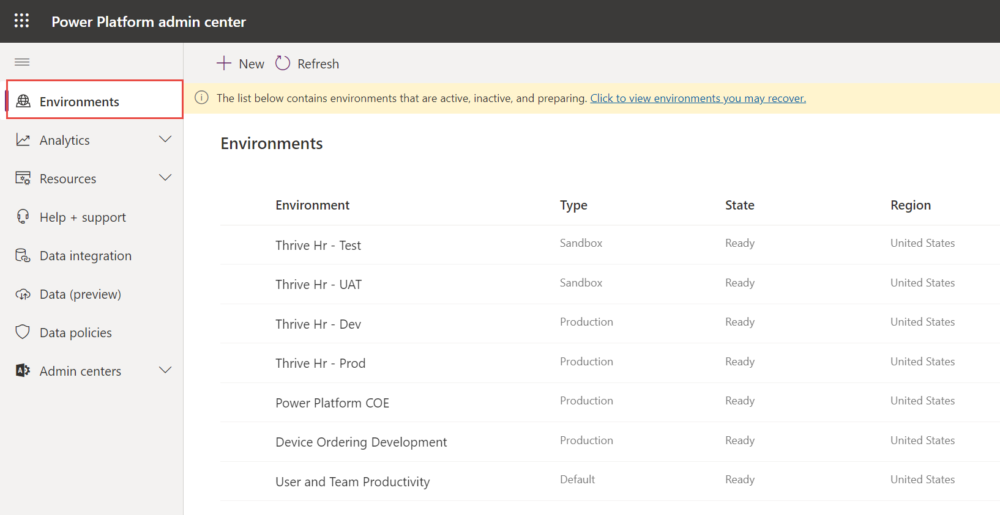
  
3. Notice the **type column**, you can see Fabrikam is already using several types of environments.                  

4. You can filter and order environments.Click on the **Type** column, select filter by **Production**,and click **Apply**.           

     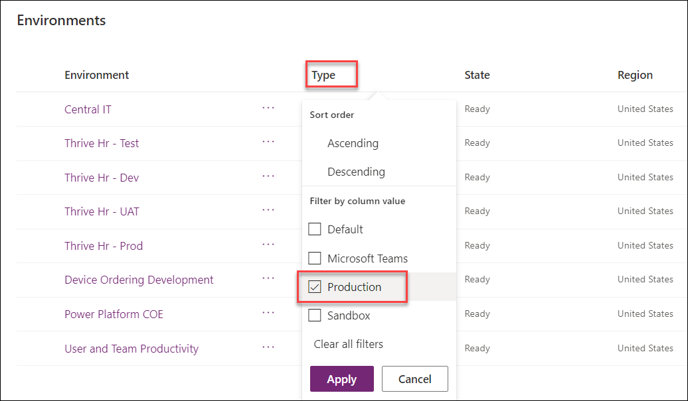

5. You should now see only the **Production** type environments.

     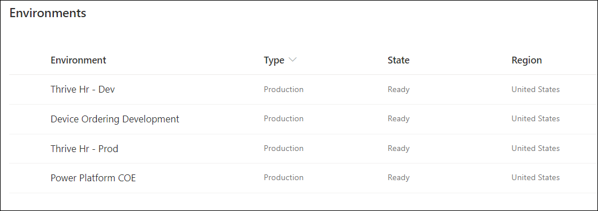

6. Click on the **Type** column again and filter by **Default** and **Production**. 

     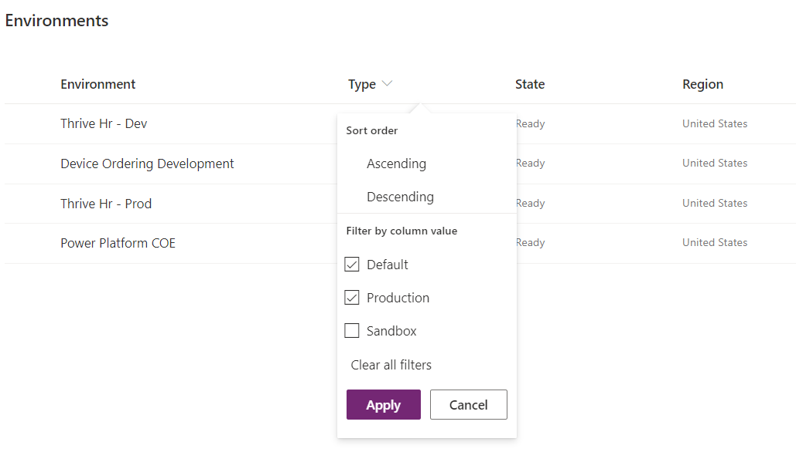

7. You should now see **Production** and **Default** environments.
  

8. Click on the **Environments** column, select **Sort order** by **Ascending**, and click **Apply**.

  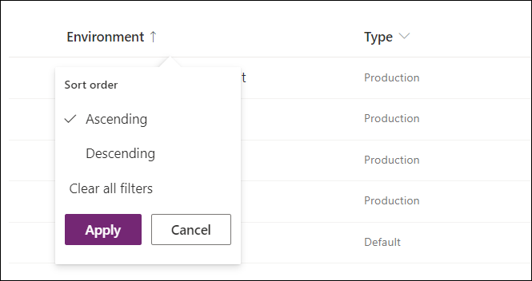
  

9. The list of environments will show **Production** and *Default* environment ordered by environment name in ascending order.                                            

  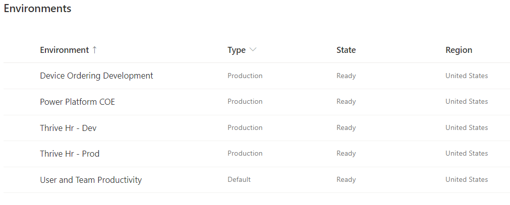
  

10. Now remove the filters and you should see all environments.                                              

11. Next, notice all the environments with **Thrive HR** in the name. These are a set of environments Contoso uses to manage the lifecycle of their Thrive apps; a         suite of employee engagement apps.They are built in Thrive HR - Dev and then are promoted to Test -\> UAT-\> Production after testing  by your admin team.                                        
12. Click on the **Type** and filter by **Default**.    

13. This is the environment in which all users are makers and can build their own apps and flows. Think of this environment as supporting personal productivity use         of the platform. This is also the default location used by any customizations built with Power Apps in  Office apps. The default environment can't be deleted, but     you can rename it to make clear its purpose. For example, some name it *User* *and Team Productivity* like we have in this tenant.    

14. Select the default environment by clicking on the name in the list to drill down into the detail page.               

  
  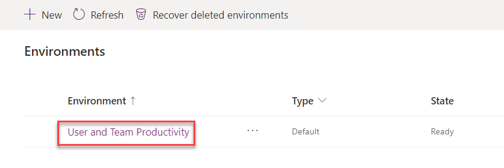
  

15. In the **Access** section. Notice the two roles that are available.

  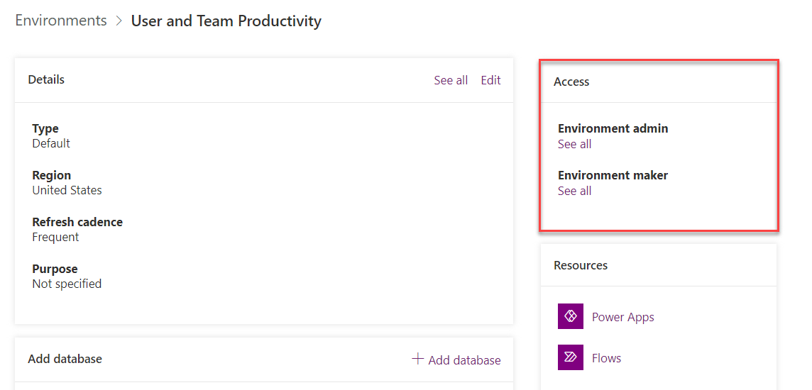
  

16. Click on **Environment Maker**.

 
  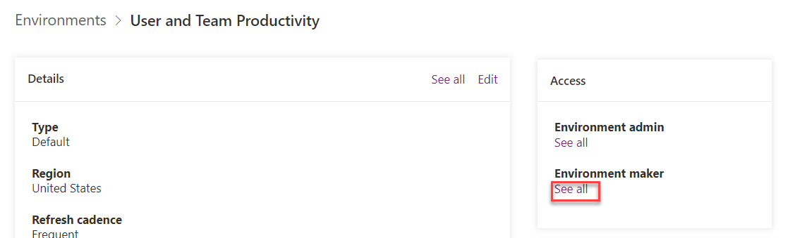
  

17. Notice Tenant is listed; this means everyone in the tenant has this role. For environments other than default, you control this. However, default is special and       Tenant can't be removed from the role.                                 

  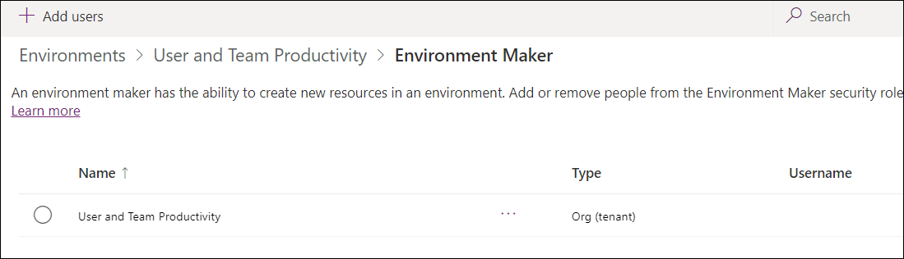
  

18. Go back and in the **Resources** section, click **Power Apps**.

  
  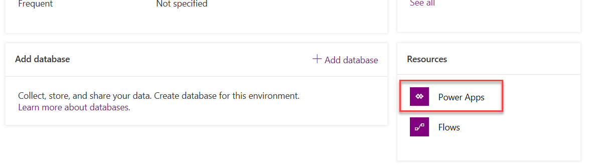
  

19. These are apps built by users in your default environment. Notice many of them are just test names because this is where a lot of users will experiment and build       their first app. As you scroll down the list you might notice some names are more deliberate e.g. Product Showcase. Later in the course we will talk about how to       identify these upcoming apps so you can help give them the guidance to ensure they mature and have adequate governance.

20. Click on the ... and select Details to view app details, such as app type (standard/premium), web link, connections  and shared with information.                               

  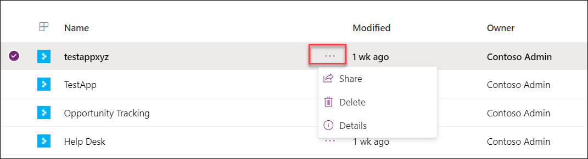
  

21. Go back to the previous page and click on **Flows** in the **Resources** section and you will notice a similar pattern to apps.                                     
  
   
  

22. From here you can quickly turn off a flow that is active, as well as delete it if necessary.

 
  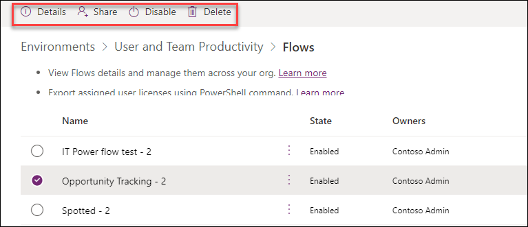
  

23. Click the **...** button on one of the flows and select **Details**.

  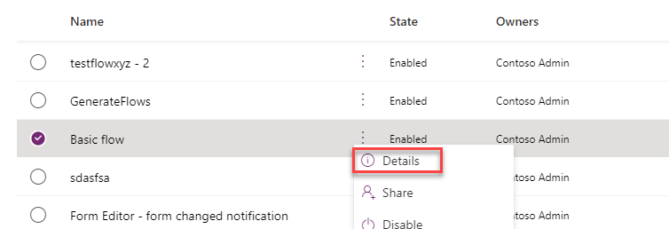
  

24. From here you can see who created it, who the owner is as well as what connections it is using. You can also view and share the flow with others from here.We will     discuss that more later in the course.      
  
   
    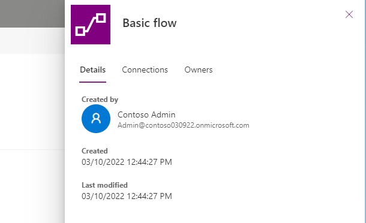
  

### Task 2: Review existing Data policies

1. Navigate to the admin portal https://aka.ms/ppac or https://admin.powerplatform.microsoft.com

2. Expand **Policies** and select **Data policies** on the left navigation.

3. Review the list of existing policies.
    
    - As the login you are using is not a tenant admin but only an environment admin, you will see policies that impact environments of which you are a member.
    
    - As an environment admin or regular environment user, you will also be able to see any tenant-wide DLP policies applied to your environment. However, you would          not be able to edit those tenant-side DLP policies.
    
    - As a Global Admin, Admin, Power Platform Service Admin  or D365 Service Admin in your tenant, you will see all policies that exist in your tenant, even those          that you did not create.

4. Notice the Contoso Global DLP policy exists that is intended to span all environments (except selected ones) and represents the global DLP policy. For this lab        environment Contoso Global DLP policy has 4 environment selected instead of All except 4.

5. You will also notice a DLP for **Thrive Exceptions**. That team had worked with the IT department to agree on exceptions they need for their environments and their    environment would be excluded from the Contoso Global DLP. This exception DLP policy would have their environments included and apply only to them.

  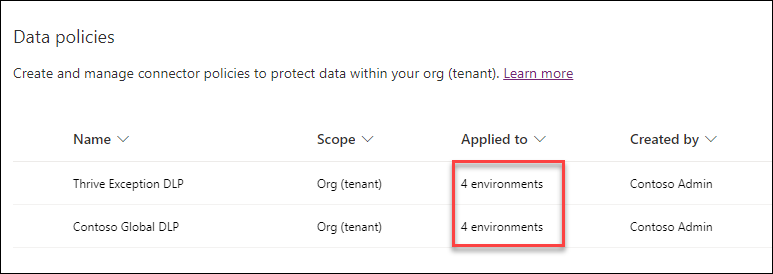
 

6. Select the **ContosoGlobal DLP** and click **View Policy**.

  
  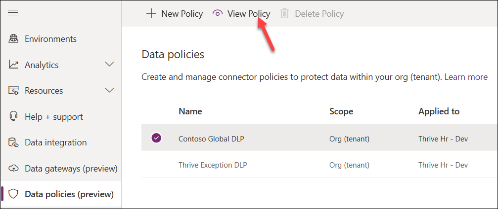
  

7. Select **Prebuilt connectors** and review the **Business** connectors.

  
  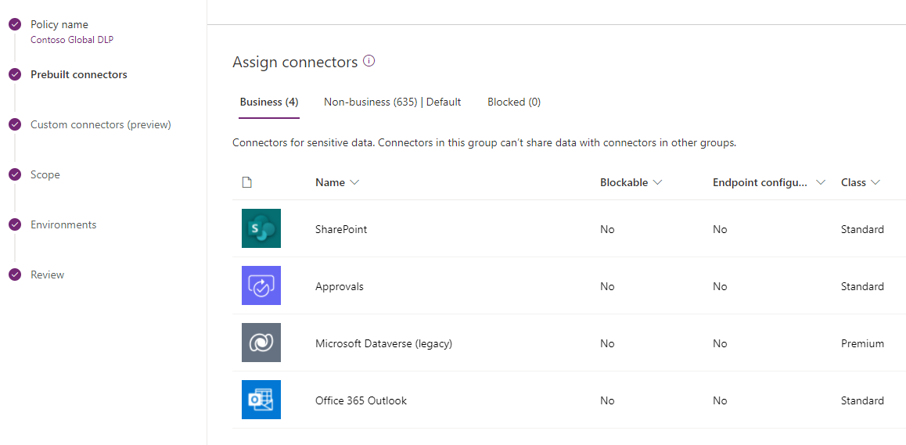
  

8. Select **Scope** and **Environments** to see how it is configured. 

9. Select **Data Policies** again.                                    

10. Select the **Thrive DLP** and click **View Policy**.               

11. Click on the **Prebuilt connectors** and select the **Business** tab. Based on the use case for the Thrive application the connectors in the Business group have       been established. You can also see how Scope and Environments are configured to only select the Thrive environments.

  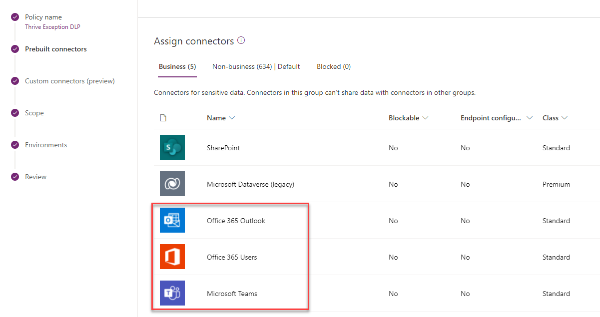
  

## Exercise 2: Plan an environment strategy

In this exercise, you will be reviewing the scenario for Fabrikam that
explains their current situation. After reviewing you will evaluate and
propose an environment plan.

### Task 1: Read about the current situation at Fabrikam

In this task, read the following and take notes that would help you
propose an environment plan for Fabrikam.

You have recently joined the newly formed Power Platform center of
excellence team at Fabrikam and are responsible for establishing a
governance strategy. Currently, there is not a governance process
established and employees are able to create apps, flows and even
environments without any control.

Fabrikam has been in existence for 40 years and has 4,500 employees at
multiple office locations in the US, UK and EU. Fabrikam employees are
all licensed for Office 365 E3 and a growing number of them have either
Power Automate or Power Apps per user licenses. Over the last 6 months
Fabrikam's management realized that that this was greatly improving
productivity, but they recognize without some planned governance it
could easily get out of control. About 50 of the users are more advanced
power users of the platform always looking at ways to push its limits.
Fabrikam's sales team of 100 users also use a heavily customized
Dynamics 365 Sales app deployment.

One of the first things you did is look in the admin center to see how
many environments were there. Currently in the tenant there are 45
environments with a variety of names that users chose. The majority of
the applications looked like they were in the default environment or a
couple of other custom environments that had been created. There was one
environment that was clearly the production Dynamics 365 application
environment used by the sales team.

The most organized department is market research, they built an
application that is used daily for conducting their market surveys.
Currently there is just a single custom environment named Market
Research that supports the application. There are a couple of people in
the department that are app makers doing all the changes. They tend to
do them in the late afternoons and evenings and publish them when
nobody\'s around to avoid impacting other users. There is not currently
any testing done before the app is published other than by the person
making the changes. They are open to the testing idea but not sure how
to do it with a single environment.

You found out that the new environments have stopped being created
simply because they have run out of storage from creating too many
environments. When you asked about this you were handed a stack of
requests that claimed they needed new environments. The following are
the priority requests; we will ask you to help identify how to handle
these when you fill out the environment strategy template.

   - Request 1: A user would like to build a set of Power Automate flows that helps organize their Outlook inbox and tags emails.                                                           
   - Request 2: VP of Service wants to build some custom apps to support their teams; like how the market research team has done.                                                          
   - Request 3: Marketing wants to build an app that makes it easy to publish tweets on Twitter using the Twitter connector. They also plan to create Power Automate                   flows that notify them of mentions along with the sentiment of the message.                                                           
  
  - Request 4: HR would like to try the Crisis Comms app that Microsoft published and would like an environment for it to run in.                                                          
  - Request 5: A user would like to build an app that uses a custom connector for a 3rd party service and also uses the DropBox connector.

Yesterday you got some good news, another 30GB of storage capacity for
environments had been procured. You also got permission to put in place
the necessary steps to ensure it does not get wasted.

### Task 2: Build an Environment Plan

In this task, you use the information from Task 1's scenario to help you
propose an environment plan for Fabrikam. To help you build the plan we
have prepared a worksheet with questions for you to answer.

1. Open **M01 - HOL Environment Worksheet.docx** from the Resources folder and complete it by answering each of the questions. You should spend no more than 10            minutes on this before proceeding to the next task.

### Task 3: Review the example environment plan and compare to yours

In this task, we have provided you with a completed environment plan.
Review the answers and compare to the one you built in the prior task.

1.Open the Example Environment Plan document **M01 - HOL Environment Example.docx** and compare the answers to the one you completed in the previous task.

2.Talk to your trainer about any significant differences that do not make sense to you.

## Exercise 3: Plan a DLP strategy

### Scenario

In this exercise, you will be planning a DLP strategy for Fabrikam using
the same scenario background information from the last exercise.

### Task 1: Build a DLP Plan

In this task, you use the information from the last exercise's scenario
to help you propose a DLP plan for Fabrikam. To help you build the plan
we have prepared a worksheet with questions for you to answer.

1.Open **M01 - HOL DLP Worksheet.docx** from the Resources folder and complete it by answering each of the questions. You should spend no more than 10 minutes on this   before proceeding to the next task.

### Task 2: Review the example DLP plan and compare to yours

In this task, we have provided you with a completed environment plan.
Review the answers and compare to the one you built in the prior task.

1.Open the Example Environment Plan document **M01 - HOL DLP Example.docx** and compare the answers to the one you completed in the previous task.

2.Talk to your trainer about any significant differences that do not make sense to you.

## Exercise 4: Evaluate impact of adding DLP

### Scenario

In this exercise, you will create an environment, a flow, and then
viewing the impact of adding a DLP policy.

### Task 1: Create a trial environment

1. Navigate to Power Platform admin center .    

2. Select **Environments** and click **+ New**. 

  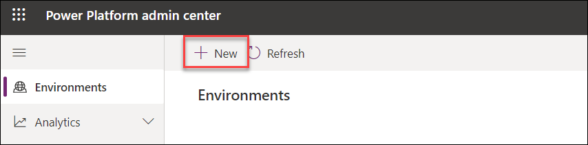
  
  
3. Enter **My Sandbox (Your initials)** for **Name**, select **Trial** for **Type**, select your **Region**, select **Yes** for **Create a database for this              environment**, and click **Next**.                                             

  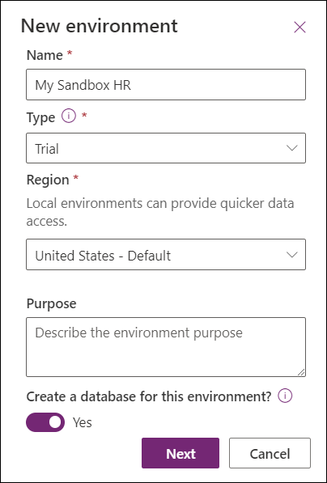
 

4.  You may provide a **URL**, select **Currency**, and click **Save**.                                                   

5. Wait for the environment to be created. The state will change to **Ready** when the environment is ready.

### Task 2: Create a flow to get the weather

1. Navigate to [Power Apps maker portal](https://make.powerapps.com) and select the environment you created.

   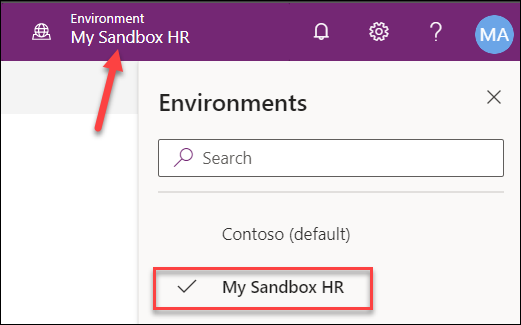
 
 
2. Select **Flows** from the left.                      

3. Click **+ New** and select **Scheduled cloud flow**. 

  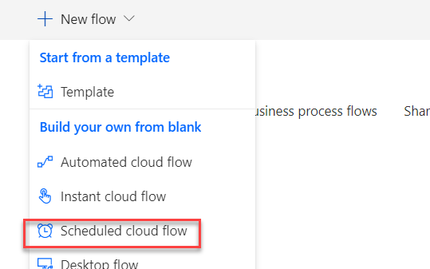
  

4. Enter **Weather flow** for **Name**, select **Repeat every 1 Day**, and click **Create**.

  
  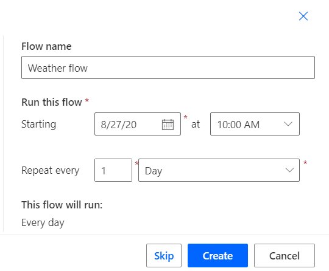
 

5. Click **+ New step**.                                       

6. Search msn and select **Get current weatherMSN Weather**. 

7. Provide your **Location**, select your preferred **Units**, and click **+ New step**.                          

  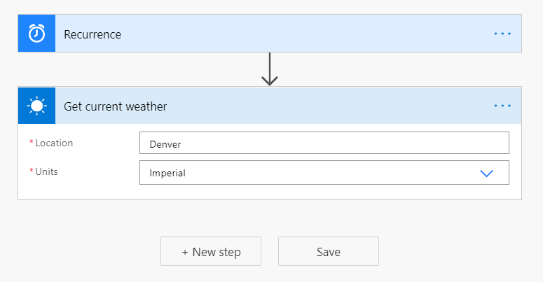
  

8. Search for send email and select **Send an email (V2) Office 365 Outlook**.                                        

9. Provide your email for **To** and enter **Current Weather** for **Subject**.                                 

10. Click on the Body enter **Current weather for:** and select **Location** from the Dynamic content pane.                  

  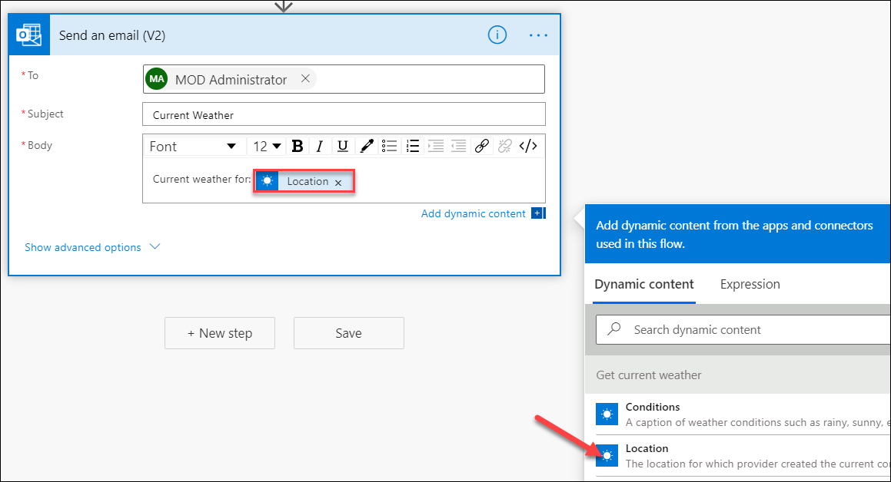
  

11. Hit the **\[ENTER\]** key, enter **Temperature:** and select **Temperature** form the Dynamic content pane.      

12. Hit the **\[ENTER\]** key, enter **Conditions:** and select **Conditions** form the Dynamic content pane.   

13. You may add other values to the email.                

14. Click **Save**.                                            

  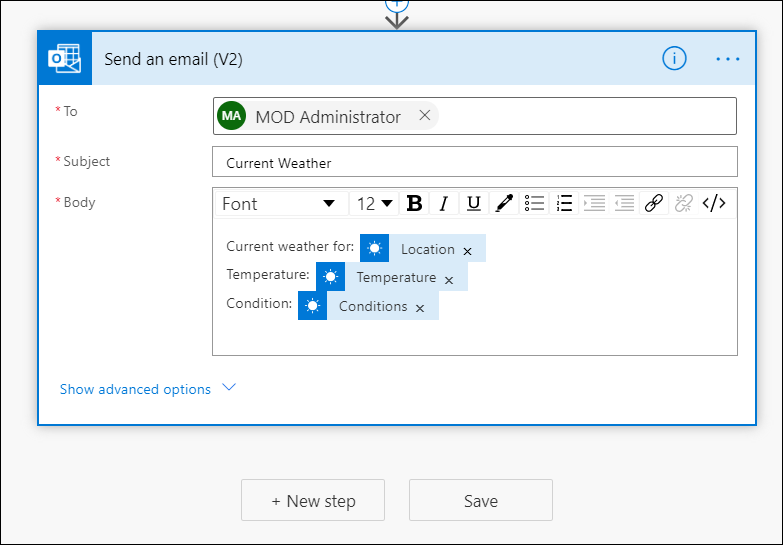

15. Go to My flows by clicking on the  button located on the top left of the page.

  
  
  
  
16. Click to open the flow. 

17. Click **Run**.          

  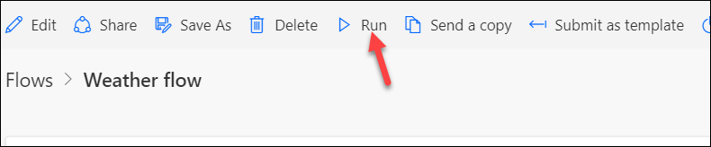
  

18. Click **Run flow**.                                        

19. Click **Done** and wait for the flow run to complete.Click on the Refresh button to see the update status.                                                    

  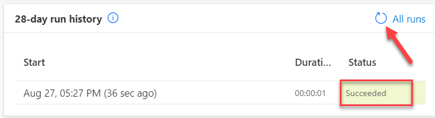

20. Navigate to **Outlook** .                             

21. You should get an email with the weather information. 

### Task 3: Create a DLP Policy

In this task you will create an environment specific DLP and see how it
impacts your working flow.

1. Navigate to Power Platform admin center .                   

2. Select **Data policies** and click **+ New Policy**.        

3. Enter **My Sandbox (Your initials)** for **Name** and click **Next**.                                               

4. Select your environment and **Add to policy**.              

  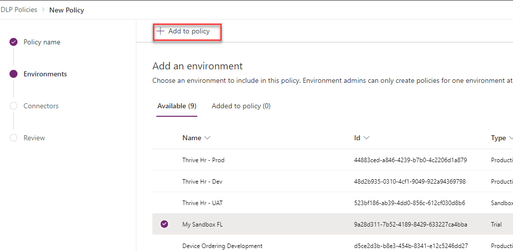
 
 
5. Click **Next**.                                             

6. Search for Microsoft Dataverse, select **Microsoft Dataverse**, and click **Move to Business**. Choose  carefully, you may have to expand the Name column to            differentiate between connectors in your search results.     

  
  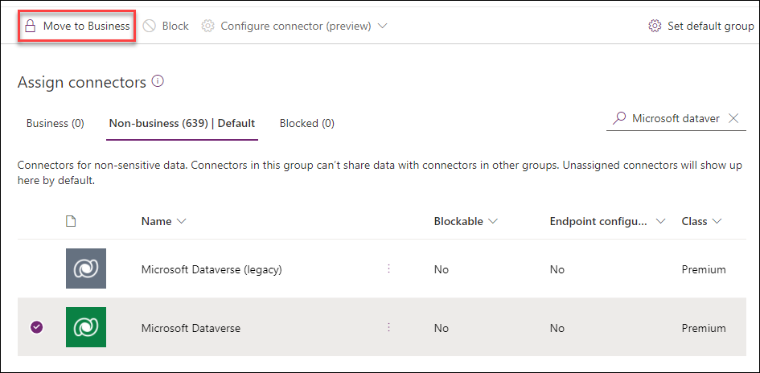
  
  
7. Search for SharePoint, select **SharePoint,** and click **Move to Business**.                                        

8. Search for Outlook, select **Office 365 Outlook,** and click **Move to Business**. 

9. Select the **Business** tab.

10.  You should now have three connectors moved to Business. Click **Next**.                                              

  
  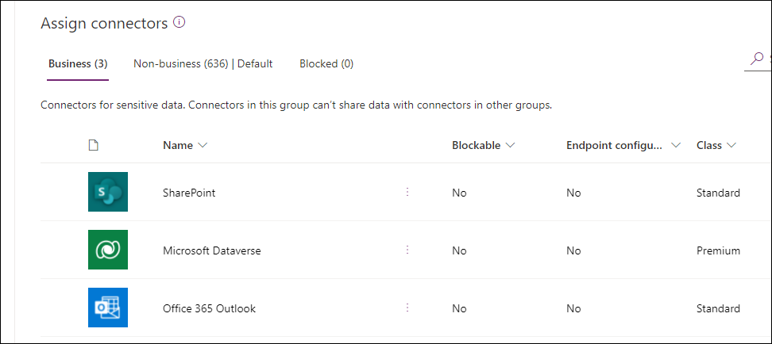
 

11. Click **Create policy**.                                   

12. Navigate to Power Automate and make sure you in the sandbox environment.                                         

13. Select **My flows**.                                       

14. The flow should now be suspended because of the DLP you created. Click to open the flow. This can take up to 5 minutes, wait few minutes and then click refresh.                                                   

  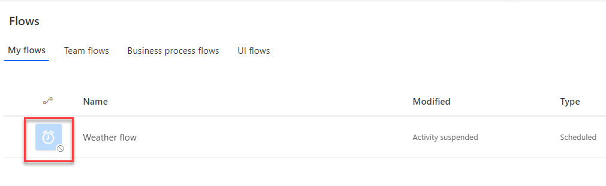
  

 15. You should not be able to run the flow.

  
  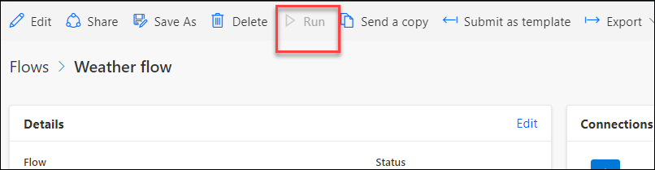
  

> **Note:** After you finish this lab if you have time come back and modify the DLP you created to fix the problem. If you have trouble getting it to work, ask your               instructor for some tips.

## Exercise 5: Configure a security role

### Scenario

In this exercise, you are going to import a pre-built Power Apps canvas
app that was built in another environment. The application allows users
to see a list of Projects stored in Dataverse. After importing you will
build a Security Role to allow users to work with the Project table
data. Finally, you will see how to share the application with an Azure
AD Security group and assign the security role you just built.

### Task 1: Import project management solution

1. Navigate toand select The My Sandbox environment you created.

  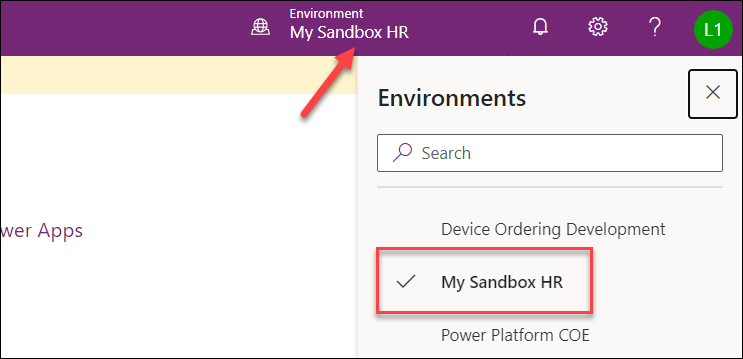
  

2. Select **Solutions** and click **Import**.

  
  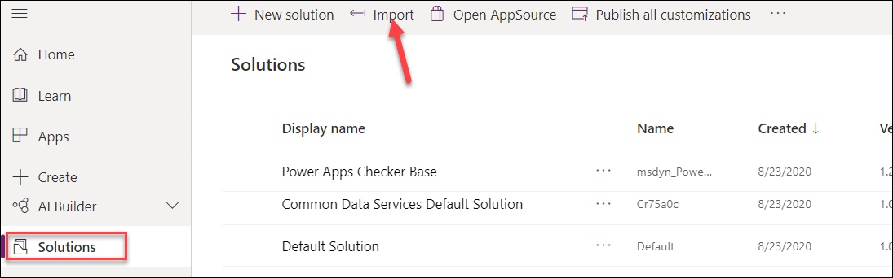
 
 
3. Click **Browse**.                                           

4.  Select the **Fabrikam Project Management** solution located in the lab resources folder and click **Open**.                                                   

5. Click **Next**.                                             

 
  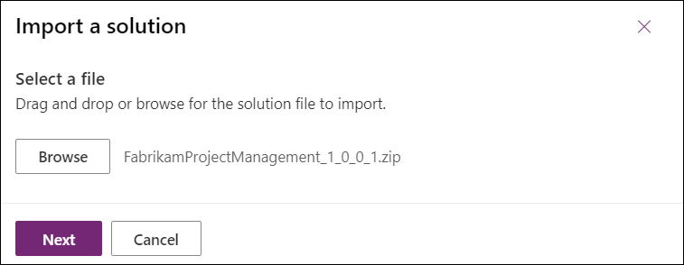
  

6. Click **Import** and wait for the import to complete. You should get a notification when the import succeeds.                                                   

7. Click **Publish All Customizations** and wait for the publishing to complete.                                       

  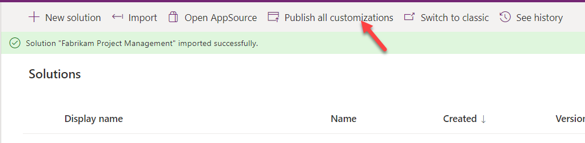
  

8. Click to open the solution you just imported.

  
  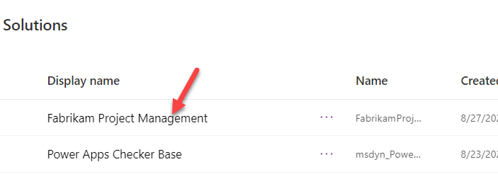

9. The solution should have six components.                   

10. Click to open the **Import Sample Data -- Projects** flow. You are going to run this flow to insert some sample project data for the app to use.               

  
  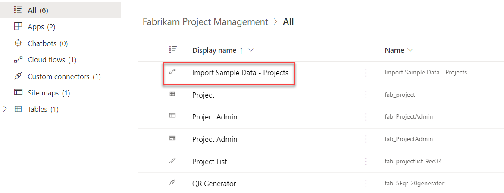
  

11. Click **Edit**.

  
  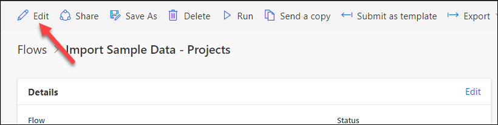
  

12. Click **Continue**.

  
  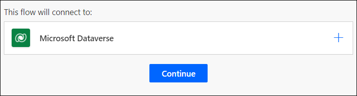
 
 
13. Click to expand the **Parse JSON** step.                 

14. Examine the sample records the flow will create.         

15. Click **Save** and wait for the flow to be saved.        

16. Go back to the details view of the flow by clicking on the  button.                                            

17. Open the flow again.                                     

18. Turn on the flow if it is off.                           

19. Click **Run** to run the flow.                           

20. Click **Run flow**.                                      

21. Click **Done** and wait for the run to complete.         

 
  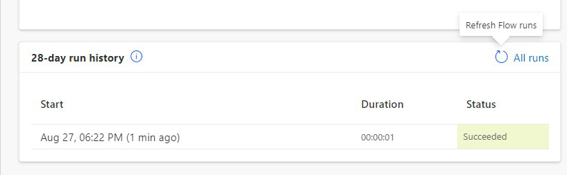
  
  
22. Click on the browser back button.                          

23. Go back to the maker home page by clicking on the **\<-** back button.                                               

24. Select **Apps** and click to open the **Project List** canvas application.                                        

  
  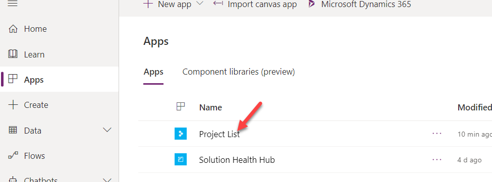

25. The application should load, and you should see the sample project records the flow created. Click +.                 

 
  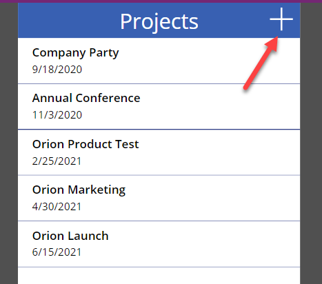
  

26. Enter **Test Project** for **Title**, select **Due date** and click **Submit**.

  
  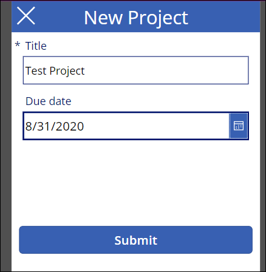
  

27. The application should create the new record and take you back to the list of projects.

 
  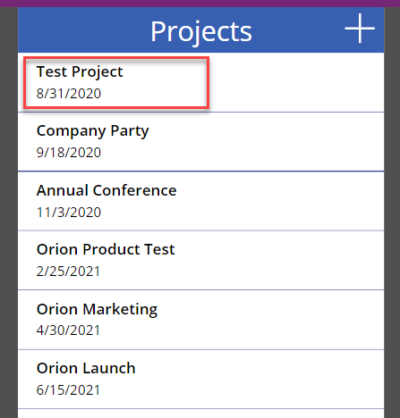
  

28. Close the Project List application browser window or tab.

### Task 2: Create a security role

1.  Navigate to Power Apps maker portal and make sure you have your sandbox environment selected.                          

2. Select **Solutions** and click to open the **Fabrikam Project Management** solution.                                

3.  Click **+ New** and select **Security** | **Security role**.                                                     

  
  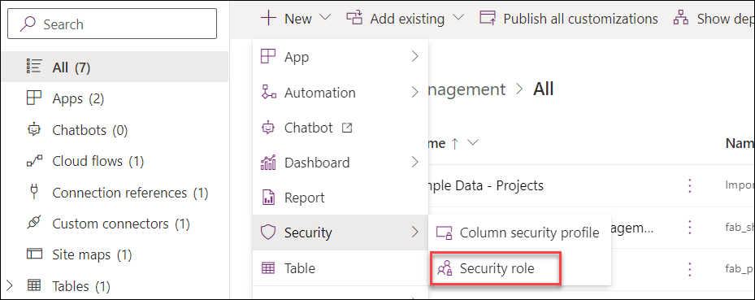
 

4. Enter **Project Manager** for **Role Nam**e and click **Save**.                                                   

5. Select the **Custom Entities** tab.                         

6. Scroll down to locate the Project table and click on the name of the entity.                                           

  
  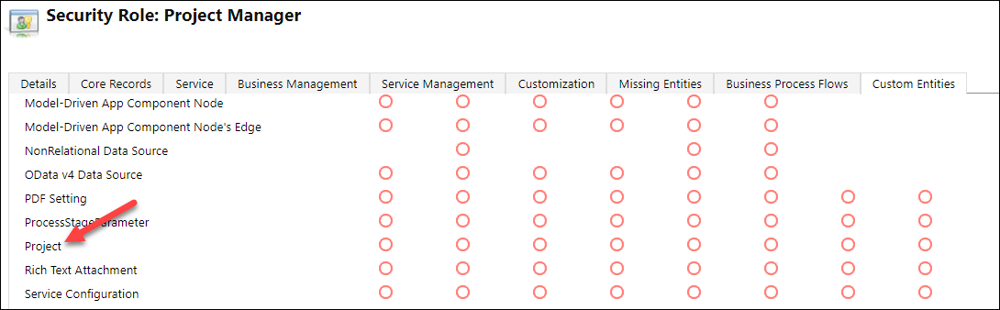
  

7. This action will give this role User rights to the Project entity. If you kept clicking on the label it would increase the permissions with each click till the user    had full privileges.                                                 

  
  

8.  You will now give this role organization read privilege. Click on the second dot from the left. You can also scroll up and see the column headers.                

 
 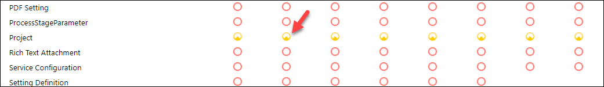
  

9. Click on the same dot two more times or until the dot is totally filled. This will allow any user with this role to see all project records in the Dataverse            environment.       

  
  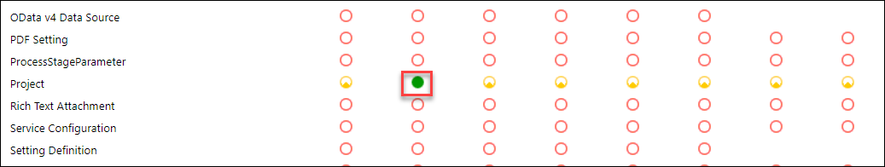
  

10. Click **Save and Close**.                                  

11. Click **Done**.                                            

12. Click **Publish all customizations** and wait for the publishing to complete.                                      

13. Do not navigate away from this page.                       

### Task 3: Share app

1.  Go back to the maker home page by clicking on the **\<-** back button.
  
2. Select **Apps**, select **Project List** application, and click **Share**.

  
  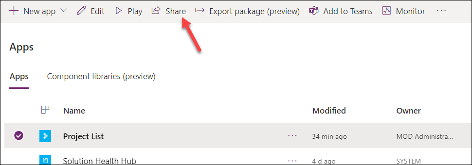
  

3. Search for lab back office and select Lab Back Office group. 

4. Click on the **Assign a security** role dropdown.            

  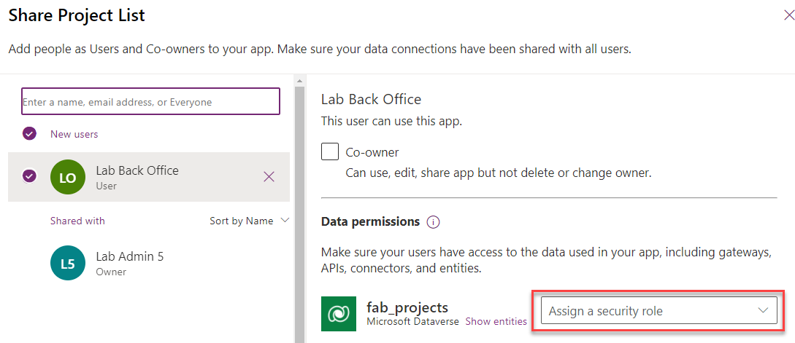
  

5. Select the **Project Manager** and **Basic User** roles and then click **Share**.

  
  

6. Close the share pane.

DISCLAIMER

This demo/lab contains only a portion of new features and enhancements
in Microsoft Power Apps. Some of the features might change in future
releases of the product. In this demo/lab, you will learn about some,
but not all, new features.

