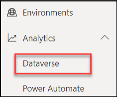

# Admin in a day

## M02-HOL Reporting and Telemetry

### Lab Scenario

In this Hands-on Lab, you are an administrator helping adopt the Power Platform.
An important part of keeping the Power Platform running successfully is monitoring the ongoing usage. 
In this hands-on lab you will be using the platform tools and the COE Starter Kit to perform usage 
monitoring.

### Lab Test Environment

This hands-on lab is designed to be completed in an environment setup for multiple students to complete 
the Admin in a day series of hands on labs.
You need to use the assigned user and environment information to complete this lab. You must have 
completed the prior labs to successfully complete this lab.

## Exercise 1: Explore the out of the box analytics

Now in this exercise, you will explore the out of the box analytics that are available from the Power 
Platform admin center.

### Task 1: Explore the Power Automate analytics

1. Navigate to [Power Platform admin center](https://admin.powerplatform.microsoft.com).
2. Expand **Analytics**.
3. Select **Power Automate**. Select change filters and change to the Power Platform COE environment.

    

4. Review the visuals in the **Runs** tab and then select the **Usage** tab.

    
    
5. Review the visuals in the **Usage** tab.
6. Review the visuals in the rest of the tabs.
7. In the upper right corner change Environment level analytics to Tenant level analytics.

     
     
8. Now you are looking at data for all environments you have access to.
9. Review the Usage data and then switch to Maker Activity and Inventory and review the data available. Notice you can still filter on more specific criteria.

     
     
### Task 2: Explore the Power Apps analytics

1. Navigate to [Power Platform admin center](https://admin.powerplatform.microsoft.com).
2. Expand **Power Apps**.
3. Review the visuals in all tabs.

    
    
4. In the upper right corner change Environment level analytics to Tenant level analytics.

    
    
5. Now you are looking at data for all environments you have access to.
6. Review the Usage data and then switch to Maker Activity and Inventory and review the data available. Notice you can still filter on more specific criteria.
7. Hover your mouse over the far-right corner of data under Region and you can click on … to show more options.

    
    
8. Select Export data.

    
    
9. If you have Excel installed choose one of the options and select Export. After the file downloads review the details available. If you don’t have Excel simply select Cancel.

    
    
### Task 3: Explore the Capacity analytics

1. Navigate to [Power Platform admin center](https://admin.powerplatform.microsoft.com).
2. Expand **Resources** and select **Capacity**.

    
    
3. Notice the **Storage capacity usage**.

    
    
1. Notice the **Storage capacity by source**.

    
    
1. Go to the **Top storage usage by environment** section and notice the capacity usage by top environments.

    
    
1. Click to select the **Dataverse** tab.

    
    
1. Locate the **Device Ordering Development** environment storage capacity and click **Details**.

    
    
1. Click on the **Chart menu** button and select **Download all tables**.

    
    
1. Click Open file. You should see list of all tables and their database size in MB.

    
    
1. Close the Excel file.
1. Expand **Analytics** and select **Dataverse**.

    
    
1. Review the visuals.
1. Click **Change filters**.

   
   
1. Change the date range to between one-week ago and today, and then click **Apply**.

   
   
1. The visuals should change to reflect your changes.

## Exercise 2: Configure Dataverse logging for a table

In this exercise, you will configure Dataverse logging for a table that requires auditing.

### Task 1: Review audit logging in the environment

1. Navigate to the [Power Apps maker portal](https://make.powerapps.com/) and select the **My Sandbox** environment.
2. Select Solutions and click to open the **Fabrikam Project Management** solution.

    
    
3. Select **Tables** and click to open the **Project** table.
4. Locate and click to open the **Due Date** column.

    
    
5. Expand the Advanced options section. **Auditing** is enabled for this column.

    
    
6. Click **Cancel** to close the field details pane.
7. Select **Tables**, select the **Project** table, and then click **Settings**.

    
    
8. Expand the **Advanced options** section.
9. Scroll down to the **For this table** section.
10. Check the **Audit changes to its data** checkbox and click **Save**.

    
    
11. Select **All** from the left navigation of the solution.
12. Click **Publish all customizations** and wait for the publishing to complete.
13. Navigate to [Power Platform admin center](https://admin.powerplatform.microsoft.com) and select **Environments**.
14. Select the **My Sandbox** environment and click **Settings**.

    
    
15. Expand **Audit and logs** section and click **Audit settings**.

    
    
16. Check the **Start auditing** checkbox and click **Save**.

    
    
### Task 2: Test auditing

1. Navigate to the [Power Apps maker portal](https://make.powerapps.com/) and select the **My Sandbox** environment.
2. Select **Apps** and click to launch the **Project Admin** application.

    
    
3. Click to open the **Annual Conference** project.

    
     
4. Change the **Due Date** and click **Save**.

    
    
5. Change the **Due Date** and save couple more times.
6. Click **Related** and select **Audit History**.

   
    
7. You should see the change history for each of your changes. Click to open one the change history records.

    
    
8. You should see the **Filed Name**, **Old Value** and **New Value**.

    
    
9. Close the change history record.

## Exercise 3: Setup the CoE Starter Kit Power BI Dashboard

### Scenario

In this exercise, you will explore some of the apps and analytics that are part of the Power Platform CoE 
Starter Kit. We have already installed and configured the starter kit into the tenant you are using for this 
lab. As part of configuring we imported the solution, shared the apps, configured the flows that 
synchronize data and published the Power BI report. If you were doing this in your own tenant, you 
would follow the instructions to complete these steps.

Now in this exercise, you will explore the following key components
- Power Platform Admin View app
- Power BI Dashboard
- The business process that is used by the Developer Compliance process

### Task 1: Explore the Power Platform Admin View app

1. Navigate to [Power Apps maker portal](https://make.powerapps.com/).
2. Select **Power Platform CoE** environment in the environment selector.

    
   
3. Select Apps in the left navigation and you should see a list of available apps in this environment – click on **Power Platform Admin View**.

    
    
4. When the app starts you will land on the Power Platform Dashboard page. This dashboard gives you a quick look at the most active makers, and environments.

    
    
5. Click on **Power Apps** and you will see a list of all apps in all environments without having to visit each environment. The Flows navigation link does the same      thing for Microsoft Power Automate flows.
6. Click on the Device Ordering App in the list to open the app details.

    
    
7. On the details notice at the top you can see where the app is in the review process. 

    
    
8. In the **Audit** tab you can see the Business Justification provided by the app maker using the Developer Compliance Center app. In the bottom part is where you as    an admin can provide your risk assessment. You can also tag the app to show in the App Catalog and make it featured. You can customize the CoE entities to add          additional fields here if needed.

    
    
9. Click on **Environments** in the left navigation. This will show you a list of all the environments in your tenant and key metrics like number of apps.

    
    
10. Click on the **User and Team Productivity** environment to open the detail form. 
11. Review the data available.
12. Click on the **Connectors** link in the left navigation. This shows all the connectors available.

     
     
13. In the upper right corner search on **Microsoft Dataverse**.

     
     
14. In the search results, click on the **Microsoft Dataverse** connector.

     
     
15. The detail page quickly shows you what apps are using this connector in all environments in your tenant.
16. Click on the **Makers** link in the left navigation, this shows you all the people that have built apps in your company.
17. Click on one of the Makers and explore the detail form.

### Task 2: Power BI Dashboard

1. Navigate in your browser to Power BI [Power BI](https://app.powerbi.com) and **Sign in** with your lab credentials.
2. When you see the You have an account with us, click Sign In again and then click Start. 

    
    
3. Click **Start**.
4. When prompted to Invite more people, click **Skip**.
5. On the left side navigation click Workspaces and then Create a workspace. We are going to use this 
   workspace to publish our report to from Power BI Desktop. This would allow you to view it from 
   PowerBI.com, the mobile app, or even embed it in other places like Microsoft Teams. The workspace 
   can also be shared with others so they can see the analytics.
   
     
     
 6. When prompted click **Try free**.

     
     
7. After the trial is started, you will have to re-navigate to Workspaces and then Create a workspace.
8. On the Create panel, provide a unique name like CoE and your lab admin user number and click **Save**.

     
     
9. Launch Power BI Desktop on your local computer, if you don’t have it installed you can install it from Downloads | Microsoft Power BI
10. Close the popup window.
11. Click Sign-in and provide your lab admin account credentials.
12. Once signed in, click **File**, **open report**, and select **Browse Reports**.

     
     
13. Locate the folder containing lab files you downloaded. 
14. Change to file type filter to PowerBI template files. Select the Production_CoEDashboard.pbit file.
15. You will be asked to provide your org URL. Let’s go find it.

     
     
16. Navigate to [Power Platform admin center](https://admin.powerplatform.microsoft.com) and select **Environments**.
17. Locate the **Power Platform COE** environment and click on the name to show the details page.

     
     
18. Right click on the **Environment URL** and select **Copy link**.

     
     
19. Back in Power BI Desktop, paste the **OrgURL** and click **Load**.

     
     
20. Click **continue**. Follow prompts for credentials if they are presented.

     
     
21. The report should load.
22. Follow the steps below to enable map and filled map visuals:
    
    a) Click **File** and select **Options and settings | Options**.

    
    
    b) Select **Security** form the left.
    
    c) Scroll down to the **Map and Filled Map visuals** section.
    
    d) Check the Use **Map and Filled Map visuals** checkbox.
    
    e) Click **Okay** to close the Options dialog.
    
    
    
23. Review the Introduction page.
  
     
     
24. Select the overview page, notice it gives a good high-level look at our tenant activity. If you have multiple locations, it will quickly highlight which users are     more engaged with building apps. You can also quickly see which environments are most active.

      
      
25. Click through each page using the navigation at the bottom of the app and review the insights available.
26. Select the **Environments** page.

      
      
27. On the Environments page, use the date range picker and see how it effects the other data on the page. When you are done leave it set at the max date range.

      
      
28. Select the **Apps** page.
29. On the Apps page notice the Creation Trend, this is a good way to watch adoption progress.

     
     
30. Click through the other pages and review the data available.
31. Click **Publish**.
32. Save the report if prompted.
33. Select the workspace you created and click **Select**.

     
     
34. Wait for the publishing to complete and click **Got it**.

     
     
35. Navigate to [Power BI](https://app.powerbi.com). Click on **Workspaces** and **CoE Workspace**.
36. Select the **Content** tab and click to open the report.

     
     
37. Select the Environments page. Use the date slider to ensure the date range includes the last month.

     
     
38. You have now successfully deployed the Power BI reports that come with the CoE starter kit.

## Exercise 4: Perform a risk assessment of overshared resources

### Scenario

We were going to perform a risk assessment to look for apps that have been over shared in your tenant. 
To accomplish this, you are going to use the Power BI report that you just published to look for apps that 
are over shared.

### Task 1: Locate Overshared Apps

1. Navigate to the Power BI report you just published
2. Click on the **Apps** page in the report 
3. Click on the Show navigation button and select **Apps Risk Assessment**.

    
    
4. The list of apps you'll see now is the ones that qualify for the default criteria. We want to focus on the ones that have been shared with the entire organization      and validate that they are appropriate.
5. In the filter panel, select True in the Shared with Everyone section.

    
    
6. The filter will take place immediately and you will see a small list of apps that have been shared with 
   everyone. In many cases a quick evaluation of the name of the app would indicate whether it was 
   appropriate but it also allows you to drill down into more details by hovering your mouse pointer 
   over the name of the app. You might also use the owner name to contact the person who made the 
   app to get more details to determine if it was appropriate to share with everyone.
   
   
## Exercise 5: How much is a connector used in your organization

### Scenario

Using the Power BI report, you can easily see what apps and flows are using a connector. In this exercise you will find out who is using the SharePoint connector.

### Task 1: Locate resources that use the SharePoint connector

1. Navigate to the Power BI report you just published
2. Select the App Connections page in the report 
3. In the filter panel, in the Connector section search for SharePoint and select it.

    
    
4. The page will now filter on makers, flows and apps that use SharePoint.
5. Using this you could evaluate things like impact of changing DLP policies or other governance or training that might be needed related to a connector.

## Exercise 6: Review tenant audit logs (Optional if you have time)

### Scenario

All other auditing of Power Apps and Power Automate flows (other than CDS data modification) are 
viewed through the Office 365 Security and Compliance site.

Prior to use, this must be enabled by a global tenant administrator using these instructions. In the tenant 
you are using we have already completed that for you as well as granting you permission to view the 
audit log data for the tenant. That was done using the PowerShell command Add-RoleGroupMember 
“Compliance Management” -Member your user.

In this exercise, you will be using the log search and alert tools to work with the audit data.

### Task 1: Review audit logging in the environment

1. Navigate to https://Protection.office.com 
2. Expand **Search**. 
3. Select **Audit log search**. 

   
   
4. Click **Search** using the default search criteria.

    
    
5. Review the items displayed; drill into a few of them to see the type of data available.
6. Click **Export Results**. You can download the data if you like. Using export, you can open the data in other tools for analysis.

    
    
7. Click **Audit search** from. 
8. Click on the **Activities** dropdown.

    
    
8. Select all **Power Apps and Power Automate** activities.
9. Click **Search** again.
10. Review the results.
11. Look for an activity of Edited Flow, click on the item to open the detail. Review what data is provided. 
12. A common task is to look at all activity for a particular user. Copy the user from this Edited flow activity and go back to the Audit search. 
13. Paste the user you copied into the Users filter and click search again. Now you are looking at all the activity for a single user.
14. Try clicking on an item to view detail. Copy the Item field and then go back to the list and click the filter results. Paste the item info you just copied into the     filed. The results list will now only show activities related to that item. For example, you could use this to show all activities for a specific flow.

## Exercise 7: Get notification of new apps, flows and connectors (Optional if you have time)

### Scenario

In this exercise, you will be using one of the pre-built Power Automate templates that run on a schedule 
and looks for newly created canvas apps, flows and connectors and sends you an email.

### Task 1: Create the flow from the template

1. Navigate to https://flow.microsoft.com and sign in.
2. Make sure **Power Platform COE** environment is selected. Note: This environment is where the CoE starter kit is installed and is intended to be our dedicated admin    environment. Even if you don’t use the starter kit, having a dedicated admin environment can be helpful.

    
    
3. **Paste the URL and press enter**. https://us.flow.microsoft.com/enus/galleries/public/templates/0b2ffb0174724ad6b4681728c0f53062/get-list-of-new-powerappsflows-and-connectors/
4. Click **Sign in**.

    
    
5. Select the user you are signed in as.
6. Click sign in for each of the rest of the connectors.
7. Click **Continue**.

    
    
8. Examine the flow steps and then click **Flow Checker**. You may need to adjust the zoom of your browser to see all of the steps.

    
    
9. There should be no errors.
10. Click **Save**. 
11. Click on the **back arrow**.

    
    
12. The flow should have one run in progress.

     
     
13. Wait for the flow run to complete and then click to open the run. You can refresh to see the updated status of the flow.

      
      
14. Examine the flow run.

      
      
15. Click **App launcher** and select **Outlook**. 

      
      
16. Navigate to https://outlook.office.com/ 
17. You should get an email from the flow. Open the email.

     
     
17. The report should list flows, Power Apps, connectors in tables.

     
     
In addition to simply seeing who is building what in your tenant you can also use the list of new connectors to evaluate if you need to adjust your DLP policies.

