# Admin in a day

## M04-HOL Application Lifecycle Management and Deploying Apps (Optional)

### Lab Scenario

 In this Hands-on Lab, you are an administrator for Contoso, helping
 them to adopt the Power Platform.

 The team building the Device Order Management app is now ready for you
 to transport their solution from their development environment to the
 test environment for testing.

 In this lab, you will be using Azure DevOps and the Power Apps build
 tools to automate checking their solution into a source control
 repository and then using that to deploy to test and production.

 Because this is the first deployment to test, you will have to do some
 setup to configure security for users to be able to access the app.

### Lab Test Environment

 This hands-on lab is designed to be completed in an environment setup
 for multiple students to complete the Admin in a day series of
 hands-on labs.

 You will be assigned one or more users to use to complete the hands-on
 tasks. Because this is a shared environment, some tasks that require a
 tenant Global Administrator or a Service Administrator will already be
 performed.

 This lab assumes you have completed M03_Automation prior to starting
 this lab. In that lab you would have created the environment that you
 will deploy to in this lab.

 **Important!** To avoid abuse Azure Pipelines now requires approval in
 free accounts to run pipelines. Use this to request the free grant of
 parallel jobs in Azure Pipelines. Please fill out this must be
 approved before you can complete the steps in this lab.

 You will receive an email when your approval request is completed.

## Exercise 1: Initialize Azure DevOps

 In this exercise, you will be signing up for an Azure DevOps account
 and configuring the PowerApps build tools for the account.

 **Note:** If you already have Azure DevOps outside of this course and this environment, you CANNOT use that here. You will need to follow our instructions to sign                up.

### Task 1: Signup for Azure DevOps

1. Navigate to and click **Sign in to Azure DevOps**.

 **Note:** Use the same account you have been using for the other labs.

  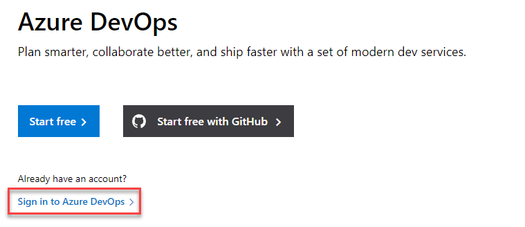
  

2. Provide your credentials and click **Next**.

3. Provide a **Password** and click **Sign in**.

4. Click **Continue**.

5. If prompted, provide a unique **Azure DevOps Organization** name such as lastnameMMYY, select a location closest to your tenant, select your region, enter captcha      if prompted and click **Continue**. Replace lastname with your last name, MM current month and YY current year.

  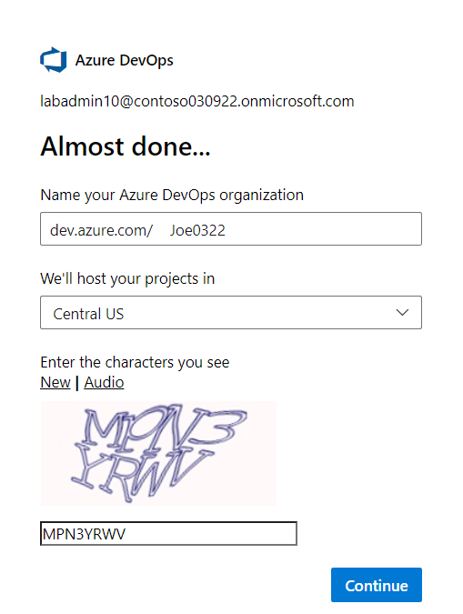
  
6. Enter **Device Management lastnameMMYY** for **Project Name** and click **Create project**. Replace lastname with your Last name, MM with current month, and YY        with current year.

  
  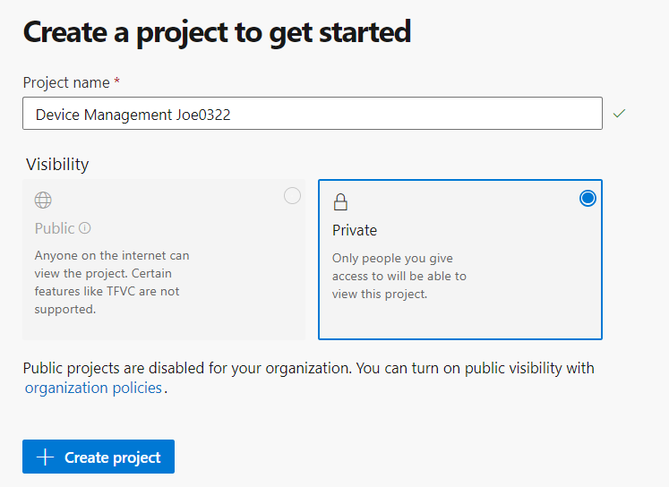
 
Projects are containers in Azure DevOps that track work items and source assets. When you set up the automation for the deployment tasks those will be pipelines built in the context of a project.

7. Select **Repos**.

  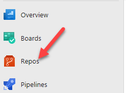
  
An Azure Repo is a source/version control container inside the Azure DevOps project used to track changes you make. You will be using it to store the solution files for the team building the Device Ordering app.

8. Check the **Add a Readme** checkbox and click **Initialize**.

  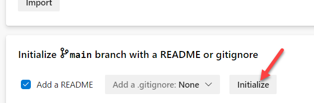

### Task 2: Configure Power Apps Build Tasks

1. Click on the shopping basket icon and select Browse marketplace.

  
  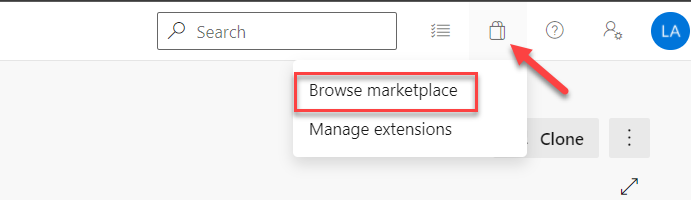
  

2. Search for **Power Platform**.
 
3. Select **Power Platform Build Tools**.

  
  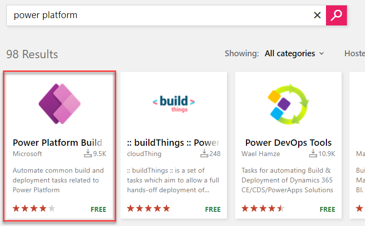
  

4. Click **Get it Free**.

  
  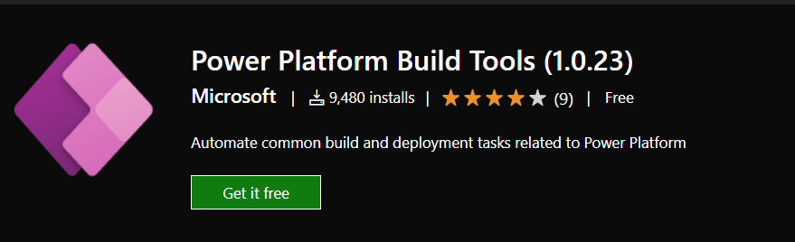
  

5. Select the **Azure DevOpsorganization** you created and click **Install**.

 
  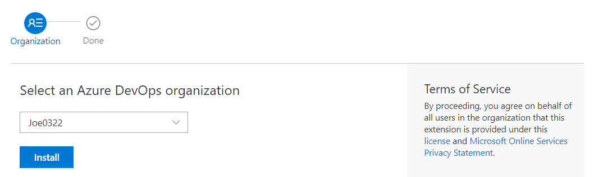
  

6. Click **Proceed to Organization**.

  
  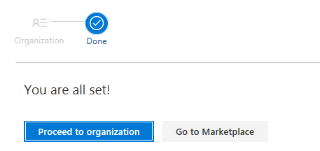
  

7. Click to open the **Device Management** project you created.

  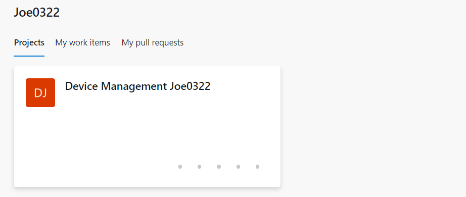
  

## Exercise 2: Build Export Pipeline

 In this exercise, you will build an Azure DevOps pipeline that will export the solution from the
 development Dataverse environment, unpack the solution file to
 individual files and then check those files into the repository. These
 solution files can be then used to re-create development environments
 or to promote the solution to test/production.

### Task 1: Export Solution

1. Create a Build Pipeline.

   a. Click to expand **Pipelines**.

     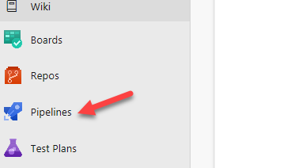
  

   b. Select **Pipelines**.

  
     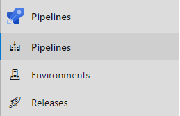
  

   c. Click **Create Pipeline**.

  
      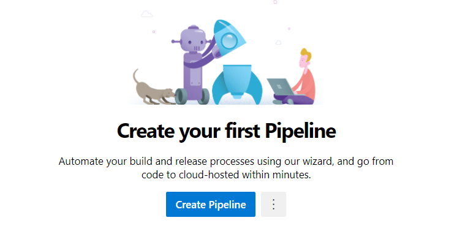

   d. Click **Use the Classic Editor.**

      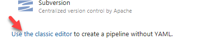

   e. Do not change the default values and click **Continue**.

      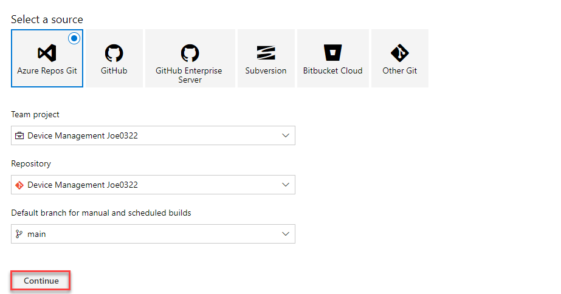
 

   f. Select **Empty Job**.

      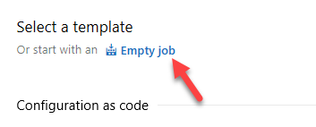

   g. Click **Save and Queue** and select **Save**.

  
      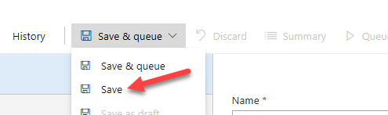

   h. Click **Save**.

  
      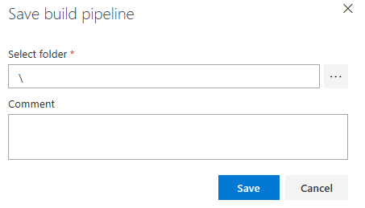
 

2. Add PowerApps Tool Installer task.

 **Note:** The Power Platform Tool Installer needs to be run before any other Power Platform build tasks.

   a. Click **+ Add Task to Agent Job 1**.

   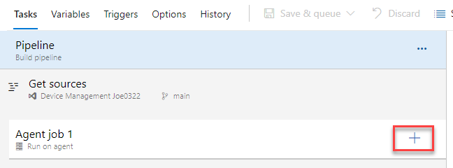
 

   b. Search for **Power Platform** hover over select **Power Platform Tool Installer** and click **Add**.

  
   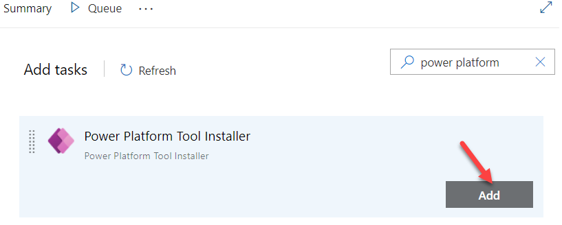

3. Add Power Platform Export Solution task.

     a. Search for **Export.**
    
     b. Hover over **Power Platform Export Solution** and click **Add**.

      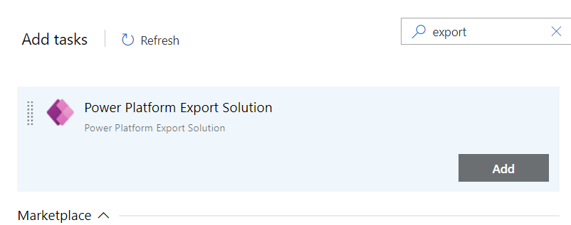

4. Open Power Platform Export Solution.

     a. Select the **Power Platform Export Solution** task.

  
      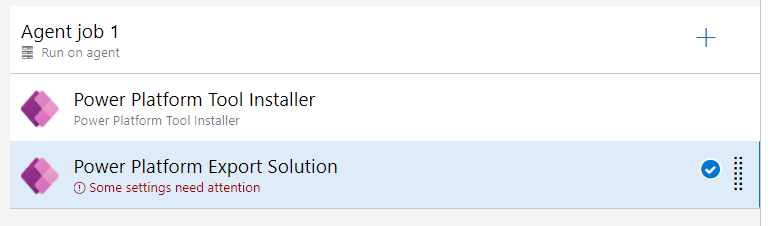
  

5. Get your development environment URL
     a. Start a new browser window or tab and navigate to

     b.Select **Environments** and click to open the **Device Ordering Development** environment. c. Copy the **Environment URL** and keep it in your clipboard or you        can keep this URL on a notepad.

  
      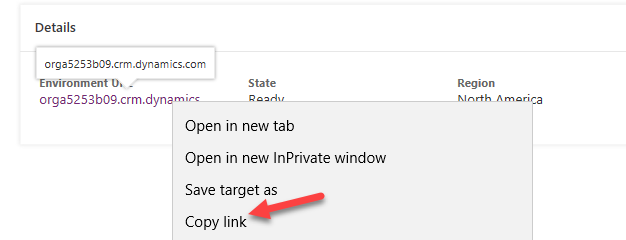

     d.Close the **Power Platform Admin** browser window or tab.

6. Create a **Generic Service Connection.** Service Connections are how the build tasks know what environment URL and user credentials to use to access the Common        Data Service environments. 
 
     a. Make sure you still have the **Power Platform Export Solution** task selected.

     b. Click **Manage**.

  
      
 

     c. Click Create Service Connection.

  
      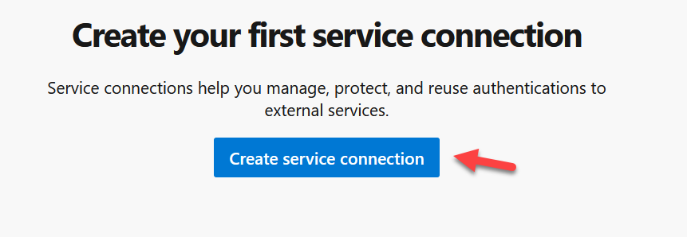
  

     d.Select **Generic** and then click **Next**.

  
      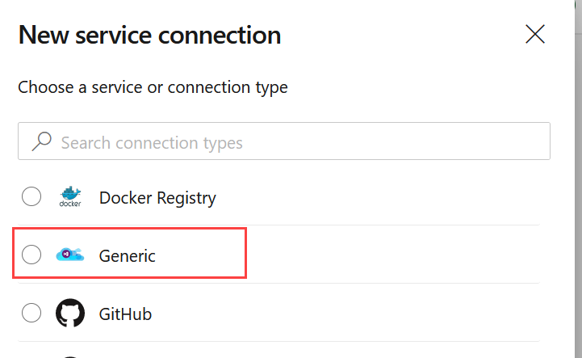
 

     e. Provide a **Connection Name**, paste the **Environment URL** you copied, provide your credentials, and click **Save**.

  
      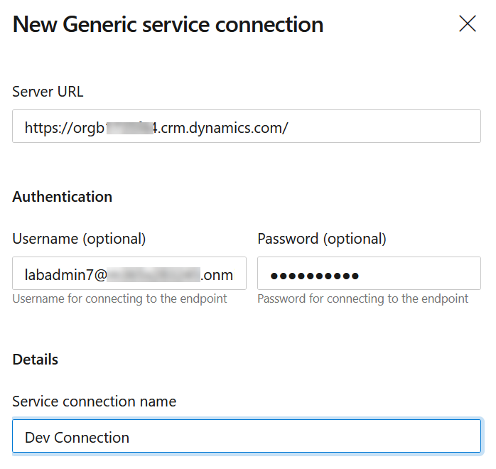
 

     f. Close the **Service Connections** browser window or tab.

7. Select the Generic Service Connection you created as the Power Apps Environment URL.

     a. Go back to the **Build Pipeline** tasks and make sure you still have PowerApps Export Solution task selected.

     b.Locate the **Service Connection** field and click **Refresh**.

      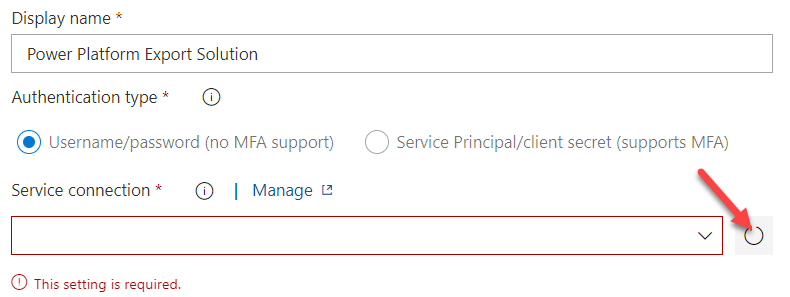
  

     c. Select the **Generic Service Connection** you just created named Dev Connection.

      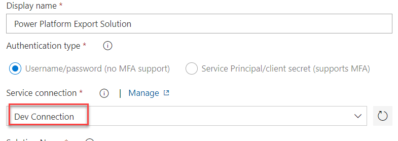
 

     d. Enter **\$(SolutionName)** for **Solution Name**, **\$(Build.ArtifactStagingDirectory)\\\$(SolutionName).zip** for **Solution Output File**.

  
      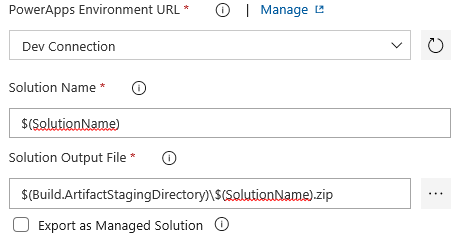
  

     e. Click **+** add Task.

 
      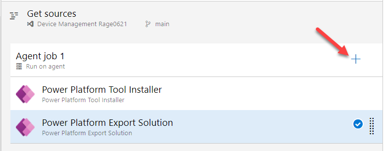
  

     f. Add another **Export Solution** task.

      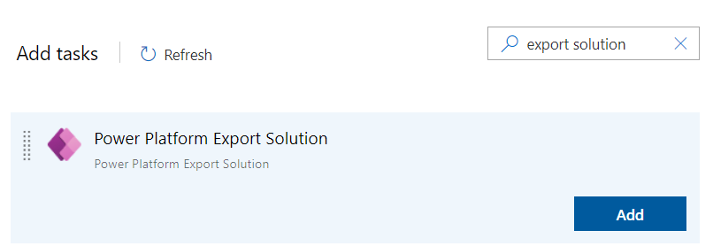
  

     g. Select **Dev Connection** for the Power Apps Environment URL.
     
     h. Check the Export as Managed Solution.
     
     i. Enter **\$(SolutionName)** for **Solution Name**, **$(Build.ArtifactStagingDirectory)\$(SolutionName)_managed.zip** for **Solution** **Output File**

  
      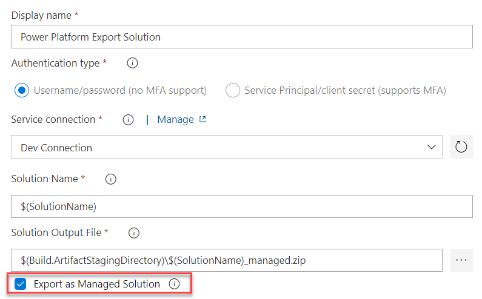
  
8. Add an Unpack task. This task will take the solution zip file and expand it into a file for each solution component.\
   
     a. Click **+ Add Task**.

      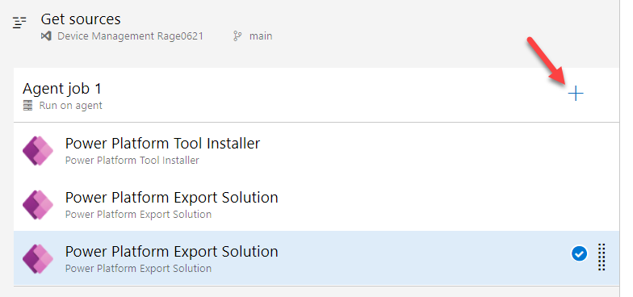
  

     b.Search for **Unpack**.
     
     c. Hover over **Power Platform Unpack Solution** and click **Add**.

  
      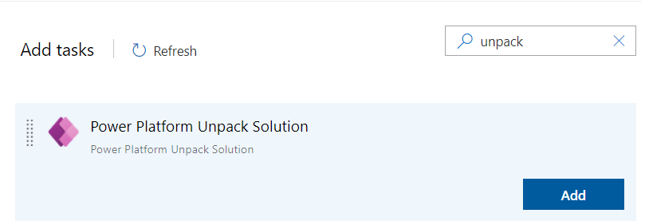
 

9. Provide Unpack settings information.
     
     a. Select the **Unpack** task.
     
     b. Enter **$(Build.ArtifactStagingDirectory)\$(SolutionName).zip** for **Solution InputFile**, **$(Build.SourcesDirectory)\$(SolutionName)** for **Target
        Folder**.
     
     c. Choose **Both** for Type of Solution.

      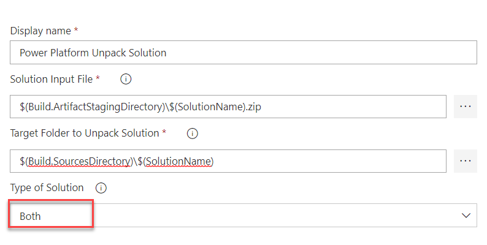
 

10. Allow scripts to access the OAuth Token. This will allow the commands you will add to check in files to the Azure DevOps repo to work.
     
     a. Select **Agent Job 1**.

       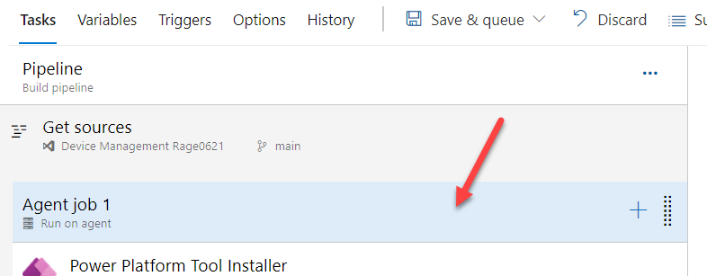
  

     b.Scroll down and check the **Allow Scripts to Access the OAuth Token** checkbox.

       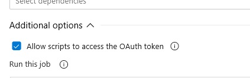
 

11. Add Command Line task.
     a. Click **+ Add a Task**.

 
       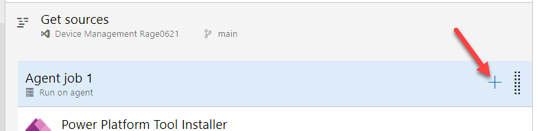
  

     b.Search for **Command line**. 

     c. Hover over **Command Line** and click **Add**.             

  
       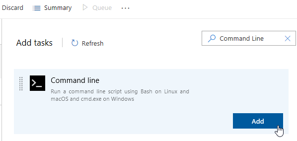
  

12. Add Scripts to the Command Line task. This task will be used to check in the solution file changes to the repo.      

     a. Select the Command Line task. 

       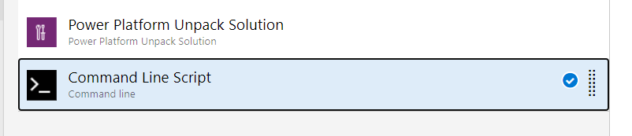
  

     b.Paste the script below in the **Script** text area. Replace **user@myorg.onmicrosoft.com** with your username.

        
         echo commit all changes                                            
         git config user.email "user\@myorg.onmicrosoft.com"              
         git config user.name "Automatic Build"                           
         git checkout main                                                  
         git add --all                                                     
         git commit -m "solution updates"                                 
         echo push code to new repo                                         
         git -c http.extraheader=\"AUTHORIZATION: bearer $(System.AccessToken)" push                                      
         origin main    
         
   
  
       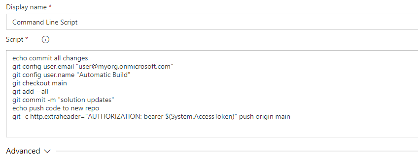
  

13. Add Solution Name variable.
     
     a. Select the **Variables** tab.
     
     b.Click **+ Add.**

  
       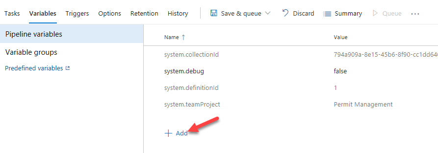
 

    c. Enter **SolutionName** for **Name** and **ContosoDeviceOrderManagement** for **Value**. Confirm that there are no extra spaces at the end  of the value after         pasting.                      

       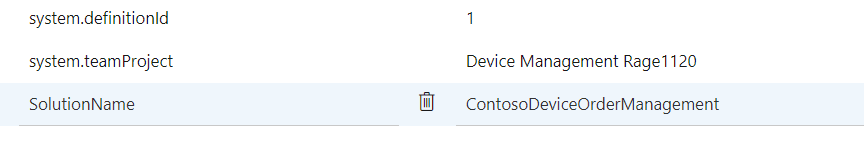
  

    d.Click **Save and Queue** and select **Save**.
    
    e.Click **Save** again.

## Exercise 3: Test the Pipeline

In this exercise, you will test the build pipeline you created.

### Task 1: Run the Pipeline

1. Open the build pipeline.
    a. Navigate to and click to open the **Device Management** project.
    
    b.Select **Pipelines \| Pipelines**.

  
      
  

    c. Click **Device Management-youruser-CI**.

  
      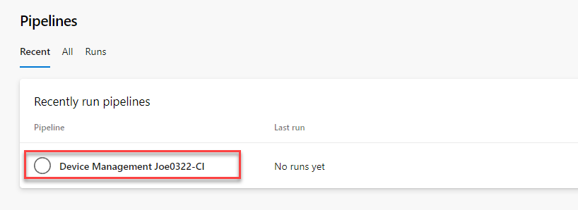
  

    d. Click **Run Pipeline**

  
      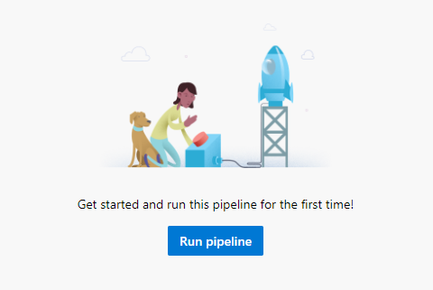
  

    e. Select **Run** again and wait.

      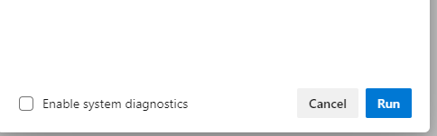
  

    f. Refresh the screen until your Agent job 1 has a Status of **Running.**

      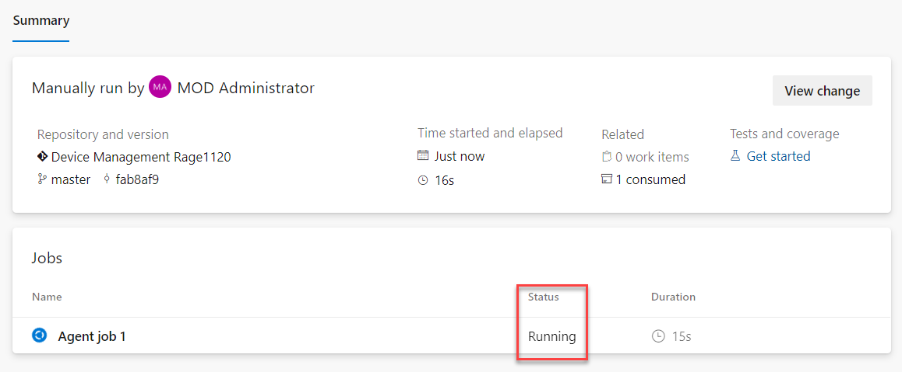
  

    g. Click on **Agent job 1** to open the job\
    
    h. The build will run up to the Command Line Script and fail because we need to adjust permissions. The first run causes a project specific build service user to        be added, we will adjust the permissions to fix this problem.

  
      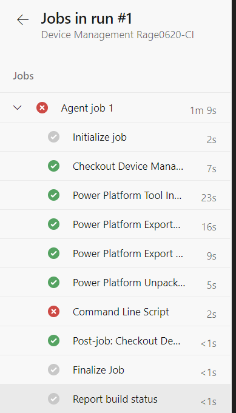
  

    i. Click **Project Settings** in the lower left corner.

      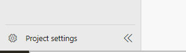
 

    j. Select **Repositories**.

      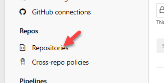
 

    k. Select the **Security** tab. 
    
    l. In the **Users** section, select the **Device Management Build Service** user. 

      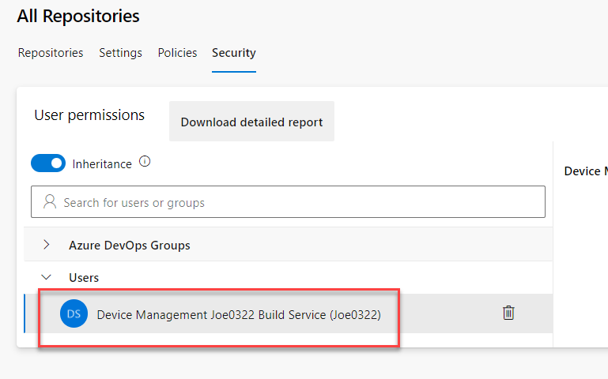
 

    m. In the **Access Control Summary**, locate **Contribute** and change it to **Allow**.

  
      
  

    n.Select **Pipelines** | **Pipelines** in the left navigation.

  
      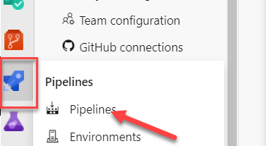
 

    o.Click to open the failed run.
    
    p.Click **Run Pipeline**.

  
      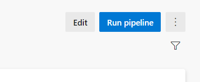
 

    q.Click **Run** and wait until the status changes to **Running**. 
    
    r. Click to open the job.

      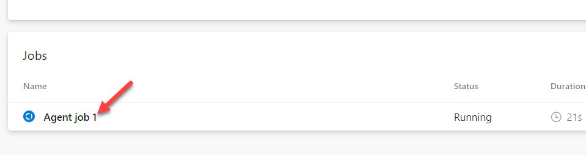
  

    s. The job should now run successfully

      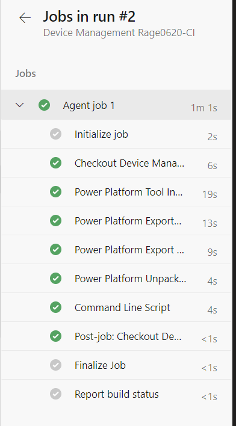
  

2. Review the Repository.
    
    a. Select Repos.

      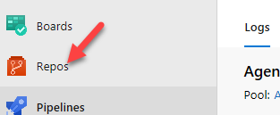
  

    b. You should see **ContosoDeviceOrderManagement** folder. Click to open the folder.

  
      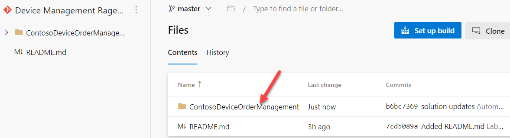
  

    c. The content of the folder should look like the image below.

      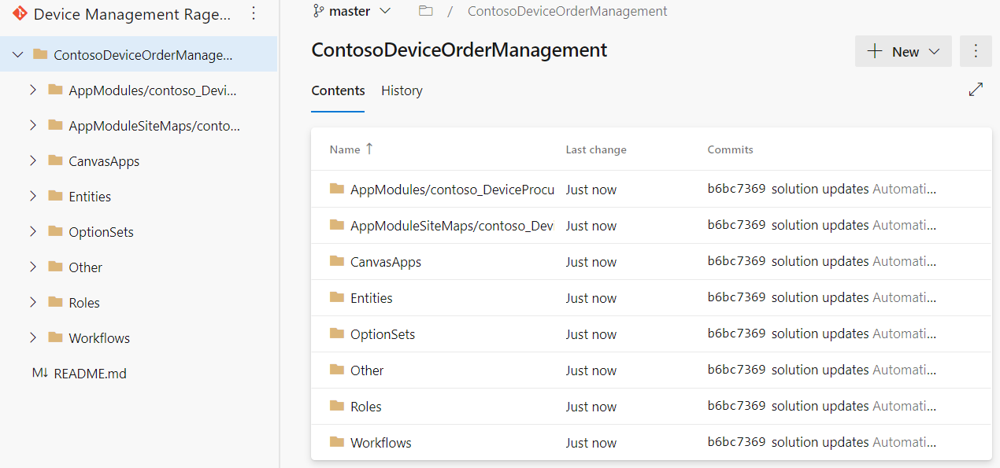
  

    d.You may examine the content of the folders.

## Exercise 4: Build Manage Solution and Publish Artifacts

 In this exercise, you will take the solution files checked into the
 repo in the prior steps and re-package them into a managed solution
 file. This solution file will be published as a build artifact so it
 can be used in the release pipeline we are going to use to publish to
 test and production.

 In a real project this is where you could add steps to import the
 solution into a build Dataverse environment to check for missing
 dependencies. You could also add build tasks to run tests against your
 solution as well as run Power Apps Solution Checker to detect
 problems. In this lab exercise we will skip those extra steps to
 ensure you have enough time to complete the lab.

### Task 1: Build the Managed Solution

1. Select **Pipelines**, click **New Pipeline**.

  
   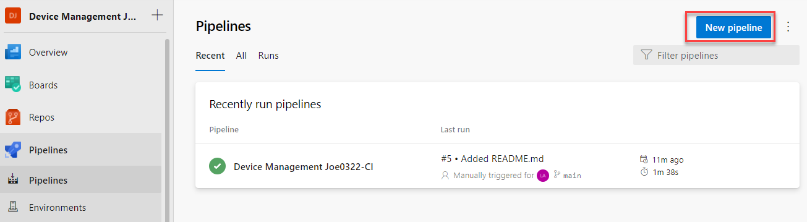
  

2. Click **Use Classic Editor**.

   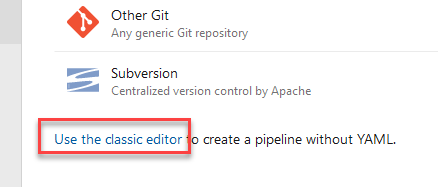

3. Click **Continue**.

   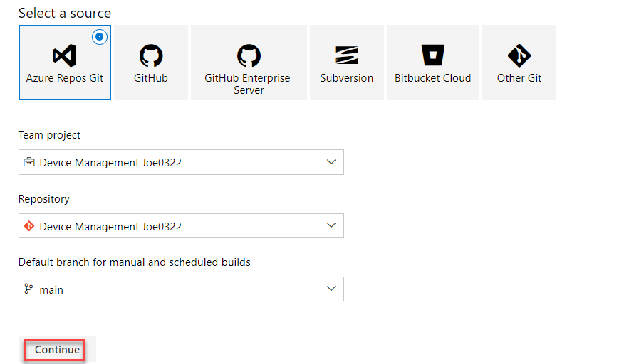
  

4. Click **Empty Job.**

  
   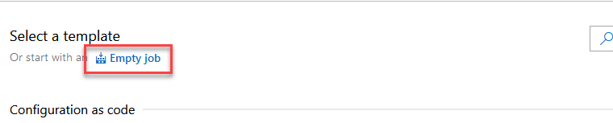
  

5. Enter **Build Managed Solution** for **Name**, click **Save and Queue** and select **Save**.

    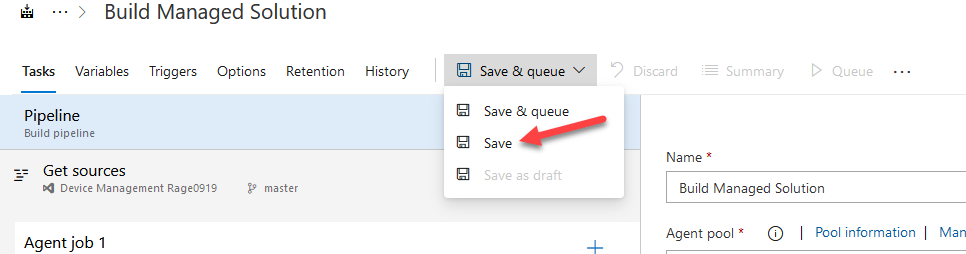

6. Click **Save** again.

7. Click **Add a Task** to **Agent Job 1**.

 
    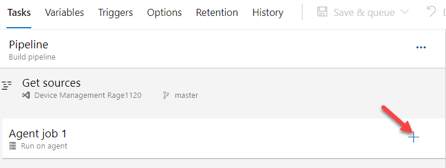
  

8. Search for **Power Platform Tool**, hover over **Power Platform Tool Installer** and click **Add**.

  
    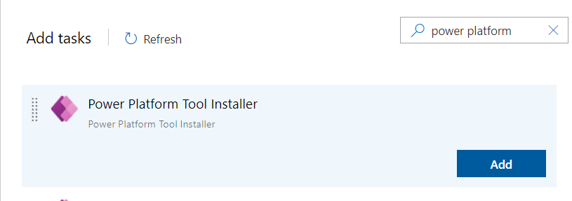
  

9. Search for **Power Platform Pack**, hover over **Power Platform Pack Solution** and click **Add**.

  
    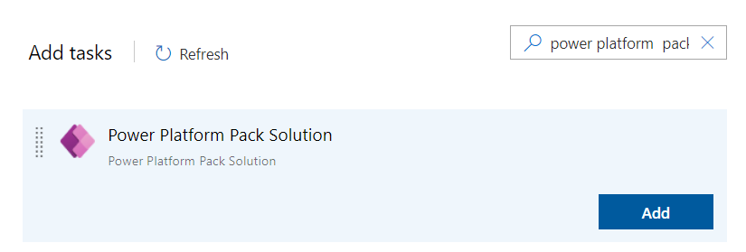
 

10. Select the **Power Platform Pack Solution** task.

     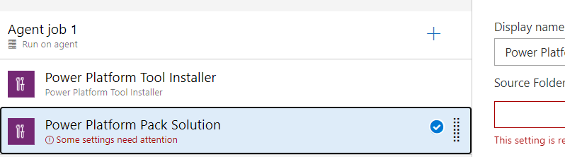
 

11. Enter **$(Build.SourcesDirectory)\$(SolutionName)** for **Source Folder of Solution to Pack**, enter **$(Build.ArtifactStagingDirectory)\$(SolutionName).zip**         for **Solution Output Folder**.
12. Change the solution type to **Managed**

     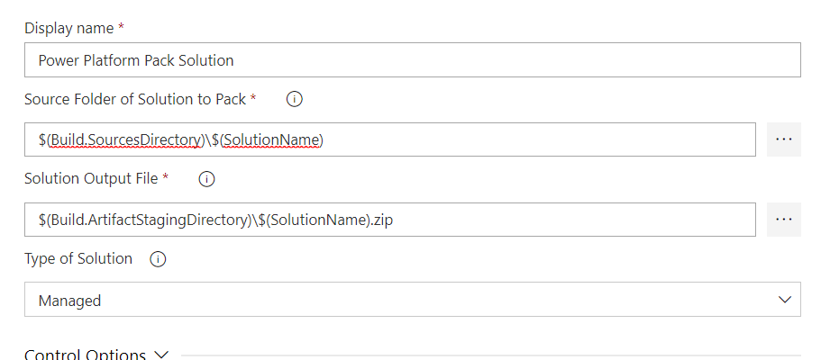{

13. Select the **Variables** tab and click **+ Add**.

  
     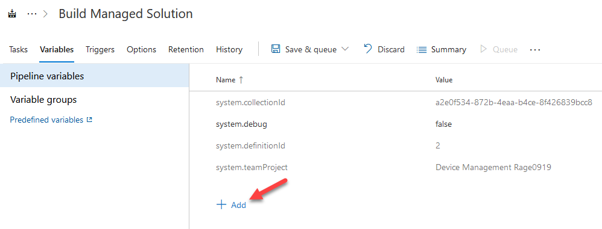

14. Enter **SolutionName** for **Name** and **ContosoDeviceOrderManagement** for **Value**.

  
     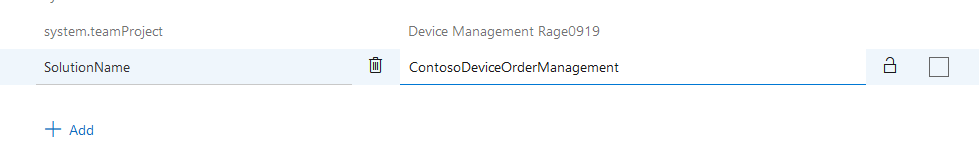
  

15. Select the **Tasks** tab.

  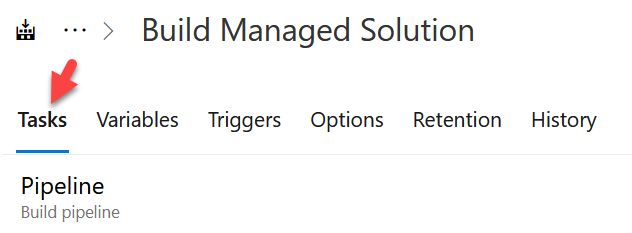
  

16. Click **Add a Task**.
17. Search **Publish Pipeline**, hover over **Publish Pipeline Artifact** and click **Add**. Publishing the solution as an artifact will make it available for the         release pipeline you will build.

  
     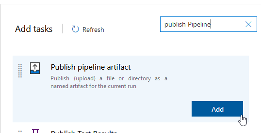
  

18. Select the **Publish Pipeline Artifact** task.

19. Enter **$(Build.ArtifactStagingDirectory)\$(SolutionName).zip** for **File or Directory Path** and enter **drop** for **Artifact Name**.

  
     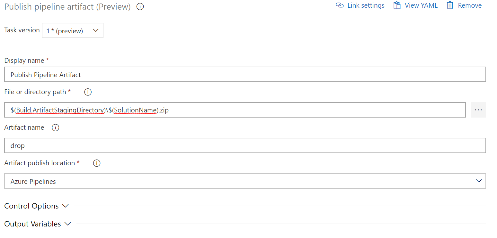
  

20. Click **Save and Queue** and select **Save and Queue**.

  
     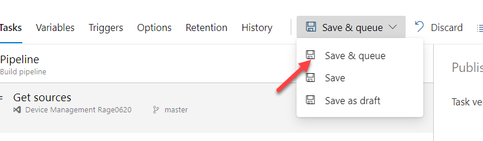
 

21. Click **Save and Run**.

22. Refresh the page until Agent Job 1 has a status of **Running**

     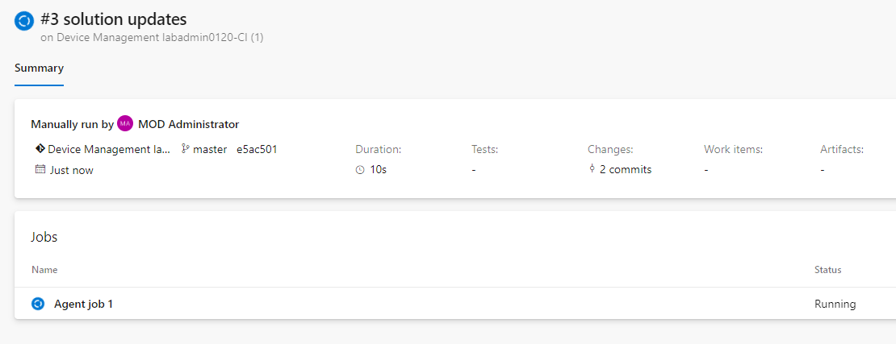

23. Click on **Agent job 1** and wait for the run to complete. Build tasks should run and succeed.

  
     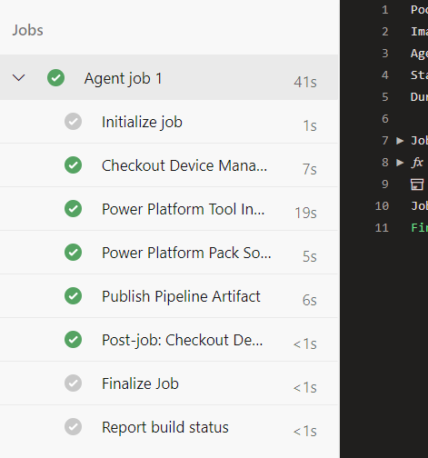
 

24.Click on **1 artifact produced**

 
     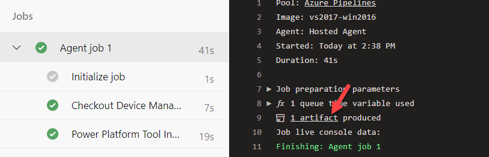
  

25. Expand the folder and you should see the managed solution.

  
     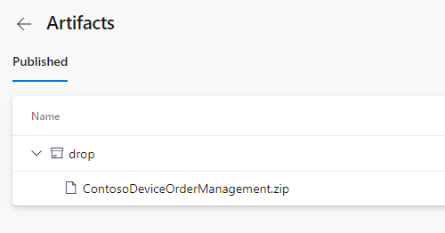
 

## Exercise 5: Build a Release Pipeline

 In this exercise, you will build your release pipeline. The release
 pipeline is intended to take the output from the build pipeline and
 coordinate deployments to one or more release environments. A common
 release pipeline might deploy to dev -\> test -\> user acceptance -\>
 production. Release pipelines can have approval requirements between
 each environment.

 For the purposes of this lab, we are only going to deploy to one test
 environment. We will be using the Central Apps Test trial environment
 we created in the previous lab. In real use, you would deploy to both
 Test and Production and would use environments of type production
 instead of trial.

## Task 1: Create Connection and Release to Prod

1. Go back to\

2. Click to open the **Device Management** project.

    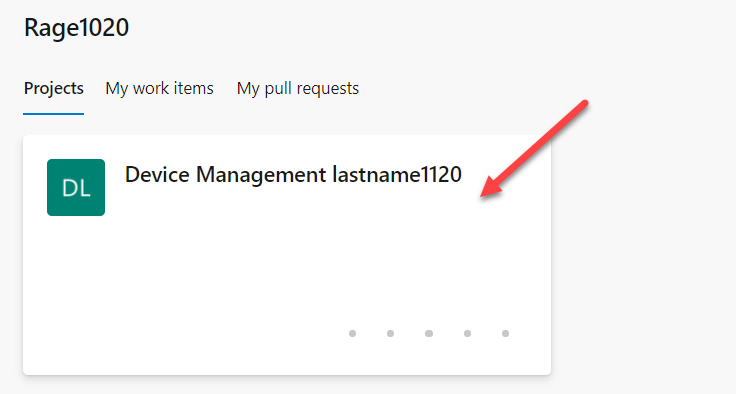

3. Click **Project Settings.**

  
     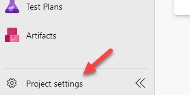
  

4. Go to the **Pipelines** area and select **Service Connections**.

 
     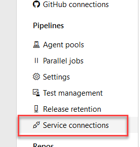
 

5.Click **New Service Connection**.

     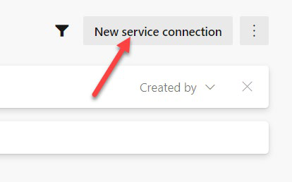
  

6. Select **Generic** and click **Next**.

 
     

7. In a new browser window or tab, navigate to\

8. Select **Environments** and locate your **Central Apps Test** environment you created in the prior lab.

9. Click on the environment name to show the details, and then copy the **URL** from the detail screen.

  
     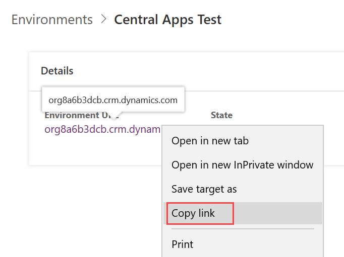
  

10. Enter **Test** for **Connection Name**, paste the **Environment URL** copied in the previous step, provide your credentials, and click **Save**.

  
     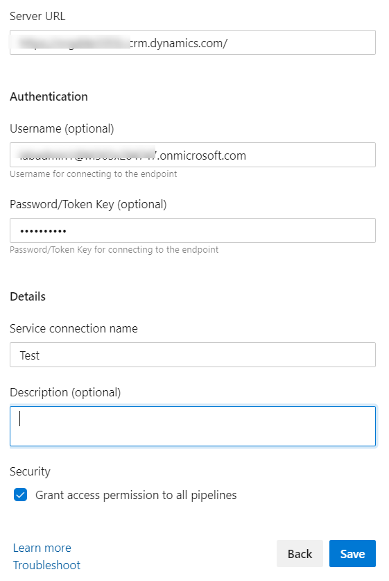
 

11. Select **Pipelines** -> **Releases**.

  
     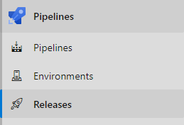
 

12. Click **New Pipeline**.

     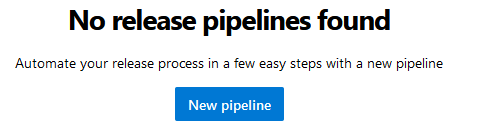
  

13. Select **Empty Job**.

     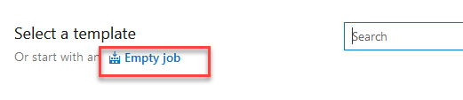

14. Enter **Test** for **Stage Name** and click **+ Add Artifacts**.

  
     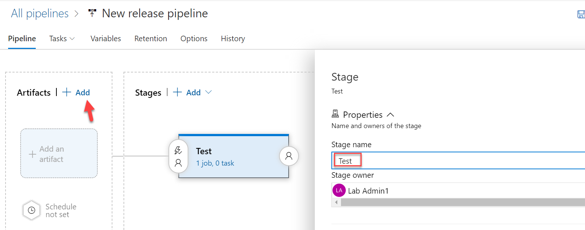
 

15. Select **Build Managed Solution** for **Source** and click **Add**.

    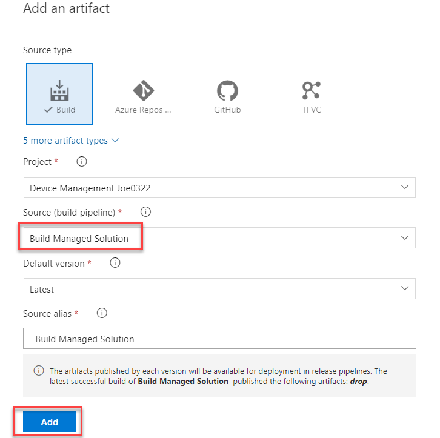
  

16. Select the **Tasks** tab and click **+ Add Task**.

 
     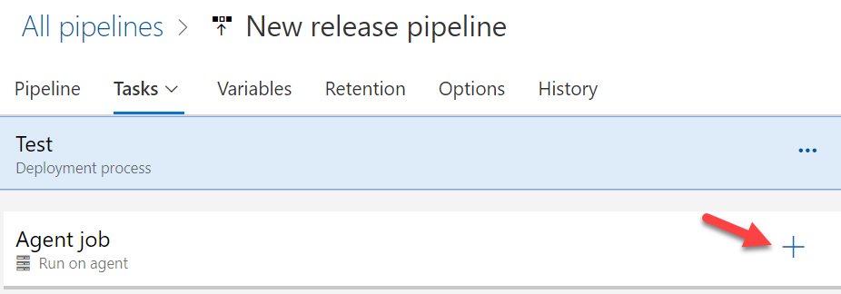
 

17. Search for **Power Platform Tool**, hover over **Power Platform Tool Installer** and click **Add**.

  
     
  

18. Search for **Power Platform Import**, hover over **Power Platform Import Solution** and click **Add**.

  
     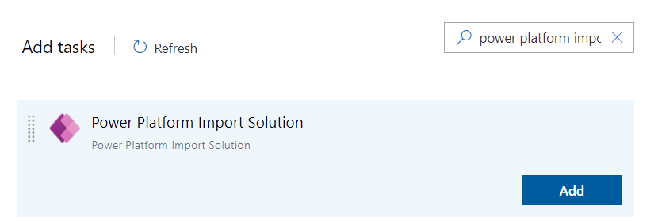
 

19. Select the **Power Platform Import Solution** task.
20. Select the **Test** connection for Environment and enter **$(System.DefaultWorkingDirectory)/_Build Managed Solution/drop/$(SolutionName).zip** for **Solution         Input File**.

  
     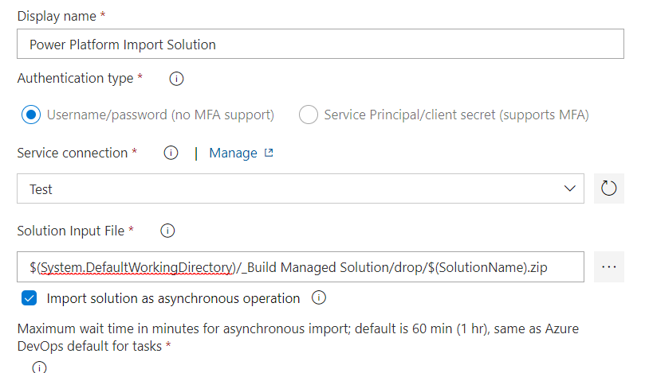
 

21. Select the **Variables** tab and click **+ Add**.

     
 

22. Enter **SolutionName** for **Name**, **ContosoDeviceOrderManagement** for **Value**, and click **Save**.

 
     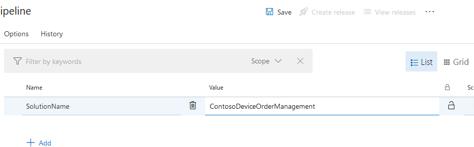

23. Click **OK**.

24. Click **Create Release**.

     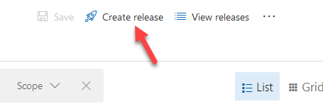
  

25. Click **Create**.

     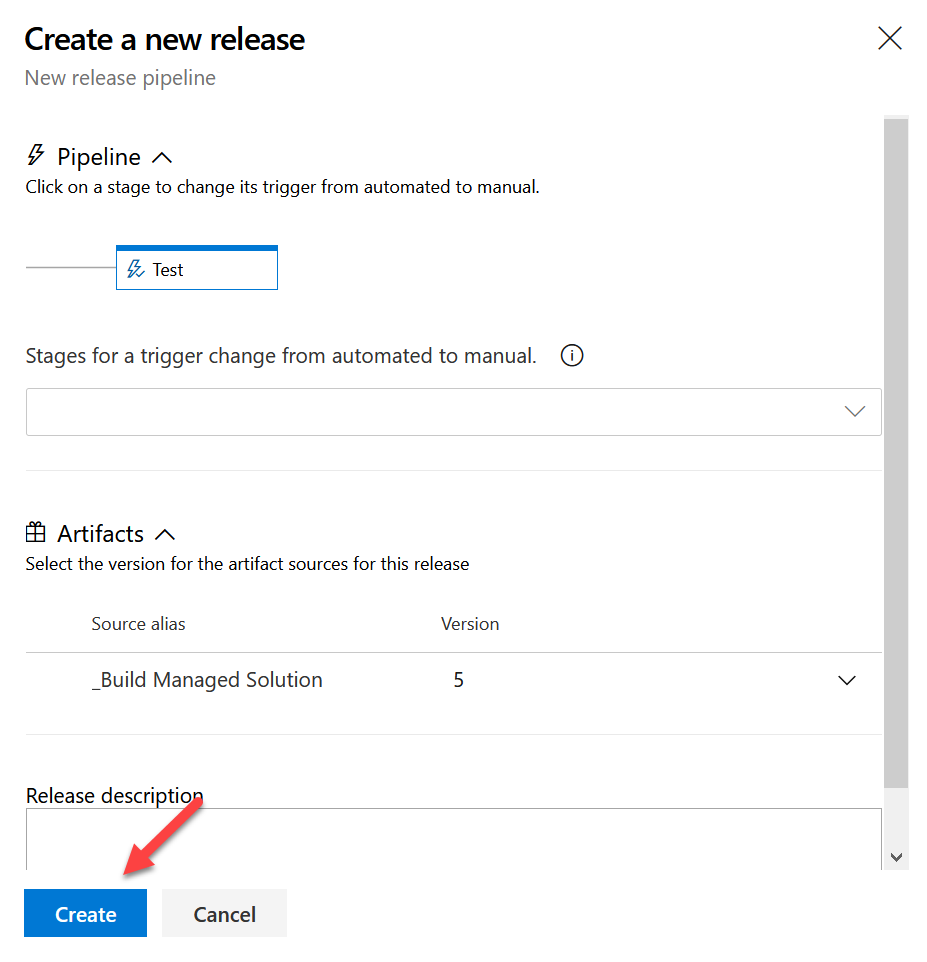
 

26. Select **Releases** and click to open the release.

     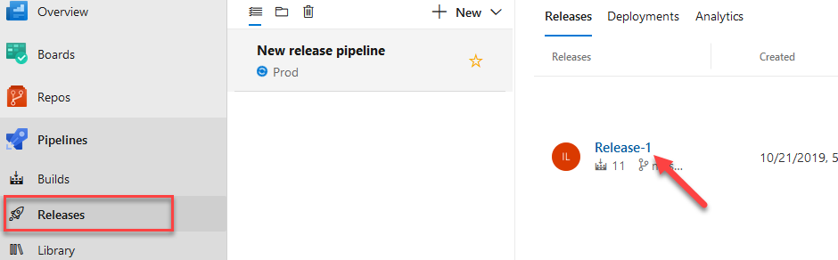
 

27. Wait for the release tasks to complete. The release pipeline should succeed.

  
     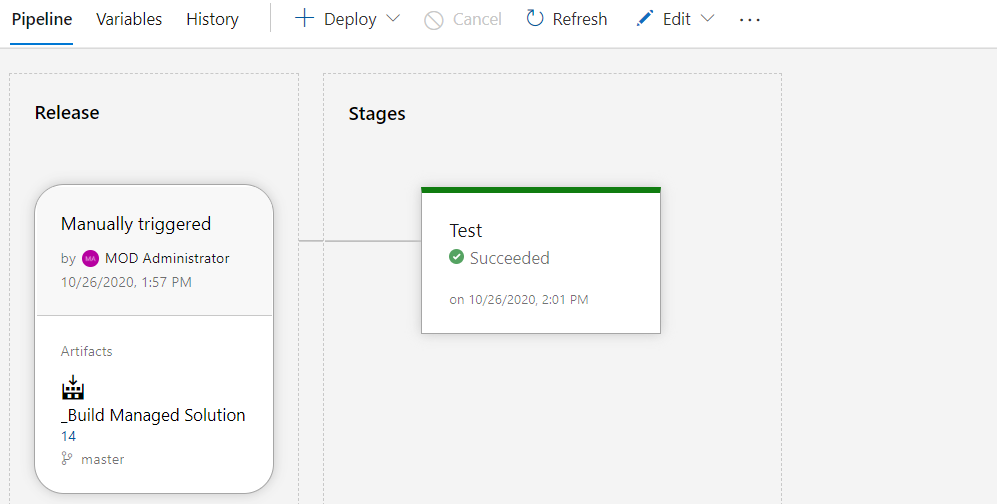
 
If your Release has succeeded, go to to Step 28\
If your Release has failed, try:

A common error here is the import fails because the Solution file is not found -- one of the reasons for this could be that you have named your pipeline different to what's written in the lab.

   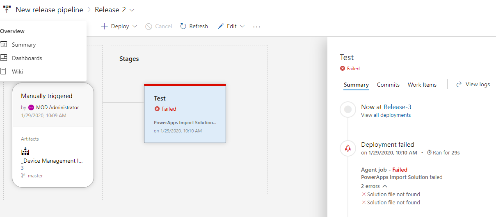
 

A fix for this is to manually select the solution file for the import.To do click on **Edit \| Edit Pipeline**

  
   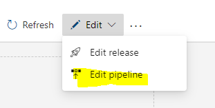

Select the **Test Task**

  
  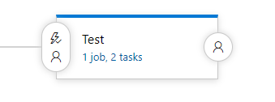
 

  

Select **PowerApps Import Solution**\
Select the ... next to **Solution Input File**

  
   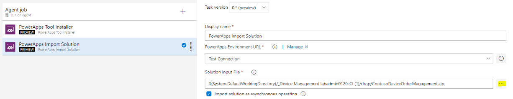
 

Select the .zip file in the drop folder and confirm with OK

  
   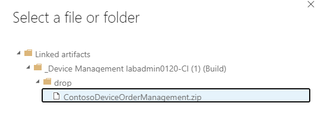
 

Go back to Releases and click **Create Release and Create**

28. Navigate to and select the **Test** environment **Central Apps Test**.

  
    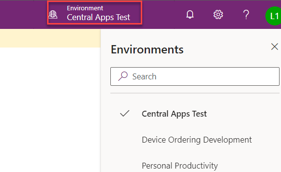
 

29. Select **Solutions**. You should see the managed solution you published from the release pipeline. 
30. Click to open the **Contoso Device Order Management** solution.

  
    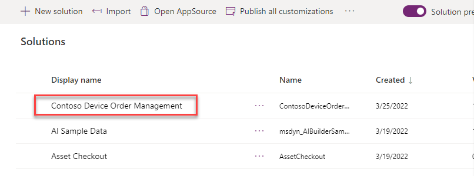
  

31. You should get the **You cannot edit managed** solution message.

    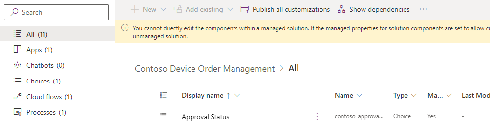

32. Select Apps. You should see **Device Ordering App** Canvas application and **Device Procurement** Model-Driven-Application.

  
    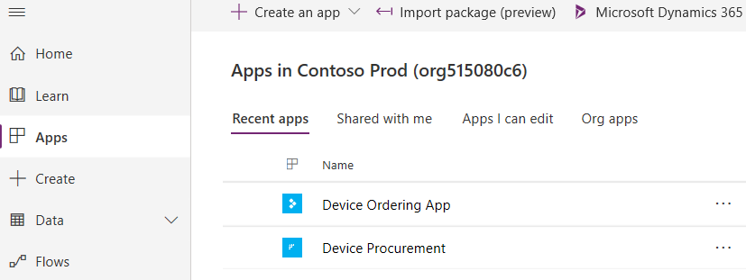

 DISCLAIMER

 This demo/lab contains only a portion of new features and enhancements
 in Microsoft Power Apps. Some of the features might change in future
 releases of the product. In this demo/lab, you will learn about some,
 but not all, new features.

