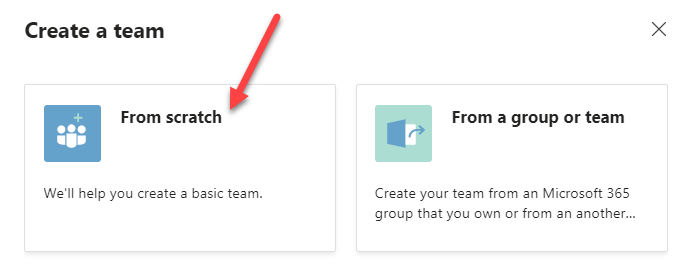
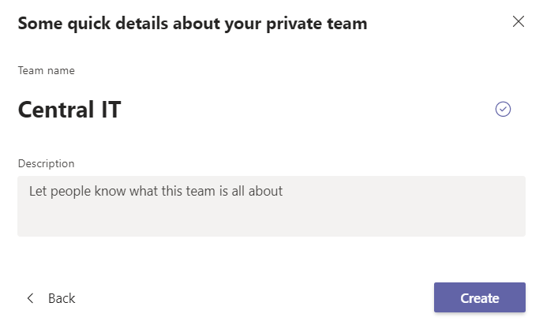
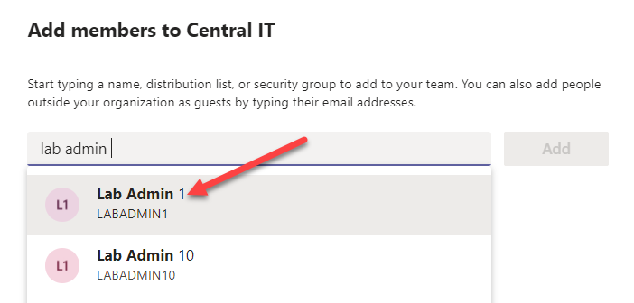
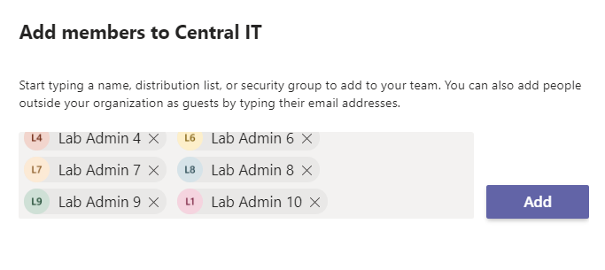
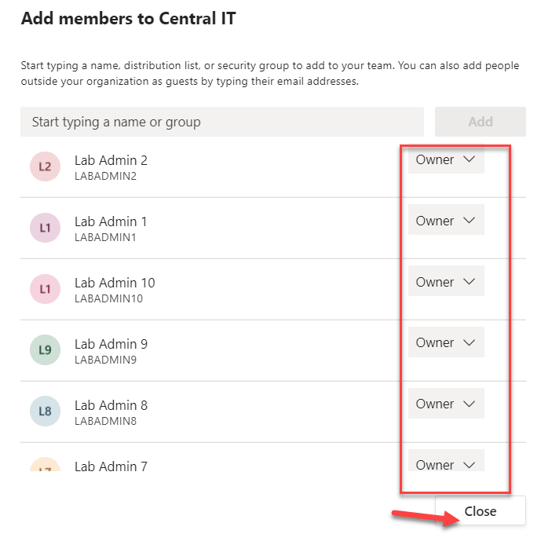
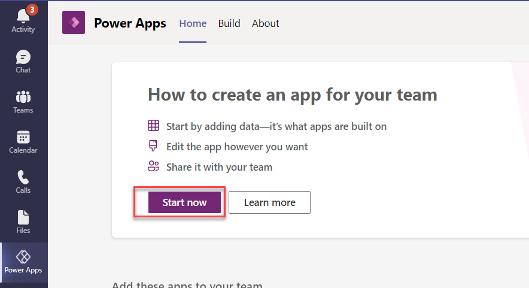
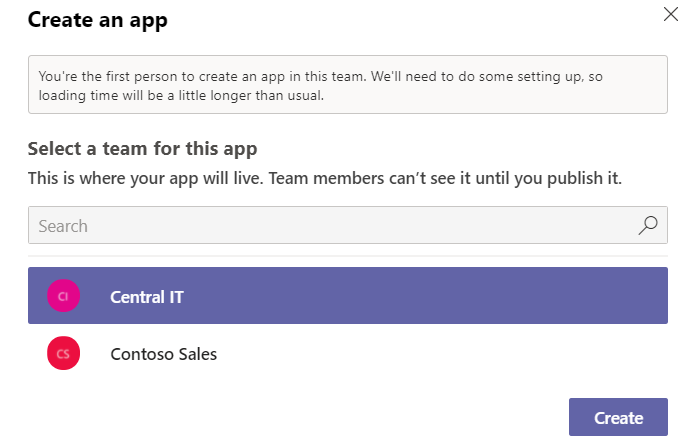
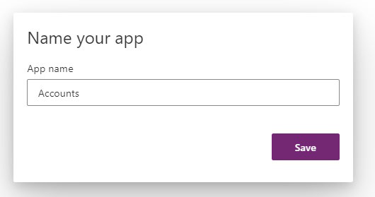

# Admin in a day

## M05-HOL Power Apps in Teams (Optional)

## Teams setup

### Task 1: Create a team

1. Navigate to Microsoft Teams and log in with the **admin account** 

2. Click **Join or create a team**.                                    

   
  
3. Select **Create a team**. 

4. Select **From scratch**.  

 
   
 

5. Select **Private**.                                      

6. Enter **Central IT** for Team name and click **Create**. 

  
   
  

7. Search for lab admin and select Lab Admin 1.

 
   
  

8. Search for lab admin again and select **Lab Admin 2**.      

9. Do the same for the rest of the users up to lab admin 20 and then click Add.                                          

    
 

10. Make all the users co-owners of the team and click **Close**.

    
 

### Task 2: Create an app

1.Navigate to Microsoft Teams and log in with the **admin account** 

2. Click **Join or create a team**.                                    

3. Select **Power Apps** from the toolbelt and click **Start now**.    

   

4. Select the **Central IT** team and click **Create**.

 
   
  

3. Enter **Accounts** for App name and click **Save**.

 
   
 

